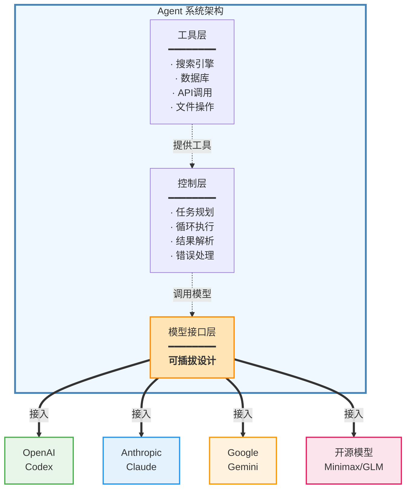
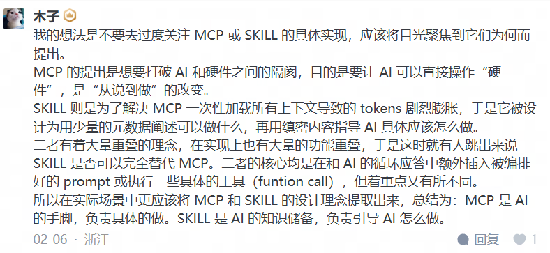

## 一、LLM(Large Language Model)
### 1. 什么是LLM
LLM(Large Language Model)，即大语言模型
LLM的底层本质确实就是不断预测下一个文字，它根据前面的所有文字，然后预测"接下来最可能出现什么"，输出一个字后，再把这个字加入上下文，继续预测下一个，如此循环

### 2. 不是真正"无限"循环
实际上有长度限制，叫做"上下文窗口"。比如某个模型可能只能记住最近的几万到几十万个字。超出这个范围的内容会被"遗忘"。
### 3. 预测是概率性的
模型给出的是一个概率分布（比如"的"概率30%，"了"概率25%...），然后根据某种采样策略选择。这就是为什么同样的问题，LLM可能给出不同的答案。
### 4. LLM如何实现与用户的交流？
LLM通过特殊的格式标记来区分问和答。虽然底层只是"预测下一个字"，但模型训练时会教它识别对话结构。
常见的方式是用标签，比如：

```
<user>你好，今天天气怎么样？</user>
<assistant>你好！我是AI助手，无法获取实时天气信息...</assistant>
<user>那LLM是什么？</user>
<assistant>LLM是大型语言模型的缩写...</assistant>
```

**工作流程**

你发送消息："LLM底层原理是什么"
系统构建输入：

```
<user>LLM底层原理是什么</user>
<assistant>
```

注意这里assistant标签是打开的，但内容是空的

模型开始预测：看到这个格式后，它知道现在该生成"assistant的回答"了，于是开始一个字一个字地生成
停止条件：当模型预测到 `</assistant>` 标记或特定的结束符时，就停止生成

**如何学会的？**
在训练时，模型见过数百万个这样的对话示例。它学会了：

- 看到 `<user>` 后面通常是问题

- 看到 `<assistant>` 后面应该生成回答
- 回答要针对前面的问题
- 要保持多轮对话的连贯性

本质上，"问答"也是预测的一部分，模型预测"在这个对话格式下，assistant角色接下来会说什么"。

它不是真的理解"这是问题，我要回答"，而是学会了"看到这种格式，应该生成这种内容"的模式。


## 二、Context（上下文）

**Context是模型"看到"的所有信息**，包括：

- 系统指令（告诉模型它是谁，该怎么表现）
- 历史对话记录
- 当前这轮的问题

模型基于**整个context**来预测下一个词。Context越长，模型越"记得"前面说过什么。但context有长度限制（上下文窗口），太长的对话开头部分会被遗忘。


## 三、Prompt（提示词）

**Prompt是你给模型的输入指令**，用来引导模型生成你想要的输出。

**简单例子**：

```
Prompt: "把这句话翻译成英文：我爱你"

模型输出: "I love you"
```

**复杂例子**：

```
你是一位资深的Python工程师。
请帮我写一个函数，功能是：
1. 读取CSV文件
2. 统计每列的平均值
3. 返回字典格式

要求：代码要有注释，处理异常情况。
```


## 四、Context和prompt的关系

- **Prompt通常是你当前输入的部分，有时也指精心设计的指令**
- **Context是prompt的超集，还包含历史记录和系统设置**

打个比方：

Prompt像是你现在问的问题

Context像是整个谈话的记录本

在实际应用中，"Prompt工程"（Prompt Engineering）是指如何设计更好的提示词，让模型生成更准确、更符合需求的回答。


## 五、Agent

### 什么是Agent?

**Agent =  可靠的代码（执行）+ 精心设计的Prompt（策略）**

如果说LLM是"大脑"，那Agent就是"手脚齐全、能自主行动的智能体"


### Agent vs 纯LLM

**纯LLM**：

- 只能"说"，不能"做"
- 你问"今天天气怎么样"，它只能说"我不知道实时天气"
- 你说"帮我发个邮件"，它只能告诉你怎么发

**Agent**：

- 既能"说"又能"做"
- 问天气 → 自动调用天气API → 返回真实结果
- 发邮件 → 自动调用邮件工具 → 真的把邮件发出去


### Agent的核心能力

1. **使用工具（Tool Use）**：调用搜索引擎、数据库、API等
2. **规划（Planning）**：把复杂任务拆解成步骤
3. **自主决策**：判断下一步该做什么
4. **循环执行**：观察结果，决定是否继续

通常第1步：使用工具（Tool Use）可以使用代码来实现

```
# LLM只能"说"要用工具
llm_output = "行动：weather_api('Tokyo')"

# 代码才能"真的调用"
def execute_tool(tool_name, params):
    if tool_name == "weather_api":
        return requests.get(f"api.weather.com?city={params}")
    elif tool_name == "search":
        return google_search(params)
    # ... 真实的API调用
```

第2-4步可以直接使用prompt让模型学会规划、决策、循环

```
你需要完成用户的任务，请按以下方式思考：

1. 规划：把任务分解成步骤
2. 决策：判断现在该做什么
3. 循环：执行后观察结果，决定是否继续

示例格式：
计划：[列出所有步骤]
当前步骤：[第几步]
思考：[为什么这样做]
行动：[调用什么工具]
观察：[工具返回什么]
继续/完成：[判断]
```


### Agent只是一个架构/框架

Agent只是一个架构/框架，不是模型本身

通常同一个Agent可以配合不同的LLM模型使用，合适的agent和模型才能发挥两者的最大实力

- 一个用于评估 AI Agent在终端环境中能力的基准测试平台 https://www.tbench.ai





## 六、RAG

RAG是**Retrieval-Augmented Generation**（检索增强生成）的缩写，是一种结合了信息检索和文本生成的AI技术架构。

### 核心原理

RAG的工作流程通常包括三个步骤：

1. **检索（Retrieval）**：当用户提出问题时，系统先从外部知识库（如文档、数据库）中检索相关信息
2. **增强（Augmentation）**：将检索到的相关内容与用户的原始问题组合在一起
3. **生成（Generation）**：大语言模型基于检索到的上下文信息生成回答

### 主要优势

- **知识更新**：可以访问最新的外部数据，不受模型训练时间的限制
- **减少幻觉**：通过引用实际文档，降低模型编造信息的可能性
- **可追溯性**：答案可以追溯到具体的信息来源
- **专业领域应用**：能够整合企业内部文档、专业知识库等私有数据


## 七、MCP

官方文档： [MCP官方文档](https://modelcontextprotocol.io/docs/getting-started/intro)

> 通过MCP，像Claude或ChatGPT这样的AI应用可以连接**数据源**（如本地文件、数据库）、工具（如搜索引擎）和**工作流**（如专门提示），使它们能够访问关键信息并执行任务。
>
> 可以把MCP想象成AI应用的USB-C接口。正如USB-C提供了连接电子设备的标准化方式，MCP也提供了将AI应用与外部系统连接的标准化方式。

MCP 服务器本质上是一个 工具注册中心 + RPC 路由器，当AI 连接上MCP服务器时，会读取MCP服务器提供所有的工具描述存入上下文，然后根据用户意图智能选择和调用工具


## 八、SKILL

官方文档： [skill官方文档](https://agentskills.io/home)

从本质上讲，一个Skill就是一个包含 `SKILL.md` 文件的文件夹。该文件包含元数据(至少包括 `name` 和 `description`)，以及告诉智能体如何执行特定任务的说明。技能还可以捆绑脚本、模板和参考资料。

```
my-skill/
├── SKILL.md          # 必需:说明 + 元数据
├── scripts/          # 可选:可执行代码
├── references/       # 可选:文档
└── assets/           # 可选:模板、资源
```

### 技能如何工作

技能使用**渐进式披露**来高效管理上下文:

1. **发现**: 启动时，Agent仅加载每个可用技能的元数据(名称和描述)，刚好足够知道技能的用处、何时使用技能
2. **激活**: 当任务与技能描述匹配时,Agent将完整的 `SKILL.md` 载入上下文。
3. **执行**: Agent遵循说明，根据需要选择性地加载引用的文件或执行捆绑的代码。

这种方法使Agent保持快速，节省上下文。

### SKILL.md 文件

每个技能都以包含 YAML 前置元数据和 Markdown 说明的 `SKILL.md` 文件开始:

```
---
name: weather-tool
description: 获取指定城市的实时天气信息。当用户询问“今天天气如何”或需要气象数据时使用此技能。
---

# Weather Tool Usage

这个技能通过调用本地 Python 脚本来获取天气数据。

## 使用步骤

1.  首先，确定用户查询的城市名称。
2.  运行以下命令获取数据：

    ```bash
    python3 fetch_weather.py --city "{city_name}"
```

3.  脚本将返回 JSON 格式的数据，请将其转换为自然语言回复用户。
```

`SKILL.md` 顶部需要以下前置元数据:

- `name`: 简短标识符
- `description`: 该技能的作用 + 何时使用此技能
```


## 九、MCP对比SKILL

> Anthropic 官方解释：
>
> MCP connects Claude to external services and data sources. Skills provide procedural knowledge—instructions for how to complete specific tasks or workflows.
>
> 
>
> **MCP（Model Context Protocol）**负责**连接**功能，让 Agent 能够访问外部工具、数据库、API 等
>
> **Skills（技能）**负责提供**方法论**，教 Agent 如何正确完成特定类型的任务


### 定义对比

|          | Skills                                | MCP                                 |
| -------- | ------------------------------------- | ----------------------------------- |
| **本质** | 程序性知识                            | 工具连接性                          |
| **目的** | 教导 Agent 如何执行特定任务或遵循标准 | 赋予 Agent 访问外部数据或系统的能力 |
| **类比** | 员工手册、SOP、操作指南               | 员工的电脑、数据库权限、电话线      |


### 运行机制与性能差异

|                  | Skills                                                       | MCP                                            |
| ---------------- | ------------------------------------------------------------ | ---------------------------------------------- |
| **加载逻辑**     | **渐进式披露**, 只有当对话触发相关主题时，完整技能文档才被注入上下文 | 工具定义通常预先加载所有工具内容，随时可供调用 |
| **Token 消耗量** | 低，有效节省上下文窗口                                       | 高                                             |


### 什么时候用 MCP，什么时候用 Skill

#### 用 MCP 的场景

- **「需要访问外部数据」**：数据库查询、API 调用、文件系统访问
- **「需要操作外部系统」**：创建 GitHub Issue、发送 Slack 消息、执行 SQL

#### 用 Skill 的场景

- **「重复性的工作流程」**：代码审查、文档生成、数据分析
- **「公司内部规范」**：代码风格、提交规范、文档格式
- **「需要多步骤的复杂任务」**：需要详细指导的专业任务
- **「团队共享的最佳实践」**：标准化的操作流程
- **「Token 敏感场景」**：需要大量知识但不想一直占用上下文


#### 如何选择

> **MCP connects AI to data; Skills teach AI what to do with that data.**
>
> MCP 让 AI 能”碰到”数据，Skill 教 AI 怎么”处理”数据。

MCP和Skill确实就存在着大量重叠的理念，它们不是替代关系，而是互补关系，一个成熟的 AI Agent，两者都会需要。

引用网友评论：



