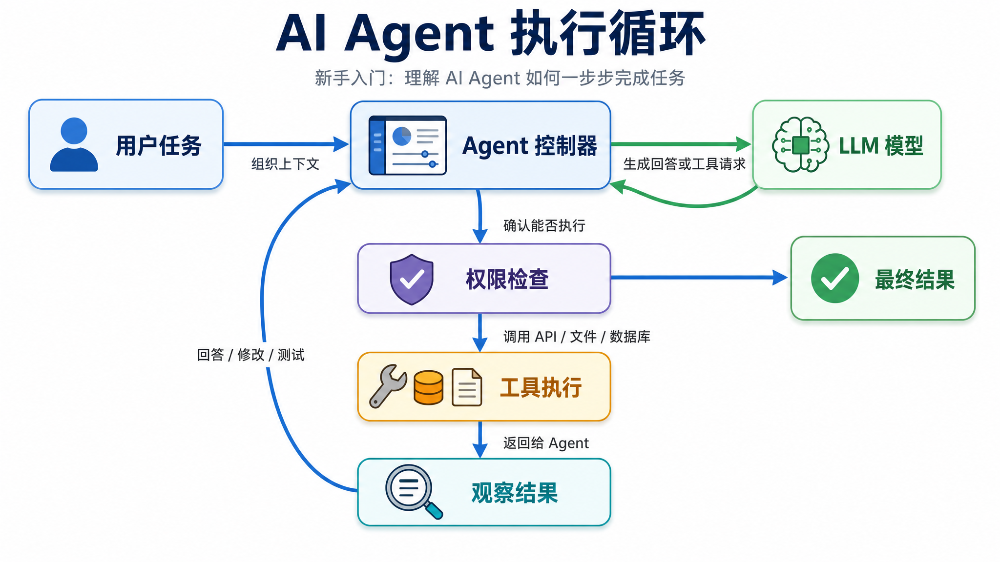
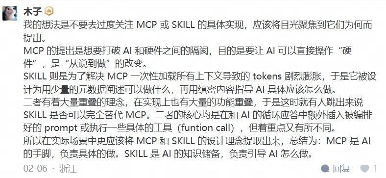

# AI相关专业名称释义

:::tip 验证与时效说明
AI 工具、模型名称、安装步骤和第三方服务变化很快。本文保留实践经验，但涉及时效性的内容，生产使用前请结合官方文档和来源记录再确认。
:::

本文面向刚开始接触 AI 辅助开发的读者，用常见例子解释后续教程中会反复出现的概念。


## 一、LLM（Large Language Model）

### 1. 什么是 LLM

LLM（Large Language Model），即大语言模型。它是一类经过大量文本、代码或多模态数据训练的模型，能够根据输入上下文生成文本、代码、结构化数据等内容。

LLM 生成内容时，会根据已有上下文预测下一个 <strong>token</strong>。token 是模型处理文本时使用的基本片段，可能是一个字、一个词、一个标点，也可能是一段子词。模型生成一个 token 后，会把它加入当前上下文，再继续生成下一个 token，直到回答完成。

常见用途包括：回答问题、总结资料、翻译文本、生成代码、解释代码、整理表格和生成结构化内容。

### 2. 上下文窗口不是无限的

模型一次能“看到”的内容有长度限制，这个限制通常叫 <strong>上下文窗口（context window）</strong>。上下文窗口一般按 token 计算，而不是按汉字数计算。

当输入内容超过窗口限制时，超出的部分通常无法直接参与本轮推理。实际应用中，系统可能会截断旧消息、压缩摘要、检索相关片段，或让用户重新提供关键信息。因此，模型并不是真的拥有无限记忆。

### 3. 生成具有概率性

模型在每一步会给出候选 token 的概率分布，例如某些词更可能出现，某些词概率较低。最终输出会受到采样策略、温度参数、随机种子、系统指令、上下文内容等因素影响。

这就是为什么同样的问题，LLM 有时会给出不同答案。

### 4. LLM 如何实现对话

用户消息、助手消息、系统指令等内容会被系统整理成模型可以处理的输入。不同模型和平台的内部格式不同，但大致可以看成下面这种对话结构：

```text
<system>你是一个有帮助的 AI 助手。</system>
<user>你好，今天天气怎么样？</user>
<assistant>你好！我无法直接获取实时天气，除非系统提供天气工具。</assistant>
<user>那 LLM 是什么？</user>
<assistant>LLM 是 Large Language Model 的缩写，也就是大语言模型。</assistant>
```

当你发送消息“LLM 底层原理是什么”时，系统可能会把它和历史对话、系统指令一起组织成模型输入，然后让模型继续生成 assistant 角色的下一段内容。

常见的停止方式包括：模型生成结束符、达到最大输出长度、命中 stop sequence，或进入工具调用等特殊流程。

### 5. 使用 LLM 时要注意什么

LLM 很擅长处理语言和代码任务，但它的回答不一定总是正确。使用时最好做到三点：

1. 目标清晰：告诉模型你要它完成什么任务。
2. 信息充足：把必要背景、限制条件、参考资料一起提供。
3. 结果验证：涉及代码、数据、配置、安装步骤时，最好再运行或检查一遍。


## 二、Context（上下文）

<strong>Context 是模型当前能看到的所有输入信息</strong>，通常包括：

- 系统指令：告诉模型角色、边界、风格和约束
- 开发者或应用指令：告诉模型在某个产品或流程中应遵循的规则
- 历史对话记录
- 当前用户问题
- 工具返回结果、检索到的文档片段等外部信息

模型会基于整个 context 生成下一步输出。Context 越完整，模型越容易理解任务背景；但 context 也会占用窗口长度，过长、杂乱或冲突的上下文反而可能降低回答质量。


## 三、Prompt（提示词）

<strong>Prompt 是提供给模型的输入指令</strong>，用来引导模型生成符合需求的输出。

简单例子：

```text
Prompt: "把这句话翻译成英文：我爱你"

模型输出: "I love you"
```

复杂例子：

```text
你是一位资深的 Python 工程师。
请帮我写一个函数，功能是：
1. 读取 CSV 文件
2. 统计每列的平均值
3. 返回字典格式

要求：代码要有注释，并处理常见异常情况。
```

Prompt 不只是“用户输入的一句话”。在实际产品里，它可能由系统指令、用户问题、历史记录、检索文档、工具结果等多部分共同组成。


## 四、Context 和 Prompt 的关系

- <strong>Prompt</strong> 通常指当前给模型的指令或任务描述，有时也特指经过设计的提示词模板。
- <strong>Context</strong> 是模型当前可见信息的整体，通常比 prompt 更大，包含历史记录、系统设置、工具结果等。

打个比方：

- Prompt 像是你现在提出的问题或任务说明。
- Context 像是整场对话和相关资料的记录本。

在实际应用中，<strong>Prompt Engineering（提示词工程）</strong>指的是如何设计输入结构，让模型更稳定、更准确地完成任务。它不只是写一句“你是专家”，还包括任务拆解、示例提供、输出格式约束、错误处理和验证策略。


## 五、Tool Calling / Function Calling（工具调用）

LLM 本身主要负责生成内容或提出“要调用某个工具”的请求。真正访问外部系统、读写文件、查询数据库、发送邮件、调用天气 API 的动作，通常由宿主程序或 Agent 框架执行。

一个简化流程如下：

```text
用户：东京今天会下雨吗？
模型：需要调用 weather_api，参数 city=Tokyo
程序：执行 weather_api("Tokyo")
工具：返回天气数据
模型：根据工具结果生成自然语言回答
```

模型通常不会直接“拥有”工具权限。它会根据工具描述生成结构化调用请求，再由外部代码判断是否允许执行、如何执行，以及如何把结果返回给模型。

这也是 AI Agent 能从“会回答”走向“能执行任务”的关键基础。


## 六、Agent

### 什么是 Agent

<strong>Agent（智能体）</strong>是一套围绕模型构建的任务执行系统。它通常包括模型、提示词策略、工具、执行环境、状态管理、权限控制和循环逻辑。

如果说 LLM 像“大脑”，那 Agent 更像一个配备了工具、流程和权限边界的执行者。它不只是回答问题，还可以在允许的范围内规划步骤、调用工具、观察结果，并继续推进任务。

### Agent vs 纯 LLM

<strong>纯 LLM</strong>：

- 主要生成文本、代码或结构化内容
- 没有外部工具时，无法主动查询实时天气、读本地文件或发送邮件
- 对实时信息和私有数据依赖用户或系统提供上下文

<strong>Agent</strong>：

- 可以在框架允许的范围内调用工具
- 问天气 -> 调用天气 API -> 基于真实结果回答
- 修改代码 -> 读取文件 -> 编辑文件 -> 运行测试 -> 根据结果继续修复

### Agent 的核心能力

1. <strong>工具使用（Tool Use）</strong>：调用搜索、数据库、文件系统、API 等外部能力
2. <strong>任务规划（Planning）</strong>：把复杂任务拆成可执行步骤
3. <strong>状态管理（State / Memory）</strong>：记录当前进度、约束、结果和待办事项
4. <strong>循环执行（Observe -> Act -> Verify）</strong>：执行后观察结果，再决定继续、修正或停止
5. <strong>权限与安全边界</strong>：判断哪些动作可以自动执行，哪些动作需要用户确认

工具调用通常由代码执行，而不是由模型“自己动手”：

```python
# 模型生成工具调用请求
llm_output = {
    "tool": "weather_api",
    "arguments": {"city": "Tokyo"}
}

# 宿主程序决定是否执行，并真正调用外部 API
def execute_tool(tool_name, params):
    if tool_name == "weather_api":
        return requests.get(
            "https://api.weather.example/current",
            params={"city": params["city"]},
            timeout=10,
        )
    raise ValueError(f"Unknown tool: {tool_name}")
```

规划、决策和循环通常由 prompt 与外部执行框架共同实现。Prompt 可以引导模型按步骤思考和输出结构化动作，但“循环执行”“错误重试”“权限控制”“日志记录”等能力仍需要框架或程序来承载。

### Agent 只是架构，不是模型本身

Agent 是一种系统架构，不是某个具体模型。通常同一个 Agent 可以接入不同的模型，例如 Claude、Gemini、GPT、Qwen、Llama、GLM 等。模型能力、工具设计、上下文质量和执行框架都会影响最终表现。

- 终端环境 AI Agent 能力评测平台示例：https://www.tbench.ai





## 七、RAG

RAG 是 <strong>Retrieval-Augmented Generation</strong>（检索增强生成）的缩写，是一种把信息检索和文本生成结合起来的 AI 应用架构。

### 核心原理

RAG 的工作流程通常包括三个步骤：

1. <strong>检索（Retrieval）</strong>：用户提出问题后，系统先从外部知识库中检索相关内容，例如文档、网页、数据库记录、代码片段等。
2. <strong>增强（Augmentation）</strong>：系统把检索到的相关内容与用户问题一起放入上下文。
3. <strong>生成（Generation）</strong>：模型基于用户问题和检索内容生成回答。

### 主要优势

- <strong>知识更新</strong>：可以接入模型训练之后产生的新数据。
- <strong>减少幻觉</strong>：让模型基于具体资料回答，降低凭空编造的概率。
- <strong>可追溯性</strong>：答案可以关联到具体来源，便于检查。
- <strong>专业领域应用</strong>：可以接入企业内部文档、项目文档、API 文档、知识库等私有数据。

### 使用 RAG 时要注意

RAG 的回答质量取决于检索质量、文档切分方式、排序策略、上下文组织方式和引用验证。检索到的资料越准确，模型越容易给出可靠答案；如果检索材料本身错误，回答也可能跟着出错。


## 八、MCP

官方文档：[MCP 官方文档](https://modelcontextprotocol.io/docs/getting-started/intro)

MCP（Model Context Protocol）是一个开放协议，用来标准化 AI 应用与外部系统之间的连接方式。官方常用类比是：MCP 像 AI 应用的 USB-C 接口，让不同 AI 客户端可以用统一方式连接数据源、工具和工作流。

通过 MCP，像 Claude、ChatGPT 或其他 AI 应用，可以在支持的客户端中连接：

- <strong>数据源</strong>：本地文件、远程文件、数据库、知识库等
- <strong>工具</strong>：搜索、API 调用、命令执行、业务系统操作等
- <strong>工作流提示</strong>：特定任务的提示模板或操作流程

一套 MCP 连接通常包含 host、client、server 等角色。MCP server 可以向客户端暴露 tools、resources、prompts 等能力。AI 应用读取这些能力描述后，可以根据用户意图选择是否调用对应工具或读取对应资源。

简单来说，MCP 是一套让 AI 应用连接外部上下文和工具能力的标准化协议。


## 九、Skill

官方文档：[Skill 官方文档](https://agentskills.io/home)

从本质上讲，一个 Skill 是一个包含 `SKILL.md` 文件的文件夹。该文件包含元数据（至少包括 `name` 和 `description`），以及告诉智能体如何执行特定任务的说明。Skill 还可以捆绑脚本、模板和参考资料。

```text
my-skill/
├── SKILL.md          # 必需：说明 + 元数据
├── scripts/          # 可选：可执行代码
├── references/       # 可选：文档
└── assets/           # 可选：模板、资源
```

### Skill 如何工作

Skill 使用<strong>渐进式披露（progressive disclosure）</strong>来管理上下文：

1. <strong>发现</strong>：启动时，Agent 通常只加载每个可用 Skill 的元数据，例如名称和描述，刚好足够判断这个 Skill 的用途。
2. <strong>激活</strong>：当任务与 Skill 描述匹配时，Agent 再把完整的 `SKILL.md` 加载到上下文。
3. <strong>执行</strong>：Agent 按照 `SKILL.md` 的说明，根据需要选择性读取引用文件、执行脚本或使用模板。

这种方式可以减少不必要的上下文占用，让 Agent 在需要时才加载详细知识。

### SKILL.md 文件示例

每个 Skill 通常以包含 YAML 前置元数据和 Markdown 说明的 `SKILL.md` 文件开始：

````markdown
---
name: weather-tool
description: 获取指定城市的实时天气信息。当用户询问“今天天气如何”或需要气象数据时使用此技能。
---

# Weather Tool Usage

这个技能通过调用本地 Python 脚本来获取天气数据。

## 使用步骤

1. 首先，确定用户查询的城市名称。
2. 运行以下命令获取数据：

   ```bash
   python3 fetch_weather.py --city "{city_name}"
   ```

3. 脚本将返回 JSON 格式的数据，请将其转换为自然语言回复用户。
````

`SKILL.md` 顶部通常需要以下前置元数据：

- `name`：简短标识符
- `description`：该 Skill 的作用，以及什么时候应该使用它


## 十、MCP 对比 Skill

Anthropic 官方给过一个简洁解释：

> MCP connects Claude to external services and data sources. Skills provide procedural knowledge—instructions for how to complete specific tasks or workflows.

两者的分工可以这样看：

- <strong>MCP（Model Context Protocol）</strong>主要解决“怎么连接外部系统”的问题，让 Agent 能访问工具、数据库、API、文件等外部能力。
- <strong>Skill</strong>主要解决“怎么完成特定任务”的问题，给 Agent 提供步骤、规范、模板和领域知识。

### 定义对比

|          | Skill                                 | MCP                                  |
| -------- | ------------------------------------- | ------------------------------------ |
| <strong>本质</strong> | 程序性知识、任务说明、最佳实践        | 外部系统连接协议                     |
| <strong>目的</strong> | 教 Agent 如何执行特定任务或遵循标准   | 赋予 Agent 访问外部数据或系统的能力 |
| <strong>类比</strong> | 员工手册、SOP、操作指南               | 员工的电脑、数据库权限、电话线       |

### 运行机制与上下文消耗

|                  | Skill                                                        | MCP                                                          |
| ---------------- | ------------------------------------------------------------ | ------------------------------------------------------------ |
| <strong>加载逻辑</strong>     | 通常采用渐进式披露：先加载元数据，需要时再加载完整说明       | 客户端通常需要知道可用工具、资源或提示的描述，才能选择调用   |
| <strong>Token 消耗</strong>   | 通常较低，因为详细内容可以按需加载                           | 视实现而定；工具和资源描述较多时，可能占用更多上下文         |
| <strong>适合解决的问题</strong> | 教 Agent 怎么做                                              | 让 Agent 能连接什么、调用什么                               |

### 什么时候用 MCP，什么时候用 Skill

#### 更适合用 MCP 的场景

- 需要访问外部数据：数据库查询、API 调用、文件系统访问
- 需要操作外部系统：创建 GitHub Issue、发送 Slack 消息、执行 SQL
- 需要把某个服务标准化暴露给多个 AI 客户端使用

#### 更适合用 Skill 的场景

- 重复性的工作流程：代码审查、文档生成、数据分析
- 公司或项目内部规范：代码风格、提交规范、文档格式
- 多步骤复杂任务：需要详细步骤、模板或参考资料
- 团队共享最佳实践：把经验沉淀成可复用操作流程
- Token 敏感场景：大量知识不需要一直放进上下文，只在触发时加载

### 如何选择

> MCP connects AI to data; Skills teach AI what to do with that data.

这句话可以简单翻译成：

- <strong>MCP 让 AI 能连接数据和工具。</strong>
- <strong>Skill 教 AI 如何正确使用知识和流程完成任务。</strong>

两者不是替代关系，而是互补关系。成熟的 AI Agent 往往会同时使用 MCP 和 Skill：MCP 负责连接外部能力，Skill 负责告诉 Agent 在具体场景中应该如何使用这些能力。

引用网友评论：


