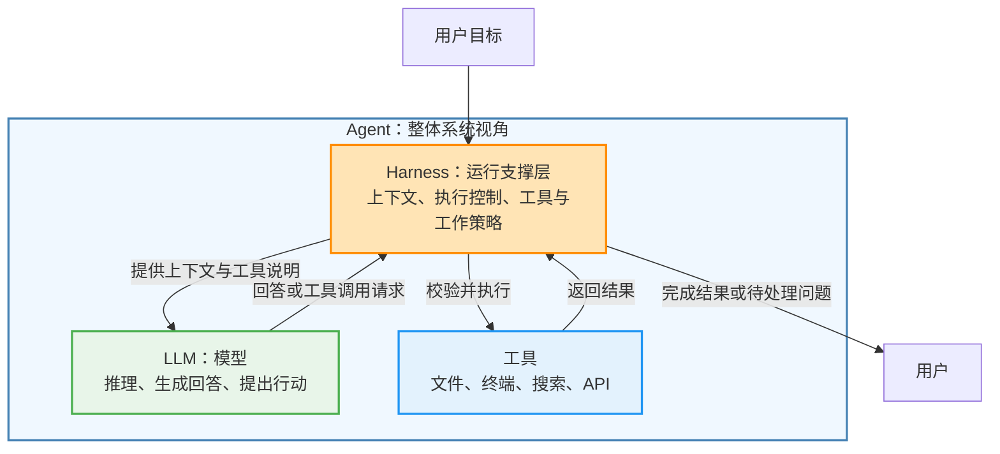
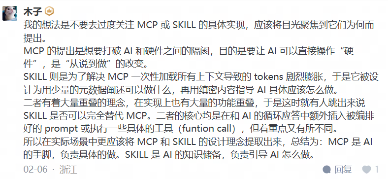

## 一、LLM(Large Language Model)
### 1. 什么是LLM
LLM(Large Language Model)，即大语言模型
主流自回归语言模型根据当前上下文，逐步预测下一个 **token（词元）** 来生成内容。Token 可能是一个字、词的一部分或标点等，并不等于一个汉字。每生成一个 token，它就成为后续生成的上下文的一部分。

### 2. 不是真正"无限"循环
模型一次能处理的上下文有长度限制，叫做**上下文窗口**，通常按 token 计量。超出限制时，应用可能截断、压缩历史或选择性保留内容，也可能直接报错，并不是模型自动只保留最近的若干字。生成还会受到输出长度上限、结束标记或应用停止条件的限制。
### 3. 预测是概率性的
模型每生成一步，都会根据前面的内容，为接下来可能出现的 token 分配概率，再按生成策略选出一个。

例如，模型已经生成了“我今天想吃”，接下来可能接“面”“饭”等内容。为了方便理解，假设“面”和“饭”各是一个 token，模型给“面”分配了 30% 的概率，给“饭”分配了 25%，其余概率分配给其他候选。这些数字只是示意，不是实际模型的测量结果。

这里的 **30% 表示生成时选择“面”这个候选 token 的概率，不是答案有 30% 的概率正确**。生成策略可能进一步调整这些概率；如果采用随机采样，就不一定每次都选中概率最高的候选。选出一个 token 后，模型再根据更新后的内容继续生成，因此，同一个问题也可能得到不同的回答。

### 4. LLM如何实现与用户的交流？
对话模型通过训练学习角色和对话结构，生成时仍然逐步预测 token。应用会把消息转换为模型支持的对话格式。
下面用标签演示这种结构；实际角色标记和结束标记因模型而异，并不一定是这些 XML 风格标签：

```
<user>你好，今天天气怎么样？</user>
<assistant>你好！我是AI助手，无法获取实时天气信息...</assistant>
<user>那LLM是什么？</user>
<assistant>LLM是大型语言模型的缩写...</assistant>
```

**工作流程**

你发送消息："LLM底层原理是什么"
系统构建输入：

```
<user>LLM底层原理是什么</user>
<assistant>
```

注意这里assistant标签是打开的，但内容是空的

模型开始预测：根据对话格式和已有内容，逐个 token 生成 assistant 的回答。
停止条件：生成模型约定的结束标记、达到输出上限，或由应用停止生成。这里的 `</assistant>` 只是示意。

**如何学会的？**
对话训练会使用对话示例，让模型学习：

- 看到 `<user>` 后面通常是问题

- 看到 `<assistant>` 后面应该生成回答
- 回答要针对前面的问题
- 要保持多轮对话的连贯性

本质上，"问答"也是预测的一部分，模型预测"在这个对话格式下，assistant角色接下来会说什么"。

这种生成机制说明了回答如何产生，但不能仅凭“预测下一个 token”就判断模型是否“真正理解”；实际使用中仍需检查回答的正确性。


## 二、Context（上下文）

**Context 是本次调用中实际提供给模型的信息**，通常包括：

- 系统指令（告诉模型它是谁，该怎么表现）
- 历史对话记录
- 当前这轮的问题
- 本次提供的文档、工具返回结果，以及模型支持的图片等输入

模型基于当前可用的 context 生成内容。保存在聊天界面或磁盘上的历史，不一定全部进入本次上下文；应用可能只提供部分记录或摘要。上下文更长不等于回答更准确，即使信息在窗口内，模型也可能遗漏或误用。


## 三、Prompt（提示词）

**Prompt（提示词）是提供给模型、用于引导生成的输入**，可以包含指令、示例和资料。日常交流中，它常指用户当前输入的要求；在一些技术语境中，也指完整的模型输入。

**简单例子**：

```
Prompt: "把这句话翻译成英文：我爱你"

模型输出: "I love you"
```

**复杂例子**：

```
你是一位资深的Python工程师。
请帮我写一个函数，功能是：
1. 读取CSV文件
2. 统计每列的平均值
3. 返回字典格式

要求：代码要有注释，处理异常情况。
```


## 四、Context和prompt的关系

- **按狭义用法**，prompt 指当前输入的要求，是 context 的一部分；context 还可能包含系统指令、历史记录和工具结果。
- **按广义用法**，prompt 可以指完整的模型输入，因此不能把“context 是 prompt 的超集”当作统一定义。

打个比方：

Prompt像是你现在问的问题

Context 像是这一轮实际翻开供模型阅读的记录与资料

在实际应用中，"Prompt工程"（Prompt Engineering）是指如何设计更好的提示词，让模型生成更准确、更符合需求的回答。


## 五、Agent 与 Harness

### 1. Agent：围绕目标选择行动

在本文讨论的 LLM 应用中，**Agent（智能体）通常指围绕目标，根据当前信息和行动结果，动态选择下一步行动并推进任务的系统**。

例如，用户要求修复一个报错，Agent 可以先读取代码，再决定修改哪里、运行什么检查，并根据检查结果继续处理。这里的重点是：模型能够在任务过程中选择后续行动和推进路径。

固定的工作流（Workflow）也可以调用模型和工具。例如，程序预先规定“让模型判断报错类型 → 按分类读取指定文档 → 生成回答”，其中虽然有模型参与判断，但主要路径仍由程序提前规定。因此，“有工具”“有循环”或“模型参与了一次决策”都不足以单独区分 Agent。

这是 [Anthropic 对工作流与 Agent 的架构区分](https://www.anthropic.com/engineering/building-effective-agents)。不同社区的边界并不完全一致，例如 [Hugging Face 将自主程度视为连续谱](https://huggingface.co/docs/smolagents/conceptual_guides/intro_agents)，而不是简单的“是或不是”。

### 2. Agent 也可以指角色或配置对象

阅读 SDK 文档时，Agent 不一定指整套应用。在 [OpenAI Agents SDK](https://openai.github.io/openai-agents-python/agents/) 中，`Agent` 用于配置模型、指令、工具等，实际执行循环由 `Runner` 驱动，会话历史可由 `Session` 管理。

| 用法 | Agent 指什么 | 例子 |
| --- | --- | --- |
| **系统语境** | 围绕目标选择行动并完成任务的整体系统 | 从收到报错到修改代码、检查结果的完整应用 |
| **SDK／角色语境** | 配置好的行动主体，或承担某项任务的角色 | 配置不同指令的代码编写 Agent、测试 Agent |

一个很直观的例子来自 Anthropic 的[长任务实验](https://www.anthropic.com/engineering/effective-harnesses-for-long-running-agents)：它将“初始化 Agent”和“编码 Agent”称为两个 Agent，但脚注明确说明，**两者只有初始用户提示不同，系统提示、工具和 harness 完全相同**。

因此，一个 harness 可以支持不同 Agent，它们也可以共用同一个模型。阅读具体资料时，要先判断 Agent 指的是完整系统，还是其中的角色或配置对象。

### 3. Harness：运行支撑层

**Agent harness 是支撑 Agent 运行的配套软件与策略。** 本文将它解释为“运行支撑层”，这不是行业统一的中文译名。

它组织模型调用和工具执行，也可能提供以下能力：

- **模型与工具接入**：构造模型请求、解析响应，提供并执行工具。
- **上下文管理**：组织指令、历史和工具结果，必要时压缩或筛选内容。
- **执行与权限控制**：驱动循环，处理错误，管理操作权限、超时和停止条件。
- **状态与交接**：保存进度和日志，让后续运行能够继续工作。
- **预置工作策略**：通过提示、规划工具、子智能体或检查流程，引导任务如何推进。

这些是常见职责，不是每个 harness 都必须具备的功能清单。比如 Anthropic 的长任务实验，还用到了初始化提示、功能清单、进度文件和测试办法，帮助后续 Agent 接着工作。

因此，harness 不只是“执行模型命令的代码”。**模型会选择行动，harness 提供的工具、上下文和提示策略也会影响它如何选择。** 最终能力取决于两者的配合与任务环境。

下面从“整体系统”的视角展示这种关系；它不是所有 SDK 的类结构，图中的工具也可以随 harness 一起提供。


```mermaid
graph TB
    U["用户目标"] --> H
    subgraph Agent["Agent：整体系统视角"]
        H["Harness：运行支撑层<br/>上下文、执行控制、工具与工作策略"]
        M["LLM：模型<br/>推理、生成回答、提出行动"]
        T["工具<br/>文件、终端、搜索、API"]
        H -->|提供上下文与工具说明| M
        M -->|回答或工具调用请求| H
        H -->|校验并执行| T
        T -->|返回结果| H
    end
    H -->|完成结果或待处理问题| R["用户"]
    style Agent fill:#f0f8ff,stroke:#4682b4,stroke-width:2px
    style H fill:#ffe4b5,stroke:#ff8c00,stroke-width:2px
    style M fill:#e8f5e9,stroke:#4caf50,stroke-width:2px
    style T fill:#e3f2fd,stroke:#2196f3,stroke-width:2px
```

### 4. 工具调用循环如何运行

裸模型的一次生成可以输出文本、代码或工具调用请求，但不会自行执行外部 API。以查询天气为例：

1. 模型根据问题提出天气工具调用请求。
2. 运行支撑层检查请求和权限，通过工具查询天气服务。
3. 工具结果被加入上下文，提供给下一轮模型调用。
4. 模型根据结果回答，或者提出下一步行动。

这种“模型生成 → 执行行动 → 回传结果 → 继续生成”的机制叫作 **agent loop（智能体循环）**。它是运行机制，不等于完整 harness，也不是 Agent 独有的结构；固定工作流同样可以包含循环。

下面是应用侧执行工具的简化伪代码，不是可直接运行的完整实现：

```text
上下文 = 用户目标 + 系统指令 + 可用工具说明

在步数、时间和费用限制内重复：
    模型响应 = 调用模型(上下文)
    将模型响应加入上下文
    如果模型返回最终回答：
        向用户返回回答并结束
    如果模型提出工具调用：
        校验工具名称、参数和权限
        执行获准的工具调用，记录成功或失败结果
        将工具结果加入上下文，供下一轮模型调用使用
    否则：
        按应用规则处理异常响应或结束任务

达到限制后停止，并说明尚未完成的工作
```

这个循环可以由应用代码、SDK 或远端托管服务实现，不一定需要自己手写。一次对外 API 请求也可能由服务端在内部完成多轮调用。**只在提示词里写“执行后继续”，不会让裸模型自行执行外部操作。** [Claude Agent SDK](https://platform.claude.com/docs/en/agent-sdk/overview) 和 [OpenAI Agents SDK 的 Runner](https://openai.github.io/openai-agents-python/running_agents/) 都提供了管理执行循环的能力。

### 5. Framework、Runtime 与 Harness 的区别

这几个词有不同侧重点，但并不互斥。以 [LangChain 官方的工程分类](https://docs.langchain.com/oss/python/concepts/products)为例：

| 概念 | 主要关注 | 该文档中的例子 |
| --- | --- | --- |
| **Framework（开发框架）** | 提供模型、工具、执行循环等可复用抽象和接口 | LangChain、OpenAI Agents SDK |
| **Runtime（运行时）** | 支撑实际执行、持久化、暂停与恢复等运行能力 | LangGraph |
| **Harness（运行支撑层）** | 提供预置工具、提示策略和上下文管理等配套能力 | Deep Agents、Claude Agent SDK |

LangChain 将 harness 描述为“有明确设计取向、配套能力齐全的框架”，因此 harness 可以是一种 framework；同一个项目也可能同时提供 framework 和 runtime。这是帮助理解职责的分类，不是所有厂商共同遵守的命名标准。

有些 harness 支持切换模型，但需要适配模型接口、工具调用格式和能力限制，不能假定任意模型都能直接替换。

### 6. 评测中的 Harness 是另一种语境

**Evaluation harness（评测运行框架）**负责组织测试任务、运行环境和评分，与支撑 Agent 完成任务的 agent harness 关注不同层面。例如，[Harbor](https://harborframework.com/docs) 是用于评测和优化 Agent 与模型的框架，它将任务、环境和被评测的 Agent 分别组织起来。

阅读 [Terminal-Bench](https://www.tbench.ai) 等任务评测时，应关注被评测系统采用的模型、harness、工具和配置，不能把整套系统的成绩简单视为模型单独的能力，也不要把评测平台与 Agent 自身的运行支撑混为一谈。

## 六、RAG

RAG是**Retrieval-Augmented Generation**（检索增强生成）的缩写，是一种结合了信息检索和文本生成的AI技术架构。

### 核心原理

RAG的工作流程通常包括三个步骤：

1. **检索（Retrieval）**：当用户提出问题时，系统先从外部知识库（如文档、数据库）中检索相关信息
2. **增强（Augmentation）**：将检索到的相关内容与用户的原始问题组合在一起
3. **生成（Generation）**：大语言模型基于检索到的上下文信息生成回答

### 主要优势

- **知识更新**：可以访问最新的外部数据，不受模型训练时间的限制
- **减少幻觉**：通过引用实际文档，降低模型编造信息的可能性
- **可追溯性**：答案可以追溯到具体的信息来源
- **专业领域应用**：能够整合企业内部文档、专业知识库等私有数据


## 七、MCP

官方文档： [MCP官方文档](https://modelcontextprotocol.io/docs/getting-started/intro)

> 通过MCP，像Claude或ChatGPT这样的AI应用可以连接**数据源**（如本地文件、数据库）、工具（如搜索引擎）和**工作流**（如专门提示），使它们能够访问关键信息并执行任务。
>
> 可以把MCP想象成AI应用的USB-C接口。正如USB-C提供了连接电子设备的标准化方式，MCP也提供了将AI应用与外部系统连接的标准化方式。

MCP（Model Context Protocol）是连接 AI 应用与外部系统的开放协议。MCP 服务器可以提供**工具（Tools）**、**资源（Resources）**和**提示模板（Prompts）**，不只是工具注册中心。

AI 应用通过 MCP 客户端发现服务器提供的能力。以工具为例，应用将相关工具描述提供给模型，模型提出调用请求，再由应用通过客户端执行并返回结果。是否一次加载全部工具描述、按需检索或延迟加载，取决于客户端实现，不是 MCP 协议统一规定的行为。


## 八、SKILL

官方文档： [skill官方文档](https://agentskills.io/home)

从本质上讲，一个Skill就是一个包含 `SKILL.md` 文件的文件夹。该文件包含元数据(至少包括 `name` 和 `description`)，以及告诉智能体如何执行特定任务的说明。技能还可以捆绑脚本、模板和参考资料。

```
my-skill/
├── SKILL.md          # 必需:说明 + 元数据
├── scripts/          # 可选:可执行代码
├── references/       # 可选:文档
└── assets/           # 可选:模板、资源
```

### 技能如何工作

技能使用**渐进式披露**来高效管理上下文:

1. **发现**: 启动时，Agent仅加载每个可用技能的元数据(名称和描述)，刚好足够知道技能的用处、何时使用技能
2. **激活**: 当任务与技能描述匹配时,Agent将完整的 `SKILL.md` 载入上下文。
3. **执行**: Agent遵循说明，根据需要选择性地加载引用的文件或执行捆绑的代码。

这种方法可以减少未使用技能占用的上下文；实际速度和 token 消耗仍取决于加载的内容、脚本输出和执行过程。

### SKILL.md 文件

每个技能都以包含 YAML 前置元数据和 Markdown 说明的 `SKILL.md` 文件开始:

````markdown
---
name: weather-tool
description: 获取指定城市的实时天气信息。当用户询问“今天天气如何”或需要气象数据时使用此技能。
---

# Weather Tool Usage

这个技能通过调用本地 Python 脚本来获取天气数据。

## 使用步骤

1.  首先，确定用户查询的城市名称。
2.  在技能目录中运行以下命令获取数据（需随技能提供该脚本及其依赖）：

    ```bash
    python3 scripts/fetch_weather.py --city "{city_name}"
    ```

3.  脚本将返回 JSON 格式的数据，请将其转换为自然语言回复用户。
````

`SKILL.md` 顶部需要以下前置元数据:

- `name`: 简短标识符
- `description`: 该技能的作用 + 何时使用此技能


## 九、MCP对比SKILL

> Anthropic 官方解释：
>
> MCP connects Claude to external services and data sources. Skills provide procedural knowledge—instructions for how to complete specific tasks or workflows.
>
> 
>
> **MCP（Model Context Protocol）**负责**连接**功能，让 Agent 能够访问外部工具、数据库、API 等
>
> **Skills（技能）**负责提供**方法论**，教 Agent 如何正确完成特定类型的任务


### 定义对比

|          | Skills                                | MCP                                 |
| -------- | ------------------------------------- | ----------------------------------- |
| **本质** | 程序性知识                            | 工具连接性                          |
| **目的** | 教导 Agent 如何执行特定任务或遵循标准 | 赋予 Agent 访问外部数据或系统的能力 |
| **类比** | 员工手册、SOP、操作指南               | 员工的电脑、数据库权限、电话线      |


### 运行机制与性能差异

|                  | Skills                                                       | MCP                                            |
| ---------------- | ------------------------------------------------------------ | ---------------------------------------------- |
| **加载逻辑**     | 通常先提供元数据，选用技能时再加载说明及所需资料 | 由客户端决定，可预先加载，也可筛选或按需加载工具描述等内容 |
| **Token 消耗量** | 取决于已加载的说明、参考资料及执行结果 | 取决于已加载的工具描述、资源及调用结果 |


### 什么时候用 MCP，什么时候用 Skill

#### 用 MCP 的场景

- **「需要访问外部数据」**：数据库查询、API 调用、文件系统访问
- **「需要操作外部系统」**：创建 GitHub Issue、发送 Slack 消息、执行 SQL

#### 用 Skill 的场景

- **「重复性的工作流程」**：代码审查、文档生成、数据分析
- **「公司内部规范」**：代码风格、提交规范、文档格式
- **「需要多步骤的复杂任务」**：需要详细指导的专业任务
- **「团队共享的最佳实践」**：标准化的操作流程
- **「Token 敏感场景」**：需要大量知识但不想一直占用上下文


#### 如何选择

> **MCP connects AI to data; Skills teach AI what to do with that data.**
>
> MCP 让 AI 能”碰到”数据，Skill 教 AI 怎么”处理”数据。

MCP 和 Skill 可以互补，是否采用取决于任务和应用架构。Agent 也可以直接调用 API、使用内置工具，或通过普通项目文档获得操作指引，并不必须同时使用两者。Skill 中的脚本也能访问外部系统；MCP 的价值在于标准化连接方式，而不是独占外部访问能力。

引用网友评论：


