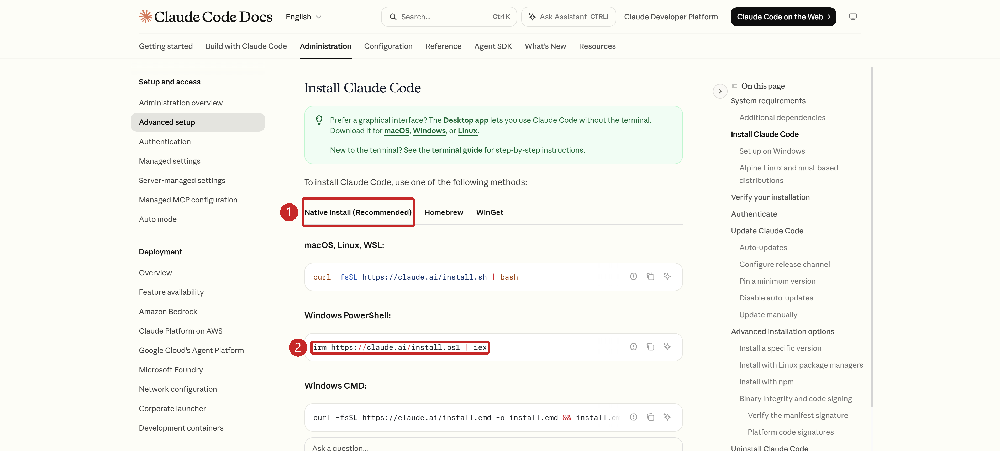

<span id="claude-code-cli简介"></span>
<span id="claude-code-cli部署以及使用教程"></span>
<span id="环境需求"></span>
<span id="二vscode下载安装"></span>
<span id="三安装nodejs"></span>
<span id="四安装claude-code-cli"></span>
<span id="五api令牌获取配置"></span>
<span id="六启动claude-code"></span>
<span id="环境与安装方式"></span>

Claude Code CLI 在终端中使用，支持 Windows 10 1809+。图形界面可选[VS Code 扩展](<./Claude Code for VSCode 扩展安装以及配置教程.md>)。

<span id="安装" className="legacy-anchor" />

## 安装 {#installation}

1. 在 Windows 开始菜单搜索并打开 **PowerShell**。
2. 粘贴下面的命令，按回车安装：

```powershell
winget install Anthropic.ClaudeCode
```

3. 安装结束后重新打开 PowerShell，执行：

```powershell
claude --version
```

显示版本号即安装成功；找不到 `claude` 时，确认安装命令执行成功后重开终端。后续通过 WinGet 更新。

若找不到 `winget`，使用[官方安装页](https://code.claude.com/docs/en/setup)的 Windows 原生安装器。

[](../img/claude-install-page.png "点击查看原图")

<span id="下一步" className="legacy-anchor" />

## 下一步 {#next-steps}

前往 [Codex/Claude 模型配置](<../CC Switch安装与使用.md>)，配置模型服务并验证连接。

来源：[官方安装页](https://code.claude.com/docs/en/setup)。
