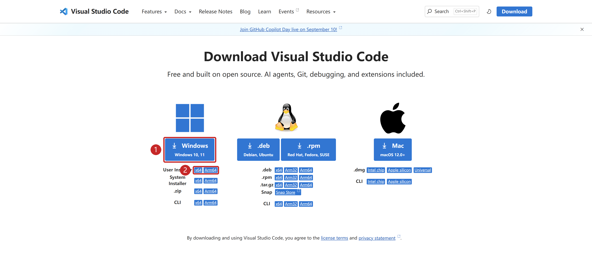
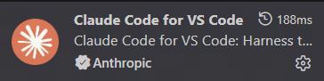
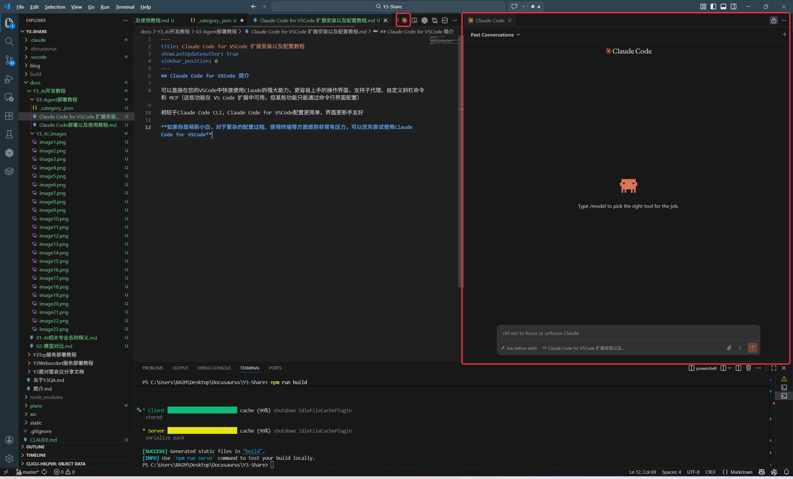

在 VS Code 面板中使用 Claude Code，无需单独安装 CLI。Y3 项目环境见[准备 Y3 项目](../../EnvironmentSetup.md)配置。

## 1. 安装扩展 {#install-extension}

1. 安装或更新 [VS Code](https://code.visualstudio.com/download)，按 `Ctrl+Shift+X` 打开扩展面板。
2. 搜索 `Claude Code`，核对发布者 **Anthropic**、标识 `anthropic.claude-code`。
3. 点击“安装”，按提示重新加载窗口。

## 2. 打开扩展面板 {#open-extension}

1. 用 VS Code 打开自己的工程和一个文件。
2. 点击编辑器右上角的 Claude 图标；找不到时，按 `Ctrl+Shift+P` 搜索 Claude Code 入口。

能打开面板即安装成功。在终端执行 `claude` 或 `claude mcp add` 需安装[独立 CLI](<./Claude Code CLI部署教程.md>)。

## 下一步 {#next-steps}

前往 [Codex/Claude 模型配置](<../CC Switch安装与使用.md>)，配置模型服务并验证连接。

来源：[官方 VS Code 教程](https://code.claude.com/docs/en/vs-code)，核对于 2026-09-08；安装时以扩展的 VS Code 兼容提示为准。
