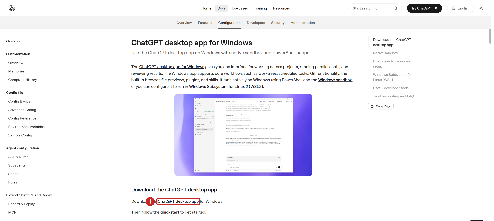
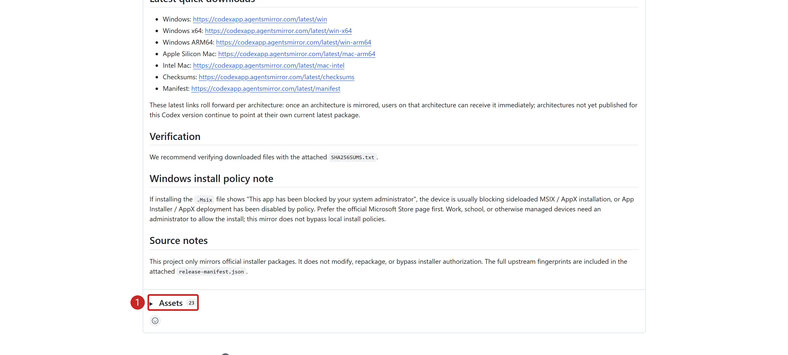
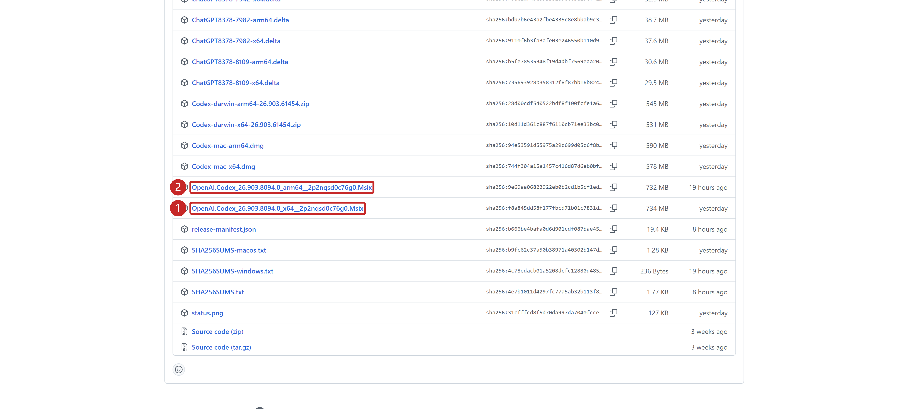
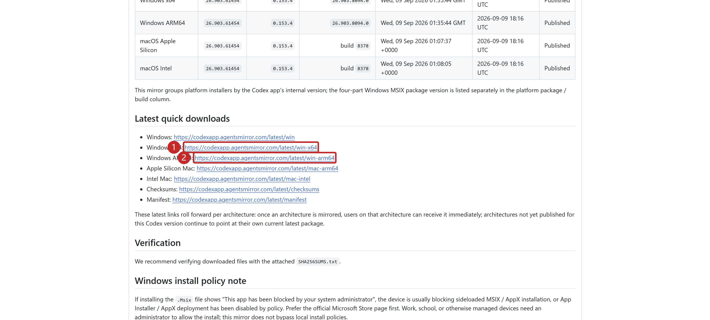

Codex App 是作者首推的客户端。以下为 Windows 安装步骤。

<span id="官方安装首选" className="legacy-anchor" />

## 官方安装（首选） {#official-installation}

从[官方 Windows 桌面应用页面](https://developers.openai.com/codex/windows/windows-app)下载安装，或在 PowerShell 中执行：

```powershell
winget install --id 9PLM9XGG6VKS -s msstore
```

推荐 Windows 11；近期更新的 Windows 10 为尽力支持。找不到 `winget` 时，使用上面的官方下载入口。官方文档将桌面入口称为 **ChatGPT desktop app**，应用内提供 Codex。

[](../img/codex-official-download.png "点击查看原图")

<span id="镜像安装官方渠道失败时" className="legacy-anchor" />

## 镜像安装（官方渠道失败时） {#mirror-installation}

若 Microsoft Store 或 `winget` 安装失败（如 Windows 更新服务被禁用），可使用 [Wangnov/codex-app-mirror](https://github.com/Wangnov/codex-app-mirror) 的独立安装包。该第三方项目声明安装包来自官方，未经修改或重新打包。

[](../img/github-assets-toggle.png "点击查看原图")

1. 打开[最新版本下载页](https://github.com/Wangnov/codex-app-mirror/releases/latest)，展开 **Assets**（下载文件列表）。
2. Intel / AMD 电脑下载名称含 `x64` 的 `.Msix` 包，ARM 电脑下载 `arm64` 包（若提供）。不确定架构时，查看 **设置 > 系统 > 关于 > 系统类型**。`Source code` 是源码，不是安装包。
3. GitHub 下载较慢时，可用镜像直链：[Windows x64](https://codexapp.agentsmirror.com/latest/win-x64) / [Windows ARM64](https://codexapp.agentsmirror.com/latest/win-arm64)。
4. 双击 `.Msix` 文件，在“应用安装程序”中点击 **安装**。

[](../img/codex-mirror-assets.png "点击查看原图")

[](../img/codex-mirror-links.png "点击查看原图")

双击无法安装时，在 PowerShell 中执行（替换为实际文件路径，保留引号）：

```powershell
Add-AppxPackage -Path "C:\Users\你的用户名\Downloads\实际下载的文件名.Msix"
```

镜像安装仍依赖本机的 MSIX 支持，不能绕过系统限制。若提示依赖缺失、部署服务被禁用或管理员阻止，请按[项目安装问题说明](https://github.com/Wangnov/codex-app-mirror#readme)处理。

从开始菜单打开应用，能正常显示界面即安装成功。

<span id="下一步" className="legacy-anchor" />

## 下一步 {#next-steps}

前往 [Codex/Claude 模型配置](<../CC Switch安装与使用.md>)，配置模型服务并验证连接。

来源：[官方桌面应用入门](https://developers.openai.com/codex/app)、[Windows 桌面应用](https://developers.openai.com/codex/windows/windows-app)、[Windows 支持说明](https://developers.openai.com/codex/windows)，核对于 2026-09-09。
