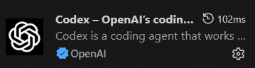
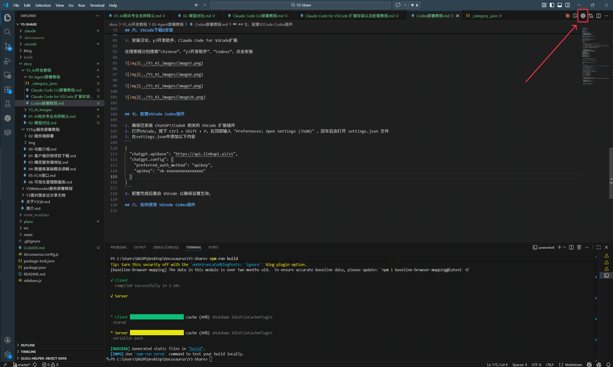

在 VS Code 侧栏中使用 Codex。Y3 项目的 Git、Python 和 Node.js 环境见[准备 Y3 项目](../../EnvironmentSetup.md)。

## 安装与打开 {#installation}

1. 安装或更新 [VS Code](https://code.visualstudio.com/download)，在 VS Code 按 `Ctrl+Shift+X`，搜索 `Codex`。
2. 核对发布者 **OpenAI**、标识 `openai.chatgpt`，点击“安装”。若提示版本不兼容，先更新 VS Code。
3. 从侧栏打开 Codex，或按 `Ctrl+Shift+P` 搜索 `Codex: Open Codex Sidebar`。

能打开 Codex 侧栏即安装成功。

## 下一步 {#next-steps}

前往 [Codex/Claude 模型配置](<../CC Switch安装与使用.md>)，配置模型服务并验证连接。

来源：[官方 IDE 文档](https://developers.openai.com/codex/ide)。
