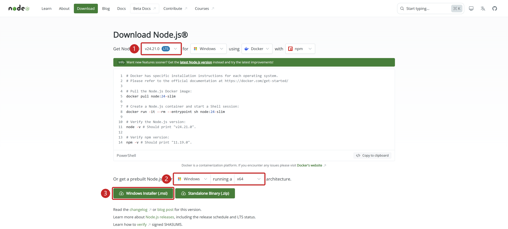

<span id="系统要求"></span>
<span id="一安装-nodejs"></span>
<span id="方法1使用官方安装包推荐"></span>
<span id="方法2"></span>
<span id="二安装-codex-cli"></span>
<span id="三获取-api-令牌"></span>
<span id="四配置codex"></span>
<span id="五启动-codex"></span>
<span id="六vscode下载安装"></span>
<span id="七配置vscode-codex插件"></span>
<span id="八如何使用-vscode-codex插件"></span>
<span id="平台与前提"></span>
<span id="常见问题"></span>

Codex CLI 在终端中使用；图形界面可选 [Codex App](<./Codex App安装教程.md>)或 [Codex VS Code 扩展](<./Codex VSCode扩展安装教程.md>)。推荐 Windows 11；近期更新的 Windows 10 为尽力支持。

## 安装

先从 [Node.js 官网](https://nodejs.org/)安装当前 LTS，再通过 npm 安装 CLI。其他方式见[官方 CLI 文档](https://learn.chatgpt.com/docs/codex/cli)。

[](../img/node-download.png "点击查看原图")

在开始菜单搜索 PowerShell 并打开，依次执行：

```powershell
node --version
npm.cmd --version
npm.cmd install -g @openai/codex
codex --version
```

显示 Codex 版本号即安装成功；找不到 `codex` 时，确认安装命令执行成功后重开终端。

VS Code 扩展不包含独立 CLI，终端使用需单独安装。

## 下一步

前往 [Codex/Claude 模型配置](<../CC Switch安装与使用.md>)，配置模型服务并验证连接。

来源：[官方 CLI 文档](https://learn.chatgpt.com/docs/codex/cli)、[Windows 支持说明](https://developers.openai.com/codex/windows)。
