安装 Agent 后，用 **CC Switch** 管理模型服务；登录、对话和开发仍在 Agent 中完成。本教程默认使用第三方 API，也可选择[官方账号登录](#official)。配置通过验证后再接入 Y3 MCP。

:::tip 同一 Agent 的客户端共用配置

同一电脑、系统用户和运行环境使用默认配置目录时，**Codex App、CLI、VS Code 扩展共用 Codex 配置；Claude Code CLI 和 VS Code 扩展共用 Claude 配置**。两类 Agent 分别配置；WSL、远程环境或自定义目录不会自动共用本机配置。

:::

## 1. 安装 CC Switch

Windows 版要求 **Windows 10 及以上**。

1. 打开 [CC Switch 最新发布页](https://github.com/farion1231/cc-switch/releases/latest)，展开 **Assets**。
2. 下载 `CC-Switch-v版本号-Windows.msi`，双击安装。`Source code` 是源码，不是安装包。
3. 从开始菜单启动 CC Switch；需要中文时，在齿轮设置中切换。

也可下载 `CC-Switch-v版本号-Windows-Portable.zip`，完整解压到固定目录后启动，不要在压缩包内运行。

[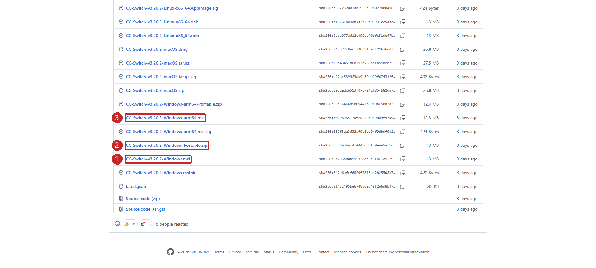](./img/cc-switch-assets.png "点击查看原图")

## 2. 配置前准备 {#prepare}

已有可用配置时，首次启动先按版本提示导入现有 CLI 配置，保留可切回的供应商。新用户直接添加。

使用 API 需准备同一家服务商的三项信息，并确认余额或额度可用：

| 参数 | 含义 |
| --- | --- |
| Base URL | API 接口地址，不是官网或控制台地址；是否含 `/v1` 以服务商接入说明为准 |
| API Key | 在该服务商平台创建的密钥 |
| 模型 ID | 该服务商支持的模型名称 |

API 独立计费，聊天订阅或网页版聊天可用不代表 API 有余额。**密钥及含密钥的导出文件不要放入聊天、文档或项目仓库。**

CC Switch 的基本操作是：**选择应用 → `+` 添加供应商 → 填写参数 → 启用**。配置由软件自动写入，无需编辑 JSON；仅添加不会生效。

## 3. DeepSeek V4 Flash 图文配置 {#deepseek}

本例使用 DeepSeek 官方 API，模型 ID 为 **`deepseek-v4-flash`**（[模型详情](https://api-docs.deepseek.com/zh-cn/quick_start/pricing)）。Claude Code 与 Codex 任选其一；都用时分别添加供应商，可共用密钥，请求地址不同。

[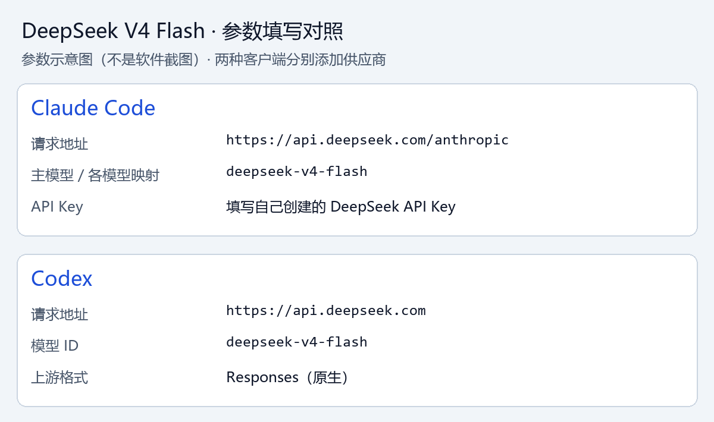](./img/deepseek-flash-values.png "点击查看原图")

### 第一步：在 DeepSeek 开放平台创建密钥

**1. 登录平台。** 打开 [DeepSeek 开放平台](https://platform.deepseek.com/)注册或登录；从 [DeepSeek 官网](https://www.deepseek.com/en/)进入时，点击 **Access API**。

[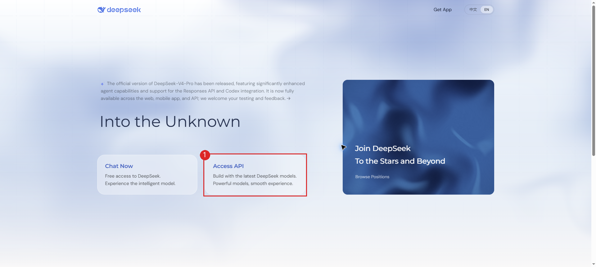](./img/deepseek-platform-landing.png "点击查看原图")

**2. 检查余额。** 左侧选择 **Usage（用量）**，查看 **Topped-up balance（充值余额）**，余额不足时按需点击 **Top up（充值）**。

[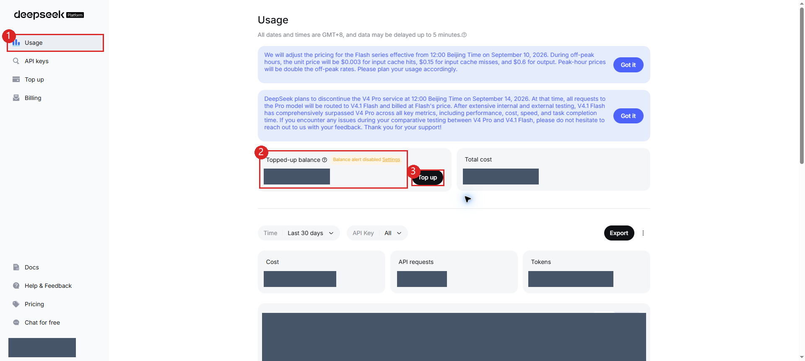](./img/deepseek-platform-usage.png "点击查看原图")

**3. 打开创建表单。** 选择左侧 [API keys](https://platform.deepseek.com/api_keys)，点击 **Create new API key（创建新密钥）**。

[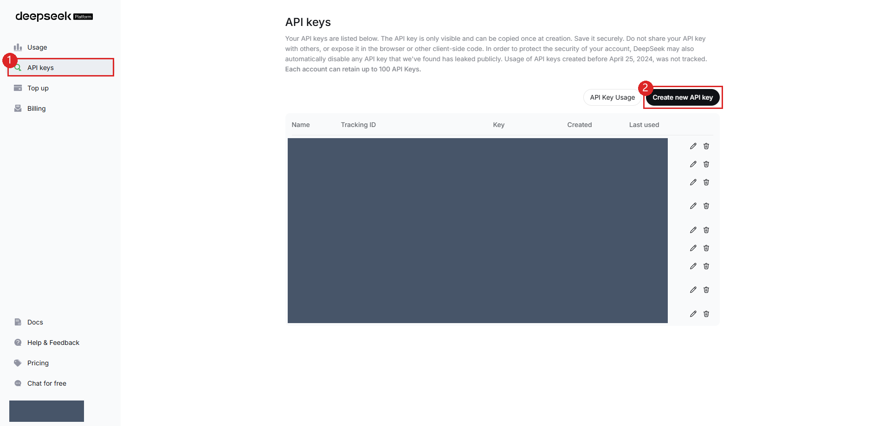](./img/deepseek-platform-keys.png "点击查看原图")

**4. 创建并保存。** 名称填 `Y3-Agent`，点击 **Create API key**，立即复制完整密钥并妥善保存，稍后填入 CC Switch。完整密钥只显示一次，列表中的隐藏值不能代替它。

[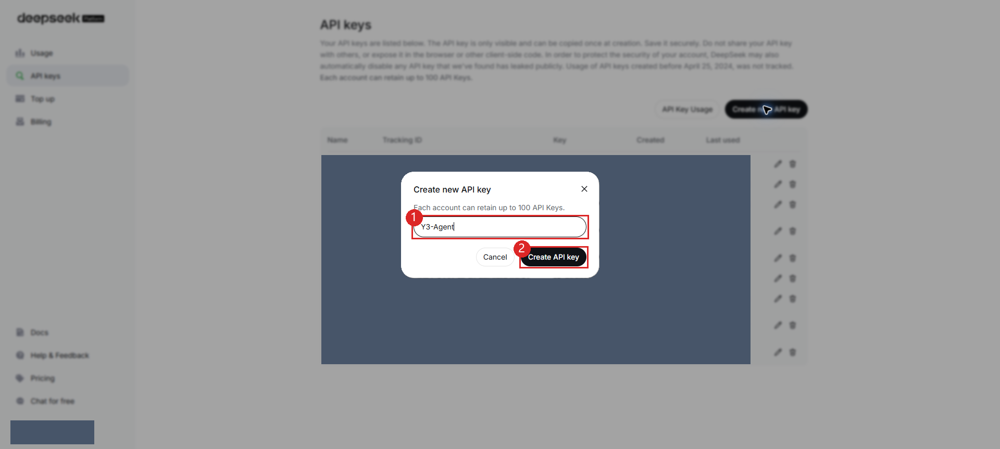](./img/deepseek-platform-create.png "点击查看原图")

### 第二步 A：配置 Claude Code

**1. 打开添加页面。** 点击顶部带终端小标记的 **Claude Code 图标**（①），再点击橙色 **`+`**（②）。注意区分相邻的 Claude Desktop。

[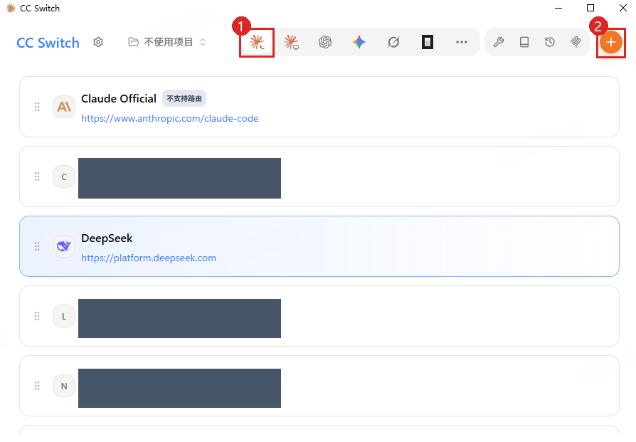](./img/claude-deepseek-entry.png "点击查看原图")

**2. 选择预设。** 确认选中 **Claude 供应商**（①），点击 **DeepSeek**（②，选中后变蓝），向下滚动到表单。

[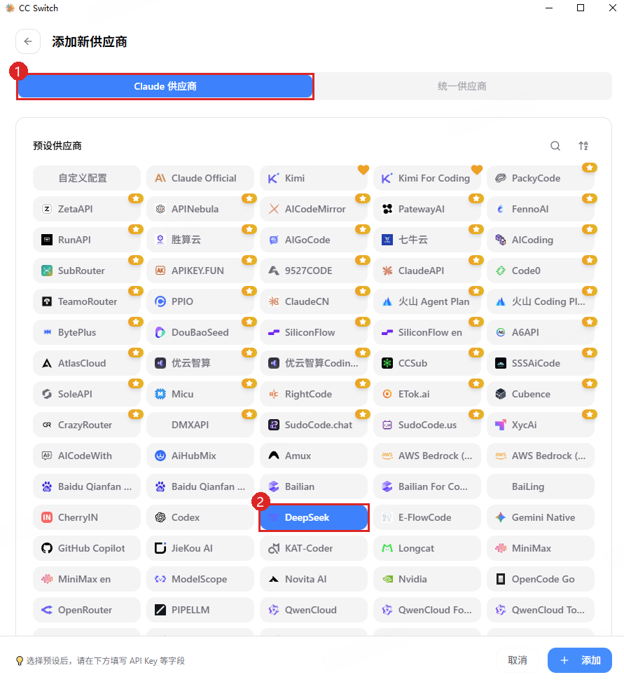](./img/claude-deepseek-preset.png "点击查看原图")

**3. 填密钥，核对接口。** 名称可保留 `DeepSeek`，或自定为 `DeepSeek Flash - Claude`。

| 图中位置 | 设置 |
| --- | --- |
| API Key（①） | 粘贴自己的 DeepSeek 密钥 |
| 请求地址（②） | 保留 `https://api.deepseek.com/anthropic`；“完整 URL”关闭，不追加 `/v1/messages` |
| 高级选项 → 上游格式（③） | 保留 `Anthropic Messages（原生）`，认证字段保留 `ANTHROPIC_AUTH_TOKEN（默认）` |

[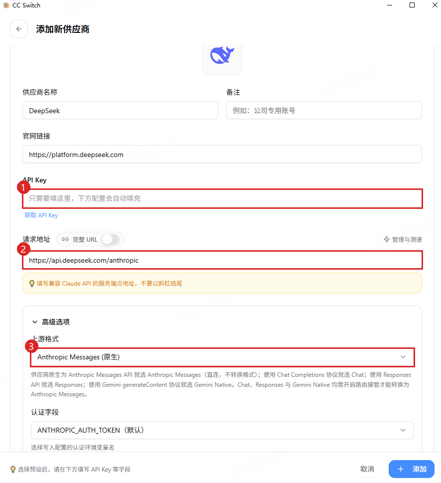](./img/claude-deepseek-fields.png "点击查看原图")

**4. 改用 Flash。** 向下滚动到模型角色表。下图是修改前的 Pro 预设，在界面中调整：

| 字段 | 设置 |
| --- | --- |
| 各角色的“实际请求模型”（①） | Sonnet、Opus、Fable 改为 `deepseek-v4-flash`；Haiku 保持不变；Subagent 也填 `deepseek-v4-flash`。对应显示名称可同步修改 |
| 默认兜底模型（②） | 改为 `deepseek-v4-flash` |

[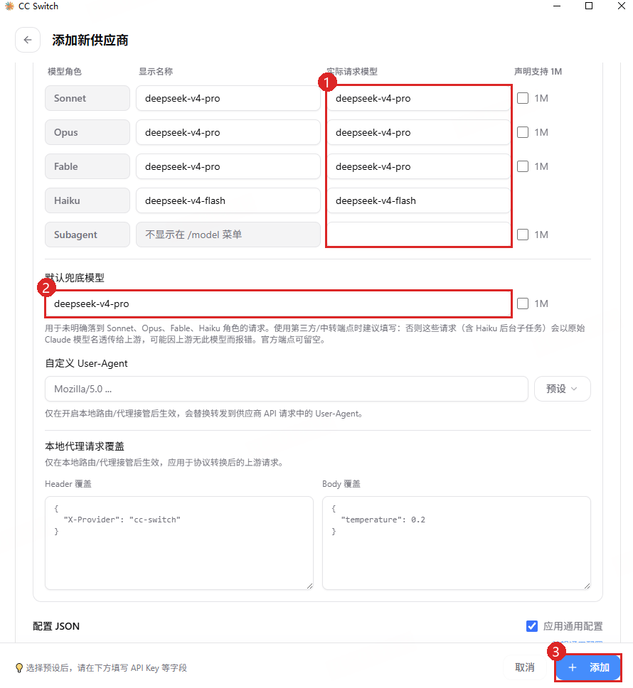](./img/claude-deepseek-models.png "点击查看原图")

**5. 添加并启用。** 点击右下角 **添加**（③），回到 Claude 列表，在刚添加的供应商卡片上点击 **启用**。按钮未显示时，将鼠标移到卡片上；随后按[验证步骤](#verify)测试。

### 第二步 B：配置 Codex

先更新 CC Switch 和 Codex。CLI 执行 `codex --version`，应为 **0.144.0 或更新**，以支持预设的模型目录。

**1. 打开添加页面。** 点击顶部 **Codex 图标**（①，OpenAI 标志），再点击橙色 **`+`**（②）。窄窗口可能只显示图标。

[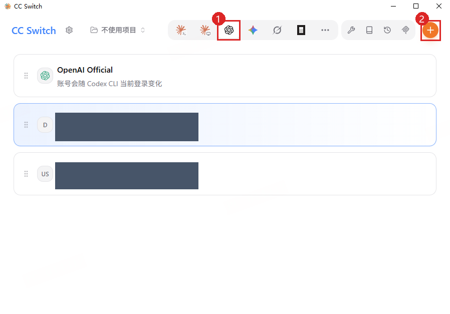](./img/codex-deepseek-entry.png "点击查看原图")

**2. 选择预设。** 确认选中 **Codex 供应商**（①），点击 **DeepSeek**（②）；找不到时可向下查找或使用列表右上角的搜索入口。

[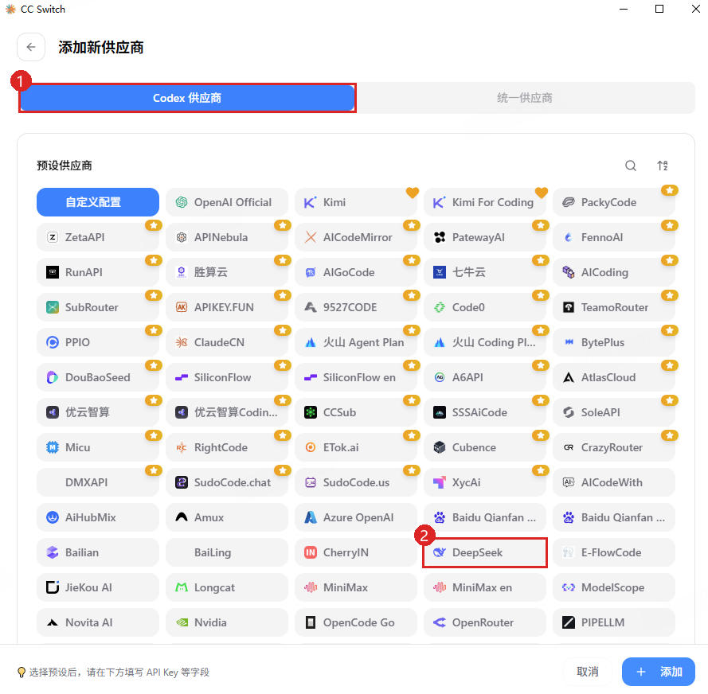](./img/codex-deepseek-preset.png "点击查看原图")

**3. 填密钥，核对模型。** 向下滚动到表单，名称可保留 `DeepSeek`，或自定为 `DeepSeek Flash - Codex`。

| 图中位置 | 设置 |
| --- | --- |
| API Key（①） | 粘贴自己的 DeepSeek 密钥 |
| API 请求地址（②） | 保留 `https://api.deepseek.com`；“完整 URL”关闭，不追加 `/responses` 或 `/anthropic` |
| 默认模型（③） | `deepseek-v4-flash` |

“官网链接”是网站入口，连接模型使用的是 **API 请求地址**。

[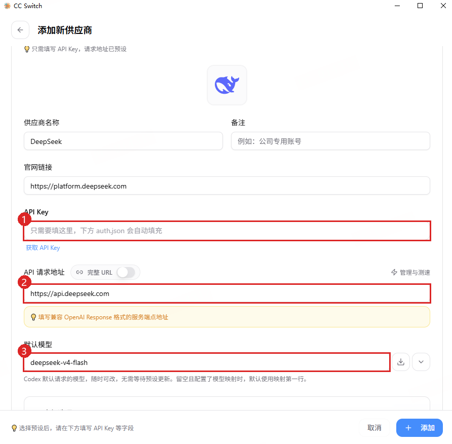](./img/codex-deepseek-fields.png "点击查看原图")

**4. 核对高级选项。** 向下滚动并展开 **高级选项**，上游格式保持 **Responses（原生）**（①），模型映射保留预设（②）。`low, high, max` 是可选思考等级；Pro 是另一个可选模型，默认模型选 Flash 即可，无需删除 Pro。

[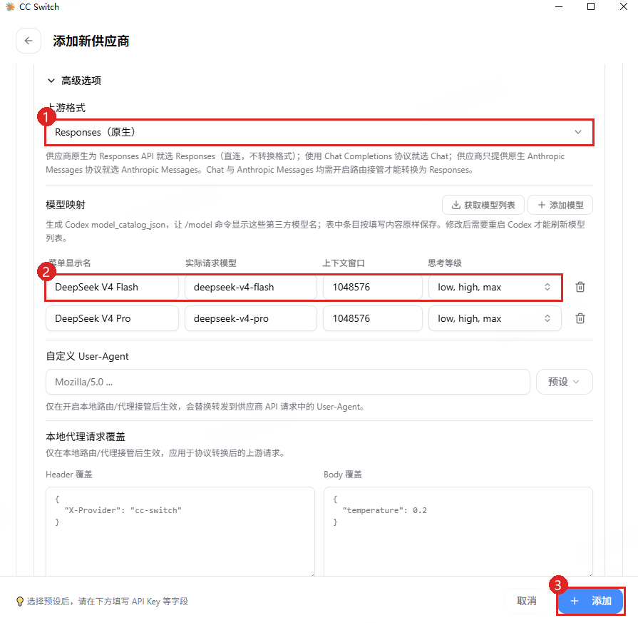](./img/codex-deepseek-advanced.png "点击查看原图")

**5. 添加并启用。** 点击右下角 **添加**（③），回到 Codex 列表，在新供应商卡片上点击 **启用**（按钮未显示时移入鼠标），再按[验证步骤](#verify)测试。

此预设原生直连，无需本地路由或 Codex 接管。已有旧路由配置时，先关闭 Codex 接管再启用新供应商；升级软件不会自动迁移旧配置。异常时参阅 [DeepSeek 官方 Codex 接入说明](https://api-docs.deepseek.com/zh-cn/quick_start/agent_integrations/codex)。

### 第三步：重启客户端，完成第一次对话 {#verify}

1. 确认 CC Switch 对应应用下，目标供应商为当前启用项。
2. **重启并新建会话**：CLI 重开终端后运行 `claude` 或 `codex`；App 完全退出后重开；VS Code 扩展重新加载窗口。Claude Code 支持热重载，首次配置仍建议重开验证。
3. 核对模型：Claude Code CLI 可用 `/model` 查看或选择 `deepseek-v4-flash`；Codex CLI 启动信息应显示 `model: deepseek-v4-flash`。显示“自定义”时，在 CC Switch 核对配置。
4. 发送下方文本，确认正常回复且无认证、模型或连接错误；再到服务商平台核对用量及可用的请求明细。

   > 请只回复“连接正常”，不要读取文件或执行命令。

**通过标准：供应商已启用、模型配置正确、新会话正常回复。** 不要靠模型自报身份判断；DeepSeek 的 Anthropic 接口会将不支持的模型名映射为 Flash，错误名称也可能得到回复。本例使用文本型号，先用文本验证。

通过后，继续[连接 Y3 配套MCP](./MCP接入.md)，再按[用外部 Agent 开发 Y3](../04-如何使用AI开发Y3项目.md)检查工程并开始开发。

## 4. 其他服务商与官方账号 {#official}

### Codex

- **其他 API 服务商**：选择 Codex → 添加供应商，优先选预设，没有时选自定义；按服务商说明填写名称、密钥、接口地址和模型。直连需兼容 Responses API；要求本地路由的预设需按 [CC Switch 供应商说明](https://github.com/farion1231/cc-switch/blob/main/docs/user-manual/zh/2-providers/2.1-add.md)开启路由服务和 Codex 接管，并保持运行。
- **官方账号（可选）**：选择 OpenAI 官方 / 官方登录预设，保存并启用。重开 Codex 后登录 ChatGPT，CLI 可执行 `codex login`；已登录时可先验证，认证异常再按官方说明退出重登。

### Claude Code

- **其他 API 服务商**：选择 Claude → 添加供应商，选预设或自定义；填写名称、密钥、Claude Code / Anthropic 兼容接口地址，以及服务商要求的模型映射。
- **官方账号（可选）**：选择 Claude Official / Claude 官方预设并启用，在 Claude Code CLI 或 VS Code 扩展中按浏览器引导登录。

两种方式都需**添加并启用**，随后按[验证步骤](#verify)重启客户端并测试；使用其他模型时核对所选模型 ID。

## 5. 日常修改与切换

统一在 CC Switch 中编辑供应商、保存并启用。切换时先选择 Codex 或 Claude，再启用目标卡片；也可右键 Windows 托盘中的 CC Switch，从对应应用子菜单切换。

Codex 切换后需重启。切回官方账号时启用官方预设并检查登录状态，认证异常再重登。

## 常见问题

| 现象 | 处理 |
| --- | --- |
| 仍使用原配置 | 确认在对应应用下启用，再按[验证步骤](#verify)重启 |
| 401 / 403、密钥无效 | 核对完整密钥、账号权限及密钥所属服务商，检查多余空格 |
| 429、额度不足 | 检查 API 余额、套餐额度和请求频率限制 |
| 404、协议错误或模型不存在 | 核对路径、接口协议及模型 ID；Codex 的 DeepSeek 预设应为 Responses（原生），检查是否误用 `/anthropic` 或仍开启旧接管 |
| Claude 仍使用 Pro | 在 CC Switch 模型角色表中将 Pro 改为 Flash，保存、启用并新建会话 |
| 模型不在列表中 | 更新客户端和 CC Switch，重新添加预设；Codex 按[官方说明](https://api-docs.deepseek.com/zh-cn/quick_start/agent_integrations/codex)检查模型目录 |
| 仍连到旧服务 | 检查旧环境变量是否覆盖配置，参阅[环境变量冲突说明](https://github.com/farion1231/cc-switch/blob/main/docs/user-manual/zh/5-faq/5.4-env-conflict.md) |
| 启用时提示写入错误 | 关闭客户端重试，检查 CC Switch 配置目录及写入权限 |
| 能对话但不能理解图片 | `deepseek-v4-flash` 是文本型号；图片需另选官方支持的视觉型号 |

Windows 默认配置在用户目录下：Claude 为 `.claude/settings.json`，Codex 为 `.codex/auth.json` 和 `.codex/config.toml`，日常由 CC Switch 管理。

## 来源与截图

CC Switch 通用说明核对于 **2026-09-09**：[中文 README](https://github.com/farion1231/cc-switch/blob/main/README_ZH.md)、[快速上手](https://github.com/farion1231/cc-switch/blob/main/docs/user-manual/zh/1-getting-started/1.4-quickstart.md)、[供应商切换](https://github.com/farion1231/cc-switch/blob/main/docs/user-manual/zh/2-providers/2.2-switch.md)、[配置文件](https://github.com/farion1231/cc-switch/blob/main/docs/user-manual/zh/5-faq/5.1-config-files.md)。DeepSeek 参数核对于 **2026-09-10**：[Claude Code 接入](https://api-docs.deepseek.com/zh-cn/quick_start/agent_integrations/claude_code)、[Responses API](https://api-docs.deepseek.com/zh-cn/guides/responses_api)、[CC Switch v3.20.2 Codex 预设](https://github.com/farion1231/cc-switch/blob/v3.20.2/src/config/codexProviderPresets.ts)。未进行付费 API 实测。

下载列表于 2026-09-09 在 Chrome 拍摄，来源为 [v3.20.2 发布页](https://github.com/farion1231/cc-switch/releases/tag/v3.20.2)；DeepSeek 平台四图于 2026-09-10 在 Chrome 拍摄；CC Switch 八图由用户于同日提供，为 Windows 实拍。实拍图已标注并遮盖敏感信息，保留完整页面或窗口及原始尺寸（下载图经过裁剪）；参数对照图为示意图。点击图片可查看原图。
