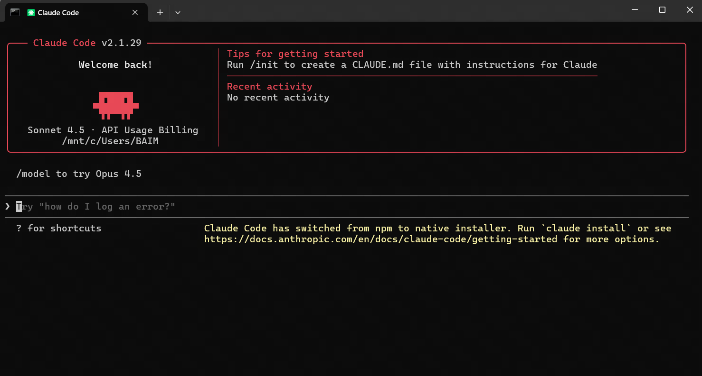
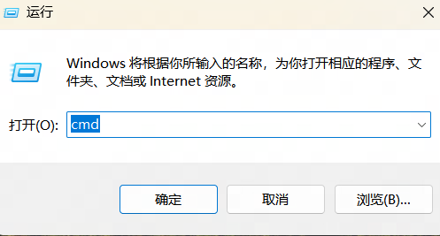
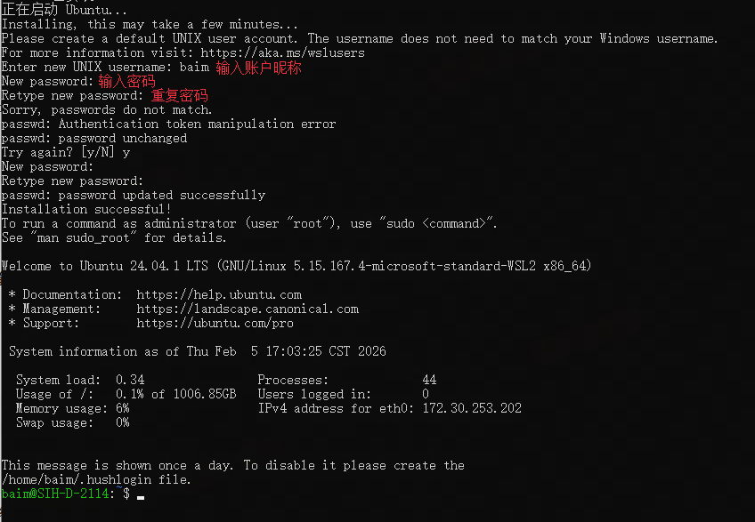
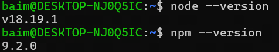
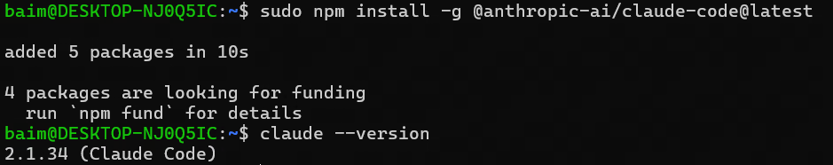
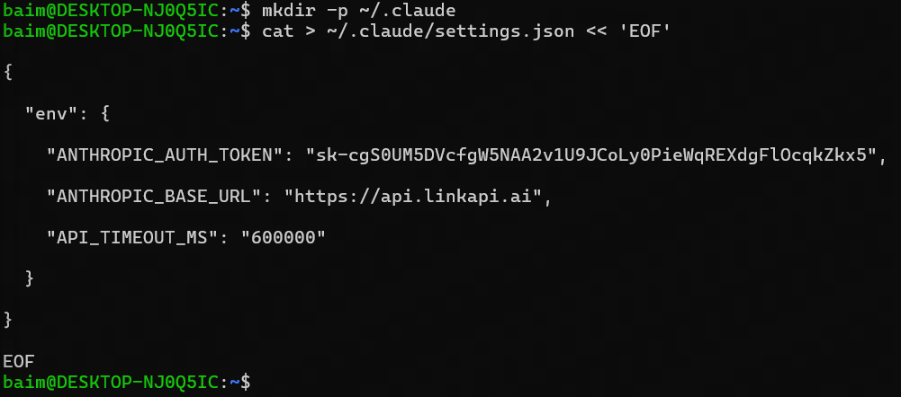
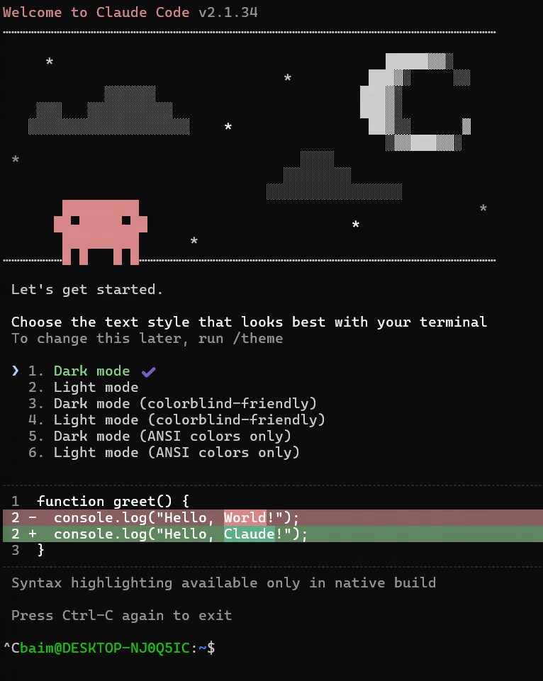
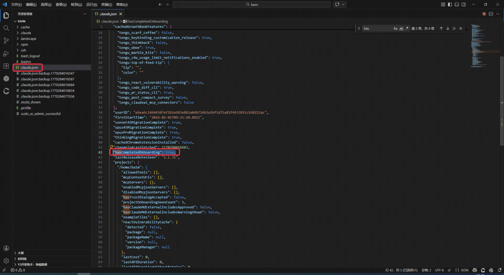
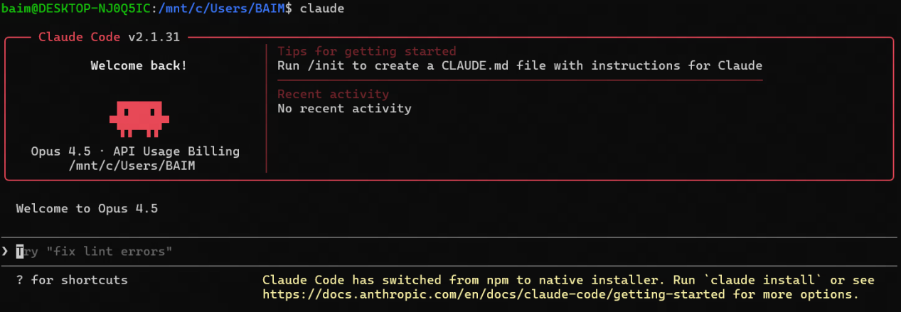
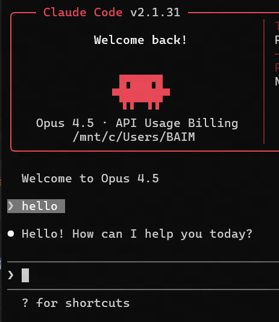

## Claude Code CLI简介
Claude Code CLI是一个在您的终端中运行的Agent。它不仅擅长编码，还可以帮助您使用命令行执行任何操作，包括但不限于: 编写文档、运行构建、搜索文件、研究主题。

**如果你习惯使用终端，这是非常推荐的方式!**



## Claude Code CLI部署以及使用教程

### 环境需求
推荐环境：windows11
不推荐win10，Claude Code win11下的表现显著优于win10，除非你愿意折腾，下面的文档均是在win11环境下操作的

### 一、安装wsl（Windows Subsystem for Linux）

1. **按下Win+R, 输入cmd 点击确认打开终端,**



2. **在终端内执行下列命令**

```bash
// highlight-next-line
wsl --install -d Ubuntu

# 执行完wsl --install -d Ubuntu后重启电脑


# 重启后打开终端执行：
// highlight-next-line
wsl -l -v

#执行wsl -l -v后应该看到类似的输出

~>wsl -l -v

  NAME              STATE           VERSION

* Ubuntu            Running         2
```

3. **安装完成，后续只需要在终端内输入wsl即可进入linux子系统**

4. **首次启动需要注册一个用户**

​	依次输入用户昵称、密码即可（ 密码输入时不会显示字符，正常输入后回车即可）

​	密码需要记住，后续步骤会需要用到




### 二、VSCode下载&安装

1. **下载安装包（如果你已经安装了，可以在vscode左上角菜单-帮助-检查更新中查看是否为最新版本，非最新版本可能导致后续y3扩展安装失败）**

​	vscode官网：https://code.visualstudio.com/


2. **安装（一直下一步，直到出现下面的页面，按照下图勾选配置）**


3. 安装汉化和y3扩展

​	在搜索框分别搜索“chinese”和“y3开发助手”点击安装


### 三、安装Nodejs

1. 打开终端，输入wsl，进入linux子系统

2. 在linux子系统中依次执行下列命令

```
# 执行下面命令后会需要输入密码，下载过程会花费一段时间
sudo apt update

sudo apt install -y nodejs npm

# 验证nodejs安装

node --version

# 输出nodejs的版本号，>18即可

npm --version

# 输出npm版本号，只要有内容输出即可
```




### 四、安装Claude Code CLI

1. **打开终端，输入wsl，进入linux子系统**

2. **在linux子系统中依次执行下列命令**

```
#执行后会提示需要输入用户密码

sudo npm install -g @anthropic-ai/claude-code@latest

claude --version

#输出Claude Code CLI版本号，只要有内容输出即可
```





### 五、API令牌获取&配置

1. **令牌获取**

​	a. 访问[relaypulse](https://relaypulse.top/)，该网站会监测中转站的api质量趋势


​	b. 目前使用[LinkAPI](https://linkapi.ai/)效果尚可，Claude API比较稳定，不过性价比较低。你也可以自行根据数据选择一个中转站

​	c. 注册中转站账户、根据中转站指引获取到api（格式类似：sk-xxxxxxxxxxxxxxxx）

​	d. 如果还是不会，通常中转站都有客服，可以尝试联系客服请求支持


2. **令牌配置（这一步中转站也都会提供详细的文档）**

​	a. 打开终端，输入wsl，进入linux子系统

​	b. 在linux子系统中依次执行下列命令
```
创建Claude配置文件夹

mkdir -p ~/.claude

#下面所有代码一次性复制粘贴到终端内执行(复制粘贴前)

cat > ~/.claude/settings.json << 'EOF'

{

  "env": {

    "ANTHROPIC_AUTH_TOKEN": "sk-xxxxxxxxxxxxxxxx(双引号的内容需要修改为你获取到的API)",
    
    "ANTHROPIC_BASE_URL": "https://api.linkapi.ai(双引号的内容需要修改为中转站提供的链接)",
    
    "API_TIMEOUT_MS": "600000"

  }

}

EOF
```




3. **在wsl环境下执行下列命令，启动Claude Code**

```bash
claude
# 第一次启动后，会提示选择主题，先不用选，连按几次ctrl+c快捷键退回至wsl环境中，执行下一步
```




4. **继续在linux子系统中依次执行下列命令**

```bash
cd ~

code .
```

5. **执行完成后会打开一个vscode窗口，点击打开.claude.json，在其中增加一行(如果已有该字段，修改值即可)**

```json
"hasCompletedOnboarding": true,
```




### 六、启动Claude Code

1. 打开终端，输入wsl，进入linux子系统

2. 在linux子系统中依次执行 claude，即可启动

3. 首次启动会提示选择一个主题，随意选择即可

4. 启动完成后通常如下图所示




5. 尝试发送消息，看看是否能正确调用模型并受到回复（如果报错或者没收到回复，一般是api配置错误，需要检查前面的步骤是否执行正确）



