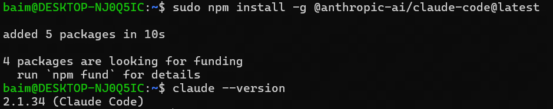

# Windows 分支

这条分支适合大多数 Windows 10 / Windows 11 用户。它的优点是路径直观，所有文件都在 Windows 里，不需要先理解 Linux 子系统。

## 一、先确认 Windows 版本

1. 按下键盘上的 `Win + R`。
2. 在弹出的“运行”窗口中输入：

```text
winver
```

3. 点击“确定”。
4. 记下弹窗中的系统版本。如果是 Windows 10，先按下文安装 Windows Terminal；如果是 Windows 11，再确认版本是否低于 22H2，低于 22H2 时不要选择 WSL 分支。

## 二、Windows 11：通常不需要额外安装终端

Windows 11 通常已经内置 Windows Terminal。

更常用的打开方式是直接在项目目录中打开终端：

1. 在资源管理器中打开你的 Y3 项目文件夹。
2. 在文件夹空白处点击鼠标右键。
3. 点击 `Open in Terminal`、`在终端中打开` 或 `在此打开终端`。
4. 如果弹出命令行窗口，并且当前路径就是你的项目目录，说明终端已经可用。

也可以用下面几种方式打开：

- 点击开始菜单，搜索“Terminal”或“终端”，找到 Windows Terminal 后打开。
- 在资源管理器地址栏中输入 `wt`，然后按回车。
- 按 `Win + R`，输入 `wt`，然后按回车。

后续教程中提到“打开终端”，优先使用“在项目文件夹中右键菜单里打开终端”的方式，这样启用的终端会直接处于项目文件夹路径，省略`cd`步骤。

## 三、Windows 10：推荐先安装 Windows Terminal

Windows 10 自带的 `cmd` 和 PowerShell 也能用，但表现很差，容易崩溃。Windows Terminal 的表现更好，体验更统一，推荐先安装。

推荐安装地址：

https://github.com/microsoft/terminal

安装步骤：

1. 先查看电脑架构：按 `Win + R`，输入 `msinfo32`，点击“确定”。
2. 在“系统信息”窗口中找到“系统类型”。
3. 如果显示 `基于 x64 的电脑`，后面下载 x64 安装包；如果显示 `基于 ARM64 的电脑`，后面下载 ARM64 安装包。
4. 打开浏览器，访问上面的 GitHub 地址。
5. 进入项目页面后，点击右侧或页面中的 `Releases`。
6. 找到最新的稳定版本。
7. 在 Assets / 资产列表中下载适合自己电脑架构的安装包，通常名字里会带有 `x64`、`arm64` 或 `msixbundle`。
8. 下载完成后，双击安装包。
9. 如果系统提示是否安装，点击“安装”。
10. 安装完成后，点击开始菜单，搜索“Windows Terminal”并打开。

如果你能看到一个命令行窗口，说明 Windows Terminal 安装成功。

## 四、安装 Node.js

Claude Code CLI 需要 Node.js 环境。

1. 打开浏览器，访问：

```text
https://nodejs.org/
```

2. 下载 LTS 版本。
3. 双击下载的安装包。
4. 一路点击“Next”。
5. 如果看到“Add to PATH”之类的选项，保持默认勾选。
6. 点击“Install”完成安装。
7. 安装完成后，关闭所有已经打开的终端窗口。
8. 重新打开 Windows Terminal。

验证安装：

```bash
node --version
npm --version
```

如果两条命令都能输出版本号，例如 `v20.x.x`、`10.x.x`，说明安装成功。

如果提示“不是内部或外部命令”，通常是安装后没有重启终端，先关闭终端再重新打开一次。

## 五、安装 Claude Code CLI

1. 打开 Windows Terminal。
2. 输入下面的命令并回车：

```bash
npm install -g @anthropic-ai/claude-code@latest
```

3. 等待安装完成。
4. 输入下面的命令验证：

```bash
claude --version
```

如果能看到 Claude Code 的版本号，说明安装成功。



## 下一步

继续阅读 [模型配置](./03-模型配置.md)。
