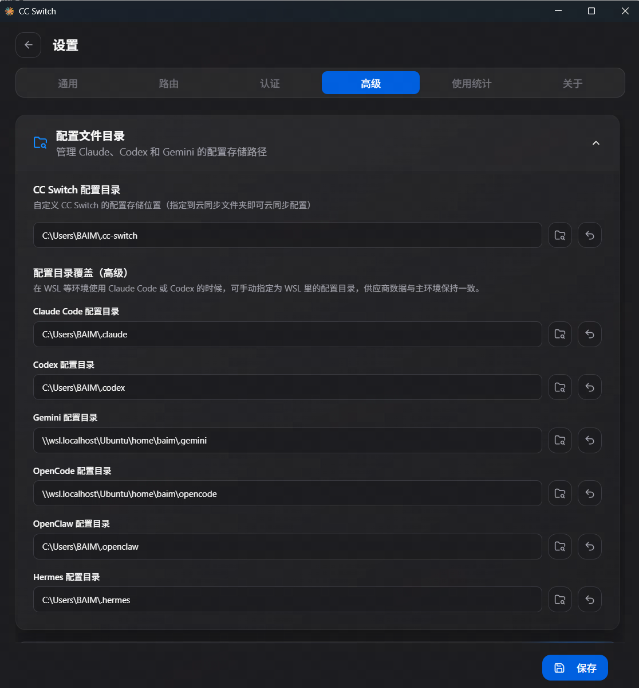
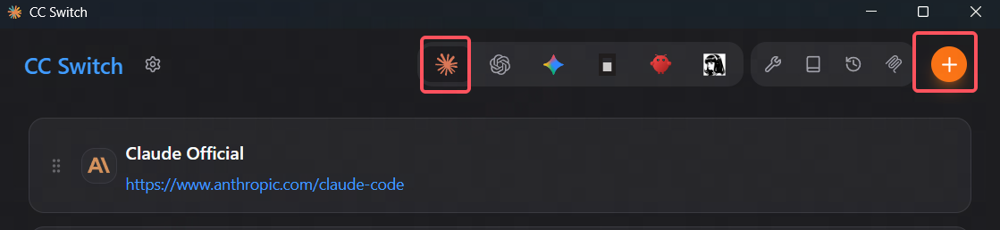
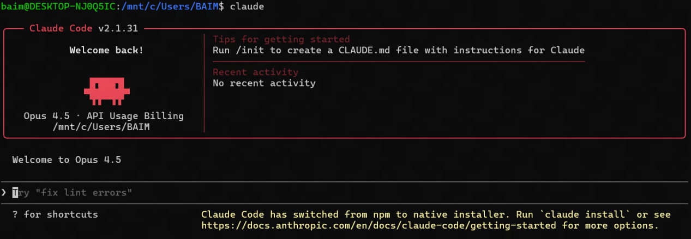
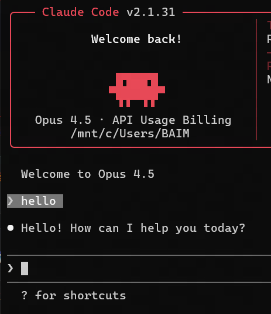

# 模型配置

安装完 Claude Code CLI 后，还需要配置模型、API Key 和 API 地址。本文推荐优先使用 cc-switch，因为它更适合零基础用户，也方便以后在 Claude Code、Codex、Gemini 等终端 Agent 之间切换。

如果 cc-switch 暂时无法满足你的需求，或者你想理解背后到底写了什么配置，也可以看后面的“手动配置”分支。

:::tip 推荐顺序
零基础用户建议先走 <strong>cc-switch 配置方式</strong>。手动配置不是更高级，只是更直接；一旦路径、JSON 格式或 Windows / WSL 环境搞错，反而更容易出问题。
:::

## 一、先确认你要配置哪套环境

前面如果选择了 Windows 原生终端分支，就配置 Windows 里的 Claude Code。

前面如果选择了 WSL 分支，就配置 WSL / Ubuntu 里的 Claude Code。

| 你选择的分支 | 配置文件通常在哪里 | 打开方式 |
| --- | --- | --- |
| Windows 原生终端分支 | `%USERPROFILE%\.claude\settings.json` | 在 Windows Terminal / PowerShell 中操作 |
| WSL 分支 | `~/.claude/settings.json` | 在 WSL / Ubuntu 终端中操作 |

Windows 和 WSL 是两套独立环境。即使都叫 `settings.json`，也不是同一个文件。

## 二、推荐方式：使用 cc-switch 配置

cc-switch 项目地址：

https://github.com/farion1231/cc-switch

### 1. 下载并安装 cc-switch

1. 打开浏览器，访问上面的 cc-switch GitHub 地址。
2. 点击 `Releases`。
3. 下载最新版本的 Windows 安装包。
4. 双击安装包完成安装。
5. 安装完成后，启动 cc-switch。

如果启动时 Windows 提示安全确认，确认来源是你刚才下载的 cc-switch 安装包后再继续。

### 2. 如果要配置 WSL 里的 Claude Code，先设置 WSL 配置路径

如果你走的是 Windows 原生终端分支，可以跳过这一小节，直接看下一节“新增 Claude Code 配置”。

如果你走的是 WSL 分支，要先让 Windows 里的 cc-switch 知道 WSL 中 Claude Code 的配置文件在哪里。否则 cc-switch 可能只会改到 Windows 侧的 `.claude` 配置，而不是 WSL 里的配置。

可以参考这篇外部经验文档：[Windows 下配置针对 WSL 的 cc-switch](https://blog.csdn.net/qq_31805821/article/details/159211262)。

操作步骤：

1. 打开 WSL / Ubuntu 终端。
2. 执行：

```bash
mkdir -p ~/.claude
wslpath -w ~/.claude/settings.json
```

3. 终端会输出一个 Windows 能识别的路径，通常类似：

```text
\\wsl.localhost\Ubuntu\home\你的用户名\.claude\settings.json
```

4. 复制这个路径，但填入 cc-switch 设置时通常要填配置目录，不是具体文件。也就是去掉最后的 `\settings.json`，保留类似下面的目录：

```text
\\wsl.localhost\Ubuntu\home\你的用户名\.claude
```

5. 回到 Windows 中打开 cc-switch。
6. 进入 cc-switch 的设置页面。
7. 找到 Claude Code 配置目录、配置路径、Settings Path 或类似选项。(cc-switch v3.14.1版本中，该配置项位于 设置-高级-配置文件目录处)

8. 把上面复制的 WSL `.claude` 目录填进去并保存。

保存后，cc-switch 再切换 Claude Code 配置时，才会写入 WSL 里的 Claude Code 配置。

:::warning 注意路径层级
`wslpath -w ~/.claude/settings.json` 输出的是文件路径；cc-switch 设置里如果要求填写“配置目录”，就填到 `.claude` 这一层，不要把 `settings.json` 也填进去。
:::

### 3. 新增 Claude Code 配置

不同版本的 cc-switch 界面可能略有差异，但整体思路一致：


1. 打开 cc-switch。
2. 点击 Claude 图标
3. 点击 + ，新增一个配置。
4. 填写配置名称，例如：

```text
LinkAPI Claude
```

5. 填写 API 地址。以 LinkAPI 为例，通常类似：

```text
https://api.linkapi.ai
```

claude code cli配置一般不带/v1结尾，如果中转站要求带 `/v1`，就按中转站文档填写。

6. 填写 API Key，格式通常类似：

```text
sk-xxxxxxxxxxxxxxxx
```

7. 选择或填写模型名称。模型名称以你的中转站实际支持为准。
8. 保存配置。


### 4. 切换到刚才保存的配置

1. 在 cc-switch 中找到刚才创建的配置。
2. 点击“启用”“切换”“Apply”或类似按钮。
3. 确认当前生效工具是 `Claude Code`。

完成后，cc-switch 会帮你写入 Claude Code 需要的配置。后续要更换模型或中转站，优先在 cc-switch 里切换，不建议手动改配置文件。

如果你配置的是 WSL 分支，切换完成后请回到 WSL / Ubuntu 终端里执行 `claude` 测试，不要在 Windows PowerShell 里测试；否则你测试到的可能是 Windows 侧的 Claude Code。

## 三、备用方式：手动配置

如果你不使用 cc-switch，可以手动编辑 Claude Code 的 `settings.json`。手动配置前请先确认自己当前使用的是 Windows 原生终端，还是 WSL / Ubuntu 终端。

:::warning 不要把 API Key 发给别人
下面示例里的 `sk-xxxxxxxxxxxxxxxx` 只是占位符。真实 API Key 只应该保存在你自己的电脑里，不要截图发群里，也不要提交到 Git 仓库。
:::

### 1. Windows 原生终端分支：打开配置文件

在 Windows Terminal / PowerShell 中执行：

```powershell
New-Item -ItemType Directory -Force -Path "$env:USERPROFILE\.claude"
notepad "$env:USERPROFILE\.claude\settings.json"
```

如果记事本提示“是否创建新文件”，点击“是”。

### 2. WSL 分支：打开配置文件

在 WSL / Ubuntu 终端中执行：

```bash
mkdir -p ~/.claude
nano ~/.claude/settings.json
```

如果你不熟悉 `nano`：

- 粘贴内容后，按 `Ctrl + O` 保存。
- 按回车确认文件名。
- 按 `Ctrl + X` 退出。

### 3. 使用官方 Anthropic API 的写法

如果你直接使用 Anthropic 官方 API Key，可以写成：

```json
{
  "env": {
    "ANTHROPIC_API_KEY": "sk-ant-xxxxxxxxxxxxxxxx"
  },
  "model": "sonnet"
}
```

这里的 `model` 可以先用 `sonnet`。如果你明确知道自己要使用的具体模型名称，也可以按官方文档或服务商后台显示的名称填写。

### 4. 使用中转站 / 第三方 API 地址的写法

如果你使用的是中转站，通常需要同时配置 API Key 和 API 地址：

```json
{
  "env": {
    "ANTHROPIC_AUTH_TOKEN": "sk-xxxxxxxxxxxxxxxx",
    "ANTHROPIC_BASE_URL": "https://api.example.com"
  },
  "model": "sonnet"
}
```

请把：

- `sk-xxxxxxxxxxxxxxxx` 替换成你的中转站 API Key。
- `https://api.example.com` 替换成你的中转站 API 地址。
- `sonnet` 替换成中转站支持的模型名称，或者先保留 `sonnet` 做测试。

不同中转站对 API 地址是否需要 `/v1` 的要求不一样。不要凭感觉添加或删除 `/v1`，以中转站文档为准。

### 5. 如果模型名称不在默认列表里

有些中转站会提供自定义模型名。如果 Claude Code 不识别这个模型名，可以尝试在 `env` 中增加 `ANTHROPIC_CUSTOM_MODEL_OPTION`：

```json
{
  "env": {
    "ANTHROPIC_AUTH_TOKEN": "sk-xxxxxxxxxxxxxxxx",
    "ANTHROPIC_BASE_URL": "https://api.example.com",
    "ANTHROPIC_CUSTOM_MODEL_OPTION": "你的模型名称"
  },
  "model": "你的模型名称"
}
```

如果这样仍然无法使用，优先检查中转站文档、模型名称是否写错、当前账号是否有该模型权限。

### 6. 手动配置后重新打开终端

保存 `settings.json` 后，建议关闭当前终端窗口，再重新打开一次终端。这样可以避免旧进程继续使用旧配置。

## 四、按你选择的分支打开项目目录

这一步和前面选择的分支有关。请只看自己选择的那一段。

### Windows 原生终端分支

推荐用资源管理器打开，避免手动输入路径：

1. 在资源管理器中打开你的 Y3 项目文件夹。
2. 在文件夹空白处点击鼠标右键。
3. 选择 `Open in Terminal`、`在终端中打开` 或 `在此打开终端`。
4. 终端打开后，看一下命令行前面的路径。如果路径就是你的项目文件夹，说明位置正确。

如果右键菜单里没有“在终端中打开”，也可以：

1. 打开 Windows Terminal。
2. 输入 `cd `，注意 `cd` 后面有一个空格。
3. 把你的 Y3 项目文件夹从资源管理器拖进终端窗口。
4. 按回车。

### WSL 分支

更简单的方式是先按 Windows 的方式在项目目录打开终端，然后在这个终端里进入 WSL。

操作步骤：

1. 在资源管理器中打开你的 Y3 项目文件夹。
2. 在文件夹空白处点击鼠标右键。
3. 选择 `Open in Terminal`、`在终端中打开` 或 `在此打开终端`。
4. 终端打开后，输入：

```bash
wsl
```

5. 按回车后，如果命令行里出现类似 `用户名@电脑名` 的 Linux 提示符，说明你已经进入 WSL。
6. 此时一般会自动停留在当前项目对应的 WSL 路径下，可以输入下面的命令确认：

```bash
pwd
```

如果你的项目在 Windows 的 `C:` 盘，路径通常会显示成 `/mnt/c/...`；如果在 `D:` 盘，路径通常会显示成 `/mnt/d/...`。

如果输入 `wsl` 后没有进入项目目录，再手动使用 `cd` 进入。例如：

```bash
cd /mnt/c/Users/你的Windows用户名/Desktop/你的Y3项目文件夹
```

:::tip 建议
做 Y3 项目时，项目文件通常还要被 Windows 侧的 Y3 编辑器读取。零基础用户可以先把项目放在 Windows 磁盘中，再通过 WSL 的 `/mnt/c/` 或 `/mnt/d/` 路径进入它。
:::

## 五、启动 Claude Code

在项目目录中输入：

```bash
claude
```

首次启动时，Claude Code 可能会让你选择主题或确认权限。零基础用户可以先使用默认选项。

## 六、发送第一条测试消息

进入 Claude Code 后，可以先输入：

```text
hello
```

如果它能正常回复，说明 Agent 已经可以工作。





如果提示 API、鉴权、模型不存在或连接失败，优先检查模型配置：

- API Key 是否复制完整。
- API 地址是否和中转站文档一致。
- 模型名称是否是中转站支持的模型。
- 如果使用 cc-switch，是否已经点击“启用/切换/Apply”。
- 如果手动配置，`settings.json` 是否保存到了正确环境里。

## 七、下一步

如果 Claude Code 可以正常回复 `hello`，说明模型配置已经生效，这条部署流程就已经跑通。

接下来可以继续阅读 [如何使用 AI 开发 Y3 项目](../../04-如何使用AI开发Y3项目.md)，学习如何把 Agent 用到实际的 Y3 项目开发流程里。

如果遇到命令找不到、无法回答、模型配置混乱等问题，再回到 [常见问题](./04-常见问题.md) 排查。
