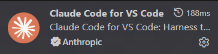

## Claude Code for VSCode 简介

可以直接在您的VSCode中快速使用Claude的强大能力，更容易上手的操作界面，支持子代理、自定义斜杠命令和 MCP（这些功能在 VS Code 扩展中可用，但某些功能只能通过命令行界面配置）

相较于Claude Code CLI，Claude Code for VSCode配置更简单，界面更新手友好

**如果你是萌新小白，对于繁杂的配置过程、使用终端等方面感到非常有压力，可以优先尝试使用Claude Code for VSCode**

配置完成后，只需要在VSCode编辑器右上角点击Claude图标即可快速使用，非常方便


### 环境需求
推荐环境：windows10/windows11
不推荐win10，Claude Code CLI 在win11下的表现显著优于win10，除非你愿意自己折腾，下面的文档均是在win11环境下操作的


### 一、安装Node.js

#### 方法1：使用官方安装包（推荐）
1. 访问 https://nodejs.org
2. 下载 LTS 版本的 Windows Installer (.msi)
3. 运行安装程序，按默认设置完成安装
4. 安装程序会自动添加到 PATH 环境变量

#### 方法2：
WIN+R打开运行窗口，输入cmd后确定打开终端，在终端中执行：
```
winget install OpenJS.NodeJS.LTS
```

---

### 二、安装Claude Code

WIN+R打开运行窗口，输入cmd后确定打开终端，在终端中执行：
```
npm install -g @anthropic-ai/claude-code@latest
```

---

### 三、API令牌获取&配置

1. 访问[relaypulse](https://relaypulse.top/)，该网站会监测中转站的api质量趋势

   

2. 目前使用[LinkAPI](https://linkapi.ai/)效果尚可，Claude API比较稳定，不过性价比较低。你也可以自行根据数据选择一个中转站

3. 注册中转站账户、根据中转站指引获取到api（格式类似：sk-xxxxxxxxxxxxxxxx）

4. 如果还是不会，通常中转站都有客服，可以尝试联系客服请求支持

---

### 四、配置Claude Code

配置前，WIN+R打开运行窗口，输入cmd后确定打开终端，在终端中执行：
```
claude
# 执行完成后，关闭终端即可
```

**配置文件1位置：%USERPROFILE%\.claude\settings.json**

1. 按 Win + R，输入 %USERPROFILE% 回车，打开用户目录
2. 打开 .claude 文件夹（注意开头有个点，如果没有就新建一个空文件夹）
3. 在 .claude 文件夹内修改(如果没有就创建一个) settings.json 文件
4. 用记事本打开，粘贴以下内容：
```
{
  "env": {
    "ANTHROPIC_AUTH_TOKEN": "sk-xxxxxxxxxxxxxxxx(双引号的内容需要修改为你获取到的API)",
    "ANTHROPIC_BASE_URL": "https://api.linkapi.ai(双引号的内容需要修改为中转站提供的链接)",
    "API_TIMEOUT_MS": "600000"
  }
}
```

**配置文件2位置：%USERPROFILE%\.claude.json**

1. 按 Win + R，输入 %USERPROFILE% 回车，打开用户目录
2. 用记事本打开 .claude.json 文件（注意开头有个点）
3. 在记事本内搜索 hasCompletedOnboarding，如果能搜到，则修改对应的值为true, 如果搜不到则需要手动添加。修改后json结构如下：

```json
{
    ···其他内容
    "hasCompletedOnboarding": true,
    ···其他内容
}

```

---

### 五、VSCode下载&安装

1. **下载安装包（如果你已经安装了，可以在vscode左上角菜单-帮助-检查更新中查看是否为最新版本，非最新版本可能导致后续y3扩展安装失败）**

​	vscode官网：https://code.visualstudio.com/


2. **安装（一直下一步，直到出现下面的页面，按照下图勾选配置）**


3. 安装汉化、y3开发助手、Claude Code for VSCode扩展

在搜索框分别搜索“chinese”、“y3开发助手”、“Claude”，点击安装




---

### 六、启动Claude Code

配置完成后，只需要在VSCode编辑器右上角点击Claude图标即可快速使用，非常方便


