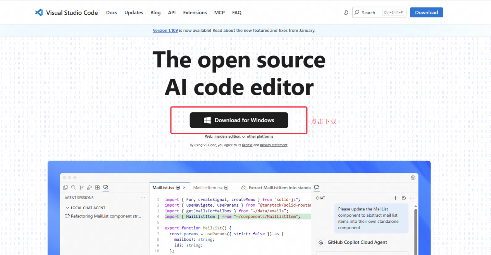
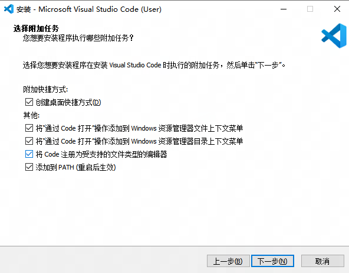
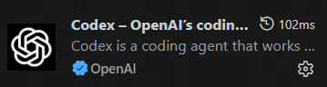
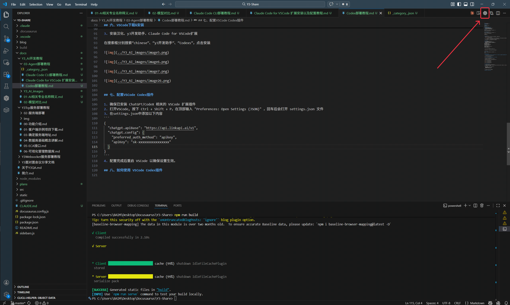

本文主要介绍在如何windows下使用VSCode Codex扩展，如果你希望在终端中使用Codex, 暂时请自行查阅网络资料


## 系统要求
Windows 10 或 Windows 11

Node.js 18+

## 一、安装 Node.js
#### 方法1：使用官方安装包（推荐）
1. 访问 https://nodejs.org
2. 下载 LTS 版本的 Windows Installer (.msi)
3. 运行安装程序，按默认设置完成安装
4. 安装程序会自动添加到 PATH 环境变量

#### 方法2：
WIN+R打开运行窗口，输入cmd后确定打开终端，在终端中执行：
```
winget install OpenJS.NodeJS.LTS
```

## 二、安装 CodeX CLI
WIN+R打开运行窗口，输入cmd后确定打开终端，在终端中执行：
```
npm install -g @openai/codex@latest

验证安装：
codex --version
```


## 三、获取 API 令牌
1. 访问[relaypulse](https://relaypulse.top/)，该网站会监测中转站的api质量趋势

   

2. 目前使用[LinkAPI](https://linkapi.ai/)效果尚可，Claude API比较稳定，不过性价比较低。你也可以自行根据数据选择一个中转站

3. 注册中转站账户、根据中转站指引获取到api（格式类似：sk-xxxxxxxxxxxxxxxx）

4. 如果还是不会，通常中转站都有客服，可以尝试联系客服请求支持


## 四、配置Codex
1. 按 Win + R，输入 %USERPROFILE% 回车
2. 创建 .codex 文件夹
3. 在文件夹内创建config.toml、auth.json两个文件：
4. config.toml 文件, 将下面的内容复制粘贴至config.toml中:
```config.toml
model_provider = "linkapi"
model = "gpt-5-codex"
model_reasoning_effort = "high"
network_access = "enabled"
disable_response_storage = true

[model_providers.linkapi]
name = "linkapi"
base_url = "https://api.linkapi.ai/v1"
wire_api = "responses"
requires_openai_auth = true
```


5. auth.json 文件, 将下面的内容复制粘贴至auth.json中:
```
{
  "OPENAI_API_KEY": "sk-xxxxxxxxxxxxxxxx(替换为您自己的令牌)"
}
```

## 五、启动 CodeX
WIN+R打开运行窗口，输入cmd后确定打开终端，在终端中执行：
```
codex
```

## 六、VSCode下载&安装

1. 下载安装包（如果你已经安装了，可以在vscode左上角菜单-帮助-检查更新中查看是否为最新版本，非最新版本可能导致后续y3扩展安装失败）

​	vscode官网：https://code.visualstudio.com/



2. 安装（一直下一步，直到出现下面的页面，按照下图勾选配置）



3. 安装汉化、y3开发助手、Claude Code for VSCode扩展

在搜索框分别搜索“chinese”、“y3开发助手”、“Codexs”，点击安装





## 七、配置VSCode Codex插件

1. 确保已安装 ChatGPT/CodeX 相关的 VSCode 扩展插件
2. 打开VSCode, 按下 Ctrl + Shift + P，在顶部输入 "Preferences: Open Settings (JSON)" ，回车后会打开 settings.json 文件
3. 在settings.json中添加以下内容
```
{
  "chatgpt.apiBase": "https://api.linkapi.ai/v1",
  "chatgpt.config": {
    "preferred_auth_method": "apikey",
    "apiKey": "sk-xxxxxxxxxxxxxxxx"
  }
}
```
4. 配置完成后重启 VSCode 以确保设置生效。

## 八、如何使用 VSCode Codex插件
启动VSCode, 点击右上角Codex图标即可
