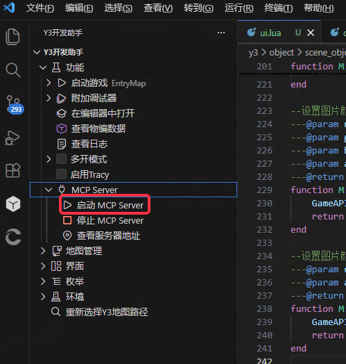

Codex 和 Claude Code 可通过 [Y3Maker 迁移 Skills](https://github.com/BAIMOoo/y3maker-migration-skills) 接入现有 Y3Maker / CodeMaker 工程，无需手动复制助手资产或填写 MCP 配置。

继续使用 Y3Maker 时，初始化后已有默认 MCP 配置，按[配置 Y3Maker](../AssistantDevelopment.md#project-check)检查即可。

## 1. 准备工程

按[Y3 项目环境](../EnvironmentSetup.md)初始化工程，再用 Agent 打开它。工程中应有 `.y3maker/` 目录；若没有，检查工程路径和初始化状态。

## 2. 安装对应的迁移 skill

向所用 Agent 发送对应请求：

### Codex

```text
请从 GitHub 仓库 https://github.com/BAIMOoo/y3maker-migration-skills 安装 sync-y3maker-to-codex skill，并确认安装后可以被当前 Codex 环境识别。
```

### Claude Code

```text
请从 GitHub 仓库 https://github.com/BAIMOoo/y3maker-migration-skills 安装 sync-y3maker-to-claude skill，并确认安装后可以被当前 Claude Code 环境识别。
```

## 3. 迁移 skills 和 MCP 等配置

安装后，在同一工程中发送：

```text
请使用刚安装的 Y3Maker 迁移 skill，迁移当前工程 .y3maker 中的 skills、规则、记忆和 MCP 等配置到当前 Agent。
先盘点并预览迁移差异，再执行迁移和校验。MCP 配置明确选择 project 范围，仅用于当前工程。
保留原始 .y3maker 目录；遇到冲突按 skill 流程处理，列出未迁移项及原因。
完成后报告迁移结果，以及是否需要重新打开会话来加载 skills 和 MCP。
```

流程为 `inventory → dry-run → apply → verify`，以 Agent 的盘点和校验报告为准。Codex 助手资产迁入 `.codex/`；Claude Code 助手资产迁入 `.claude/`，项目级 MCP 配置写入 `.mcp.json`。

默认使用项目级 MCP；多个工程共用用户级配置时，将请求中的 `project` 改为 `user`，迁移和验收保持同一范围。

后续 `.y3maker/` 更新时，再用同一 skill 同步差异；它会通过迁移记录跟踪同步，保留原始目录。

## 4. 启动服务并验证连接

迁移配置后还需启动服务：

1. 用 Y3 开发助手打开同一工程，保持 Y3 编辑器打开该工程。
2. 助手通常自动启动服务；未启动时，展开 **功能 > MCP Server > 启动 MCP Server**。
3. 按迁移结果提示重新打开 Agent 会话，检查 skills 和 MCP 是否加载。



在 Agent 中发送：

```text
列出已连接的 Y3 MCP 服务和工具，使用只读工具核对工程及游戏状态。
报告实际返回结果；暂不修改或启动游戏，无法确认工程时先说明。
```

**完成标志：**所需 skills 已识别、MCP 工具可发现，且至少一次只读调用成功并返回当前工程的结果。运行时服务需在游戏启动后检查，服务与工具清单见[工具参考](../Tools.md)。

## 连接失败时

**先检查 VS Code 和 Y3 编辑器是否正在运行，并打开了正确的目录或项目：**

- **Y3 Helper MCP（`y3-helper`）**：需要 VS Code 打开对应的 Y3 项目目录才会启动；未自动启动时，按上文入口手动启动 MCP Server。
- **Y3 Editor MCP（`y3editor`）**：需要 Y3 编辑器打开对应的 Y3 项目才会启动。

确认两者打开的是 Agent 当前使用的同一工程后，再检查端口和日志。同一 Windows 主机的默认端口如下，实际以工程和迁移结果为准：

- 8766 被占用或连到另一工程：检查其他 VS Code 窗口及服务归属。
- 8765 失败：检查编辑器服务日志。
- 8767 离线：启动游戏后刷新或重连。
- skills 或 MCP 未加载：检查校验报告、未迁移项和 Agent 工程路径，按提示重开会话。

更多问题查[排错表](../Troubleshooting.md)，迁移流程以 [Y3Maker 迁移 Skills 仓库说明](https://github.com/BAIMOoo/y3maker-migration-skills)为准。
