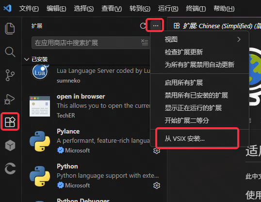
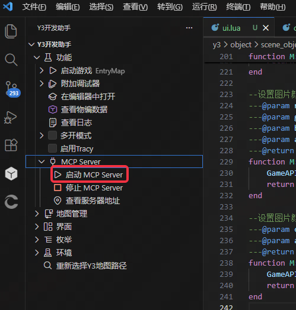
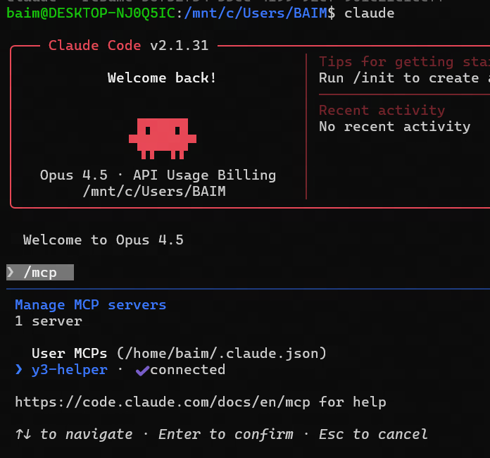
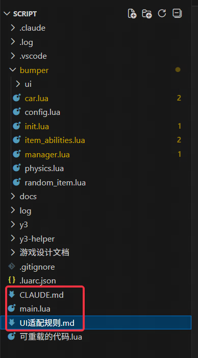
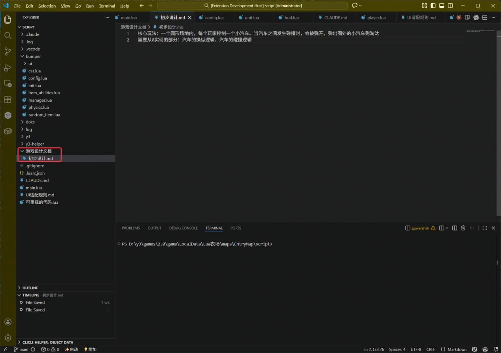

## 简介
本文主要介绍如何使用Claude Code CLI进行Y3项目开发

如果你使用的是其他Agent，下文配置的skill以及mcp需要自行查找相关的配置教程，流程上是可以互通共用的

### 一、在y3项目脚本目录下启动终端


### 二、终端中执行wsl进入linux子系统

### 三、在linux子系统中执行claude,启动Claude Code

### 四、[可选但推荐的步骤，且只需要安装一次即可] 为Claude安装superpowers(一个skill库，提供一套完整的软件开发流程)

[superpowers github repo](https://github.com/obra/superpowers)

```
在Claude Code中，发送消息：

/plugin marketplace add obra/superpowers-marketplace

然后再发送消息：

/plugin install superpowers@superpowers-marketplace
```

### 五、[可选步骤]y3-helper mcp服务器配置（配置后，AI可以自动运行游戏、查看日志、调试修正bug）

1. 卸载原本的Y3开发助手插件

2. 使用此visx文件重新安装开发助手：https://pan.baidu.com/s/1jETRU2LL0GNeCAkuGeOgmg?pwd=g49u 提取码: g49u 




3. 重启vscode，点击y3开发助手扩展，侧边栏中启动mcp服务器



4. 启动wsl, 并执行下面的命令
```
# 需要把<用户名>替换为你的windows用户名

claude mcp add -s user y3-helper -- node.exe "C:\\Users\\<用户名>\\.vscode\\extensions\\sumneko.y3-helper-1.21.6\\dist\\mcp-server.js"

# 如果不知道用户名是什么，可以按照下面的步骤来替换双引号内的字符串

# 双引号内为y3开发扩展路径

1. 在 VSCode 中按 `Ctrl+Shift+P`

2. 输入 "Developer: Open Extensions Folder"

3. 找到 `sumneko.y3-helper-1.21.6` 目录

4. MCP Server 文件位于该目录下的 `dist/mcp-server.js`

5. 将路径替换到前面的命令中
```

5. 重启Claude Code，发送消息/mcp，如果显示connect即正常



6. 上面分享的方案是基于mcp实现的，社区也有同学制作了基于skill的版本，欢迎大家尝试
https://github.com/pirronewantlux529-coder/y3autohotfreshskill


### 六、将Claude.md和UI适配规则.md粘贴至y3项目的脚本根目录下

Claude.md https://github.com/BAIMOoo/y3-ai-md/blob/master/CLAUDE.md

UI适配规则.md https://github.com/BAIMOoo/y3-ai-md/blob/master/UI%E9%80%82%E9%85%8D%E8%A7%84%E5%88%99.md




### 七、在Claude Code中向AI提出你的功能需求

1.通常我会在脚本根目录下新建一个design（其他命名也ok）文件夹，里面存放我的功能初步设计文档

​	这些初步设计文档通常十分简陋，口语化（如果你能写出详细完整的策划文档更好）




2.然后我会向AI发送消息：“根据这个游戏初步设计文档 @初步设计文档\幸存者肉鸽游戏设计.md，配合superpower流程完善游戏设计方案、并实现代码”

​	tips: Claude code中通过@符号，可以快速引用文件，相对路径可以在vscode中右键文件复制


3.Cluade code会自动调用superpowers的“头脑风暴”技能，通过向你提问来完善粗略的想法，探索替代方案，并将设计分成章节进行验证，自动保存设计文档。

​	superpowers介绍： https://github.com/obra/superpowers

​	个人使用下来，感觉superpowers非常好用，十分推荐

​	如果工作目录是git仓库，还会自动帮你创建分支、提交代码，此处就不展开讲解了


4.superpowers的“头脑风暴”技能会帮你完成一个详细的设计文档，然后再将所有工作拆分为小任务，生成一个任务列表文档

​	生成文档后，AI通常会询问你，是选择新开一个窗口，还是使用子代理的方式来执行该任务列表

​	个人推荐新开一个窗口，子代理的生成速度感觉显著慢


5.AI完成代码逻辑开发后，调用y3-helper mcp的工具，自动启动游戏、查看日志，测试代码，如果有报错则修正后重启游戏

