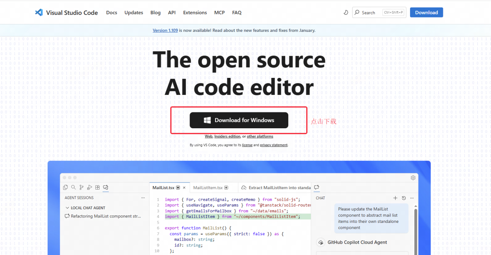
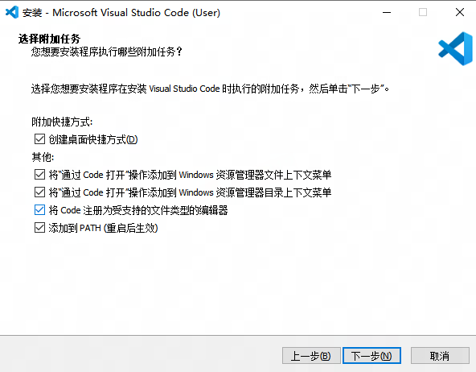
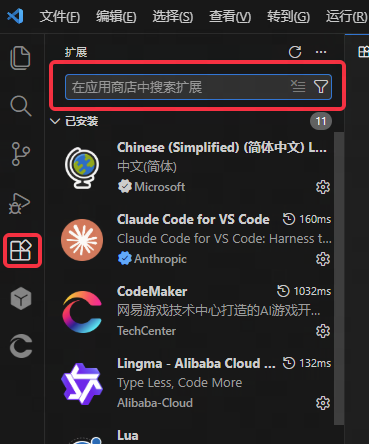
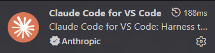
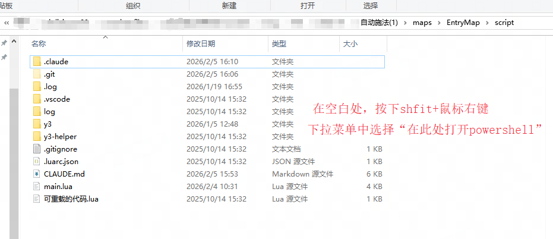
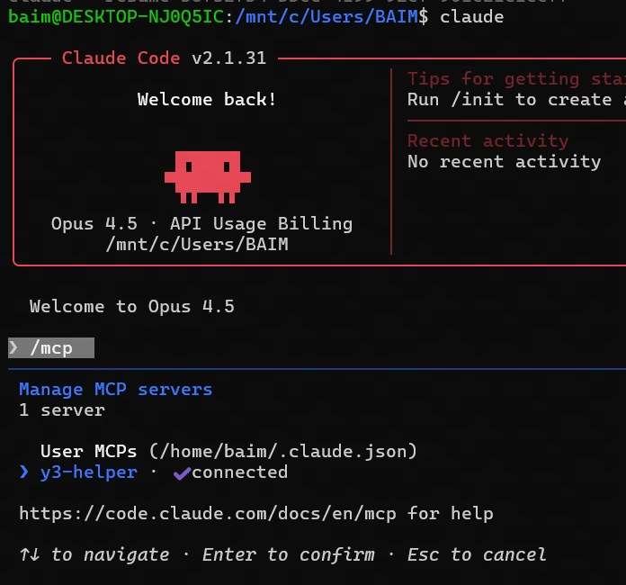
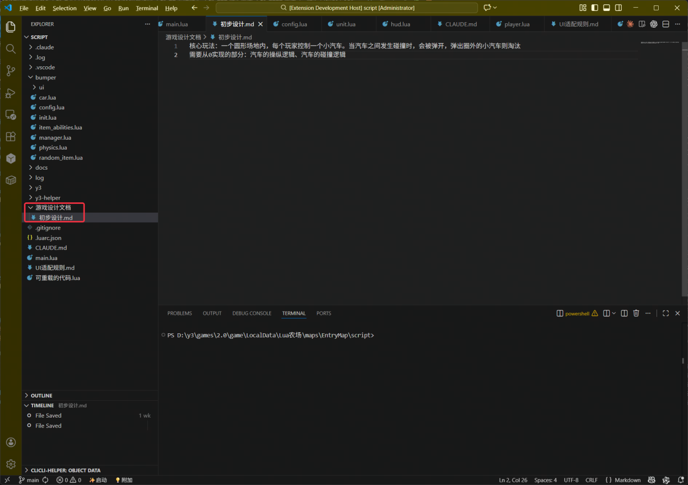

---
title: 04-如何使用AI开发Y3项目
showLastUpdateAuthor: true
sidebar_position: 0
---
# 如何使用AI开发Y3项目

:::tip 验证与时效说明
AI 工具、模型名称、安装步骤和第三方服务变化很快。本文保留实践经验，但涉及时效性的内容，生产使用前请结合官方文档和来源记录再确认。
:::


## 简介
本文主要介绍如何使用 Claude Code CLI 进行 Y3 项目开发。

如果你使用的是其他 Agent，下文配置的 skill 以及 MCP 需要自行查找对应工具的配置教程，但整体开发流程是可以互通共用的。

## 一、准备 VS Code 和 Y3 开发助手

后面的 Y3 MCP Server 需要依赖 VS Code 里的 Y3 开发助手扩展。如果你已经安装好了 VS Code 和 Y3 开发助手，可以跳过这一节。

### 1. 下载并安装 VS Code

1. 打开 VS Code 官网：

```text
https://code.visualstudio.com/
```

2. 下载 Windows 安装包。



3. 双击安装包，一路点击“下一步”。
4. 安装到下面这种选项页面时，建议勾选“通过 Code 打开”相关选项。这样以后可以在项目文件夹右键菜单中直接用 VS Code 打开项目。



如果你已经安装了 VS Code，可以在 VS Code 左上角菜单中点击“帮助” → “检查更新”，尽量保持为较新版本。版本太旧时，后续安装 Y3 开发助手扩展可能会失败。

### 2. 安装常用扩展

打开 VS Code 后，点击左侧“扩展”图标，在搜索框分别搜索并安装：

- `Chinese`：中文语言包，方便零基础用户使用中文界面。
- `Y3 开发助手`：后续启动 Y3 MCP Server 会用到。
- `Claude` 或 `Claude Code`：如果你想在 VS Code 界面中使用 Claude Code 扩展，可以安装；如果你只使用终端里的 Claude Code CLI，这一项不是必须。






:::tip 终端 CLI 和 VS Code 扩展的区别
本文后续主要按 Claude Code CLI 讲解。VS Code 里的 Claude 扩展可以作为更图形化的入口，但不是后续命令行流程的必需项。
:::

## 二、在 Y3 项目目录下启动 Agent



如果你走的是 Windows 原生终端分支，就在项目目录中直接启动 Claude Code。

如果你走的是 WSL 分支，可以先按 Windows 的方式在项目目录打开终端，然后输入：

```bash
wsl
```

进入 WSL 后再执行：

```bash
claude
```

## 三、可选但推荐：配置 Agent 工作流框架

这里的 **Agent 工作流框架**，指 superpowers、OMX（Oh My Codex）、OMC（Oh My ClaudeCode）这类围绕终端 Agent 提供技能、流程、任务拆解、记忆、验证和协作能力的工具体系。

它们不是模型本身，而是给 Claude Code / Codex 这类 Agent 增加“怎么拆任务、怎么沉淀规则、怎么检查结果、怎么复用技能”的工作流层。

:::warning Token 消耗提醒
这类工作流框架通常会显著增加 Token 消耗。因为它们会让 Agent 额外进行需求澄清、方案设计、任务拆分、执行记录、验证复盘，复杂任务还可能调用多个子 Agent 或多轮审查。

如果只是改一两行小问题，不一定需要启动完整工作流；可以先直接向 Claude Code / Codex 提需求。只有当任务比较复杂、容易做偏、需要长期执行或需要严格验证时，再考虑使用 superpowers、OMX 或 OMC。
:::

### 1. 三个方案怎么选

| 方案 | 更适合谁 | 优点 | 缺点 |
| --- | --- | --- | --- |
| superpowers | 主要使用 Claude Code 的用户 | 安装和理解相对简单<br/>和 Claude Code 插件机制结合紧密<br/>适合用标准流程做需求澄清、方案设计、任务拆分 | 更偏 Claude Code 生态<br/>跨 Agent 复用能力相对弱 |
| omx | 使用 Codex，并希望有更强流程控制的用户 | 有更完整的 workflow / skill / team / verify 思路<br/>适合复杂任务、长任务、多轮验证<br/>更接近“项目级 Agent 工作台” | 概念更多<br/>零基础用户需要一点时间理解 |
| omc | 使用 Claude Code，并希望体验类似 omx 工作流的用户 | 更贴近 Claude Code 使用方式<br/>适合把 skill、memory、项目规则沉淀到 Claude 生态里 | 和 omx 一样需要理解工作流概念<br/>不同 Agent 之间配置不完全通用 |

我的建议：

- 如果你只用 Claude Code，想先快速体验工作流增强，选择 **superpowers**。
- 如果你主要用 Codex，或者未来想做更复杂的多 Agent / 多流程协作，选择 **omx**。
- 如果你主要用 Claude Code，但希望使用更接近 omx 的项目级工作流体系，选择 **omc**。
- 零基础用户不要一开始三个都装；先选一个跑通，再考虑切换或补充。

### 2. 方案 A：superpowers

superpowers 项目地址：

https://github.com/obra/superpowers

superpowers 更适合刚开始使用 Claude Code 的用户。它可以通过 Claude Code 插件机制安装。

#### 安装步骤

1. 打开 Claude Code。
2. 在 Claude Code 对话里先发送下面这条命令，添加 superpowers marketplace：

```text
/plugin marketplace add obra/superpowers-marketplace
```

3. 等 Claude Code 提示 marketplace 添加完成后，再发送下面这条命令安装插件：

```text
/plugin install superpowers@superpowers-marketplace
```

4. 安装完成后，重新打开 Claude Code，或者按 Claude Code 的提示刷新当前会话。
5. 后续你可以直接让 Claude Code 使用 superpowers 的流程帮你做需求澄清、方案设计和任务拆分。

:::tip 也可以使用官方插件市场
如果你的 Claude Code 已经能访问官方插件市场，也可以尝试：

```text
/plugin install superpowers@claude-plugins-official
```

如果官方市场不可用，再使用上面的 `obra/superpowers-marketplace` 方式。
:::

:::warning 注意
这两条 `/plugin` 命令要一条一条发送，不要一次性整段复制进去。第一条添加市场完成后，再执行第二条安装插件。
:::

### 3. 方案 B：omx

OMX 全称是 **Oh My Codex**，更适合 Codex 用户，尤其适合需要计划、执行、验证、多人/多 Agent 协作的复杂任务。

OMX 项目地址：

https://github.com/Yeachan-Heo/oh-my-codex

#### 安装前确认

OMX 主要面向 Codex CLI。安装前建议先确认：

1. 已经安装 Node.js。
2. 已经安装并能启动 Codex CLI。
3. 当前终端里执行 `codex` 能正常进入 Codex。

如果前面 Codex CLI 部署教程已经跑通，一般就可以继续安装 OMX。

#### 安装步骤

在你准备使用 Codex 的终端环境中执行：

```bash
npm install -g @openai/codex oh-my-codex
```

安装完成后执行：

```bash
omx setup
```

然后做一次基础检查：

```bash
omx doctor
```

如果 `omx doctor` 没有报严重错误，再启动 OMX：

```bash
omx --madmax --high
```

进入 OMX / Codex 会话后，可以使用类似下面的工作流命令：

```text
$plan
$ralph
$team
```

:::tip Windows / WSL 提醒
OMX 官方更推荐 macOS 或 Linux 环境；如果你在 Windows 上使用，建议优先在 WSL 里安装和运行。前面如果选择的是 WSL 分支，就在 WSL 终端里执行 `npm install`、`omx setup` 和 `omx doctor`，不要在 Windows PowerShell 和 WSL 之间混装。
:::

### 4. 方案 C：omc

OMC 全称是 **Oh My ClaudeCode**，可以理解为更偏 Claude Code 侧的工作流增强方案，适合希望在 Claude Code 中使用类似 omx 工作流体验的用户。

OMC 项目地址：

https://github.com/Yeachan-Heo/oh-my-claudecode

#### 安装方式一：Claude Code 插件方式

这种方式更适合大多数 Claude Code 用户。

1. 打开 Claude Code。
2. 在 Claude Code 对话里发送下面这条命令，添加 OMC 插件市场：

```text
/plugin marketplace add https://github.com/Yeachan-Heo/oh-my-claudecode
```

3. 等 marketplace 添加完成后，再发送下面这条命令安装插件：

```text
/plugin install oh-my-claudecode
```

4. 安装完成后，在 Claude Code / OMC 会话中执行初始化：

```text
/setup
```

如果 `/setup` 不可用，也可以尝试：

```text
/omc-setup
```

#### 安装方式二：npm CLI / runtime 方式

如果你希望在终端里使用 `omc` 命令，可以安装 npm 包：

```bash
npm i -g oh-my-claude-sisyphus@latest
```

安装完成后，在终端里执行：

```bash
omc setup
```

:::tip 包名提醒
项目名叫 **oh-my-claudecode**，但 npm 包名是 `oh-my-claude-sisyphus`。如果用 npm 安装或升级，要使用 `oh-my-claude-sisyphus@latest`。
:::

安装完成后，你可以在 Claude Code 中使用 OMC 提供的 skill / workflow 能力来管理需求澄清、任务拆解、知识沉淀和验证流程。例如：

```text
/deep-interview "我想做一个新的 Y3 玩法"
/ralplan "为这个功能制定实现计划"
/ralph "按计划完成并验证"
/team 3:executor "并行处理这个复杂任务"
```

如果你还不确定自己应该选哪个，先使用 superpowers。等你熟悉 Agent 开发流程后，再考虑 omx 或 omc。
如果想进一步了解这三类框架的架构、skill 列表、适用场景和前后流程关系，可以继续阅读：

- [superpowers 详细介绍](./05-Agent工作流框架/01-superpowers.md)
- [OMX 详细介绍](./05-Agent工作流框架/02-OMX.md)
- [OMC 详细介绍](./05-Agent工作流框架/03-OMC.md)

## 四、迁移 Y3Maker 配置和 y3 MCP Server 配置

如果你的项目之前使用过 Y3Maker / CodeMaker，项目里可能已经有 `.y3maker` 目录。这个目录里通常会保存旧的 skill、knowledge、rules、memory 和 MCP 设置。

**如果项目里还没有 `.y3maker`，需要先用安装了 Y3 Helper / Y3 开发助手扩展的 VS Code 打开一次项目目录，让扩展完成初始化。**

现在更推荐使用迁移 skill 自动处理这些内容，而不是手动复制每个文件、手动拼 MCP 配置。

迁移 skill 仓库：

https://github.com/BAIMOoo/y3maker-migration-skills

这个仓库目前包含两类迁移 skill：

| 你使用的 Agent | 推荐安装的 skill | 会迁移到哪里 |
| --- | --- | --- |
| Claude Code | `sync-y3maker-to-claude` | `.claude/`、项目级 `.mcp.json` 或用户级 Claude MCP 配置 |
| Codex | `sync-y3maker-to-codex` | `.codex/`、项目级或用户级 Codex 配置 |

:::warning 不要直接删除 `.y3maker`
迁移脚本的设计目标是读取 `.y3maker`，然后把内容复制并转换到新 Agent 的目录中。不要在迁移前删除原始 `.y3maker`。
:::

### 1. 先让 Y3 Helper 生成 `.y3maker`

如果你的项目根目录下已经能看到 `.y3maker` 文件夹，可以跳过这一小节。

如果还没有，请按下面步骤操作：

1. 确认 VS Code 已经安装 `Y3 开发助手` / `Y3 Helper` 扩展。
2. 打开 VS Code。
3. 点击“文件” → “打开文件夹”。
4. 选择你的 Y3 项目根目录，不要只打开单个脚本文件。
5. 等待 VS Code 左侧出现 Y3 开发助手相关入口，或等待扩展完成初始化。
6. 回到资源管理器，打开项目根目录。
7. 如果看不到 `.y3maker`，先确认资源管理器已经开启“显示隐藏的项目”。

在 Windows 资源管理器中显示隐藏文件的方法：

1. 打开项目文件夹。
2. 点击顶部“查看”。
3. 勾选“隐藏的项目”。
4. 再检查项目根目录下是否出现 `.y3maker`。

如果仍然没有 `.y3maker`，可以尝试：

- 重启 VS Code 后重新打开项目文件夹。
- 确认打开的是 Y3 项目根目录，而不是上一级目录或某个子目录。
- 确认 Y3 开发助手扩展已经启用。
- 在 VS Code 中打开 Y3 开发助手侧边栏，看是否有初始化、启动服务或类似入口。

生成 `.y3maker` 后，再继续下面的自动迁移步骤。

### 2. 先安装对应迁移 skill

如果你使用 Claude Code，在 Claude Code 中发送：

```text
请从 GitHub 仓库 https://github.com/BAIMOoo/y3maker-migration-skills 安装 sync-y3maker-to-claude skill，并确认安装后可以被当前 Claude Code 环境识别。
```

如果你使用 Codex，在 Codex 中发送：

```text
请从 GitHub 仓库 https://github.com/BAIMOoo/y3maker-migration-skills 安装 sync-y3maker-to-codex skill，并确认安装后可以被当前 Codex 环境识别。
```

如果你的 Agent 支持项目级 skill，可以补充一句“安装到当前项目级目录”；否则默认安装到用户级 skill 目录即可。

### 3. 让 Agent 执行迁移

安装完成后，在你的 Y3 项目目录中显式调用对应 skill 即可。

如果你使用 Claude Code，发送：

```text
/sync-y3maker-to-claude
```

如果你使用 Codex，发送：

```text
$sync-y3maker-to-codex
```

调用后，skill 会按自己的标准流程执行：

```text
inventory -> dry-run -> apply -> verify
```

也就是先盘点，再预览，再真正迁移，最后验收。这样比手动改 MCP 配置更安全。

### 4. MCP 配置选择建议

迁移过程中如果发现 `.y3maker/mcp_settings.json`，脚本会要求明确选择 MCP 配置迁移范围：

| 选择 | 含义 | 建议 |
| --- | --- | --- |
| `project` | 写入当前项目级配置 | 推荐，项目换电脑或交给队友时更清晰 |
| `user` | 写入当前用户级配置 | 适合只给自己用，不想放进项目目录 |
| `skip` | 本次不迁移 MCP 配置 | 适合只想迁移 skill / knowledge，不想动 MCP |

零基础用户建议优先选择 `project`。如果你不确定，就让 Agent 先 dry-run 并解释它准备写入哪些文件。

### 5. 迁移完成后如何验证

迁移完成后，重启当前 Agent，然后检查 MCP 是否能连接。

Claude Code 中可以发送：

```text
/mcp
```



如果能看到 y3-helper 之类的 MCP Server 处于 connected / 可用状态，说明 MCP 配置基本正常。

如果迁移后没有出现 MCP Server，优先检查：

1. 项目里是否真的存在 `.y3maker/mcp_settings.json`。
2. 迁移时是否选择了 `skip`。
3. 迁移脚本的 verify 是否通过。
4. 你当前使用的是 Claude Code 还是 Codex，是否安装了对应平台的迁移 skill。


## 五、选择工作流后再向 AI 提需求

具体怎么向 AI 提需求，取决于你选择的 Agent 工作流框架。不要只照抄一个固定 prompt；先根据自己的工具选择 superpowers、OMX 或 OMC，再按对应框架的流程走。

请继续阅读：

- [Agent 工作流框架总览](/docs/category/05-agent工作流框架)
- [superpowers 详细介绍](./05-Agent工作流框架/01-superpowers.md)
- [OMX 详细介绍](./05-Agent工作流框架/02-OMX.md)
- [OMC 详细介绍](./05-Agent工作流框架/03-OMC.md)

如果你只是想快速开始，可以先按下面的通用方式准备：

1. 在脚本根目录下新建一个 `design` 文件夹。
2. 在里面写一个初步设计文档。文档可以很口语化，先把玩法目标、核心规则、参考案例、你不确定的点写进去。
3. 启动你选择的 Agent。
4. 根据你选择的框架调用对应流程：
   - superpowers：让它先走 `brainstorming`，再进入 `writing-plans`。
   - OMX：需求模糊时先 `$deep-interview`，再 `$ralplan` / `$ralph`。
   - OMC：需求模糊时先 `deep-interview`，再 `plan` / `ralph`。



完成代码逻辑开发后，再结合前面配置好的 y3 MCP Server，让 Agent 自动启动游戏、查看日志、测试代码；如果有报错，再让它根据日志继续修正。


