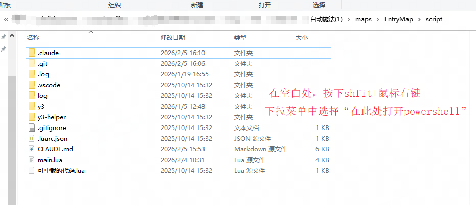

<span id="简介"></span>
<span id="一在y3项目脚本目录下启动终端"></span>
<span id="四可选但推荐的步骤且只需要安装一次即可-为claude安装superpowers一个skill库提供一套完整的软件开发流程"></span>
<span id="五可选步骤y3-helper-mcp服务器配置配置后ai可以自动运行游戏查看日志调试修正bug"></span>
<span id="六将claudemd和ui适配规则md粘贴至y3项目的脚本根目录下"></span>
<span id="七在claude-code中向ai提出你的功能需求"></span>
<span id="6-检查并保存结果"></span>


目前进行 Y3 AI 开发，推荐优先使用 **Codex 或 Claude Code**。根据当前使用体验，Y3Maker 仍有较多 bug，性能与主流 Agent 相比也存在差距，暂不推荐作为首选。本页介绍这两类外部 Agent 的接入流程，首次使用也可以按以下步骤开始。

## 1. 选择客户端并确认环境

**作者个人推荐**（按推荐优先级排序）：

- Agent：Codex > Claude Code。
- Codex 客户端：Codex App > Codex CLI > Codex VS Code 扩展。
- Claude Code 客户端：Claude Code CLI > Claude Code VS Code 扩展。

先完成[Y3 项目环境](./EnvironmentSetup.md)。外部客户端任选一种：

| 操作方式 | 安装教程 |
| --- | --- |
| Codex 桌面应用（作者首选） | [Codex App](<./03-Agent部署教程/Agent安装教程/Codex App安装教程.md>) |
| Codex 终端工具 | [Codex CLI](./03-Agent部署教程/Agent安装教程/Codex部署教程.md) |
| Codex 编辑器面板 | [Codex VS Code 扩展](<./03-Agent部署教程/Agent安装教程/Codex VSCode扩展安装教程.md>) |
| Claude Code 终端工具 | [Claude Code CLI](<./03-Agent部署教程/Agent安装教程/Claude Code CLI部署教程.md>) |
| Claude Code 编辑器面板 | [Claude Code VS Code 扩展](<./03-Agent部署教程/Agent安装教程/Claude Code for VSCode 扩展安装以及配置教程.md>) |

安装所选客户端后，**必须完成本教程的 [Codex/Claude 模型配置](<./03-Agent部署教程/CC Switch安装与使用.md>)步骤**，通过可视化界面配置模型服务，完成认证并验证回复。Y3 编辑器、Lua 环境和所需助手工具仍需正常工作。

## 2. 打开正确的工作目录

1. 用 Y3 开发助手打开包含 `header.project` 的工程目录，确认主地图。
2. 使用扩展时，在该 VS Code 工作区打开 AI 面板。
3. 使用 CLI 时，在主地图的 `script` 文件夹中打开终端，再执行 `claude` 或 `codex`。常见位置为 `maps/EntryMap/script`，地图名以实际工程为准。
4. 使用 Codex App 时，在应用中添加项目或打开文件夹，选择同一个 Y3 工程目录。



发送一次检查请求：

```text
请只读检查当前 Y3 工程，列出工程根目录、主地图、main.lua、业务模块和已读取的项目说明。
指出官方库与助手生成目录，暂不修改文件或运行游戏；找不到的项目逐项说明。
```

核对返回路径。选错目录时先切换，避免修改另一张地图。

## 3. 补充项目上下文

把当前需求、项目约定和相关参考资料交给 AI。外部客户端需要按自己的规则加载这些文件。

## 4. 连接工具，或准备人工运行

按[连接 Y3 配套MCP](./03-Agent部署教程/MCP接入.md)使用迁移 skill，自动迁移现有助手的 skills、规则和 MCP 等配置。启动对应服务并完成一次只读调用后，再用于启动游戏、日志和截图。

没有 MCP 时，由你保存并运行地图，将本轮日志或截图提供给 AI。

## 5. 按具体任务开发与验证

选择一个具体需求，让 AI 检查现有工程、明确修改范围和完成标准，再实施并运行地图验证。出现问题时，使用[问题报告](./Troubleshooting.md#发给-ai-的问题报告)提供复现步骤与日志。

