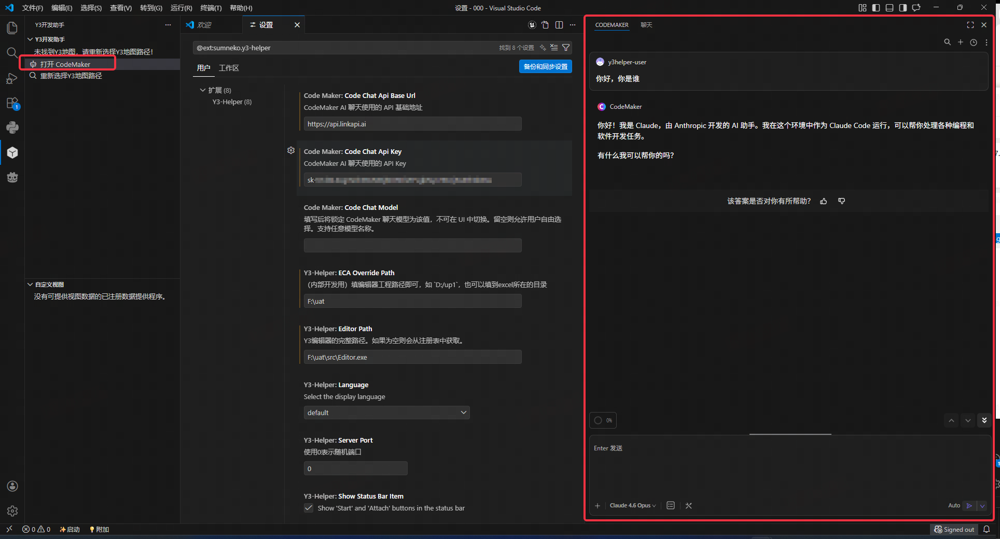
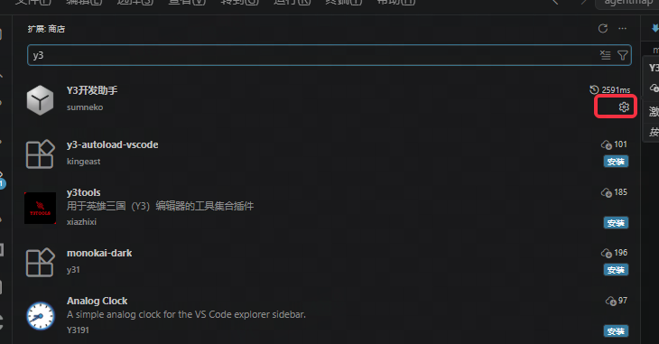
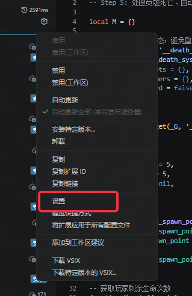
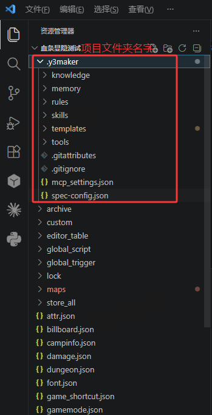
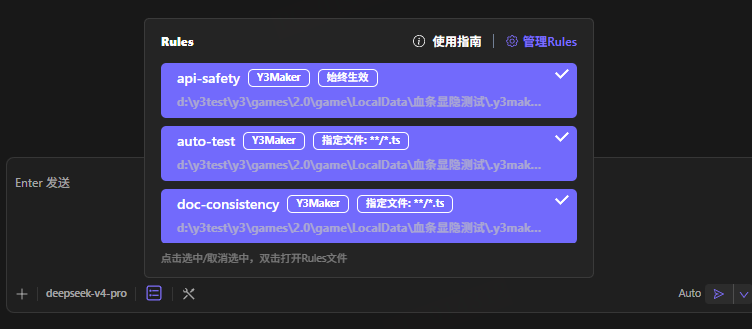
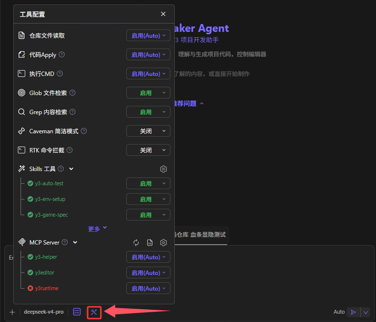

<span id="使用y3开发助手进行ai辅助开发"></span>
<span id="配置流程"></span>
<span id="如何判断是否配置完成"></span>
<span id="开始开发"></span>
<span id="使用指南"></span>
<span id="新增内容"></span>
<span id="mcp"></span>
<span id="ui-预览与调试"></span>
<span id="编辑器控制"></span>
<span id="官方资源管理"></span>
<span id="接下来做什么"></span>


# 配置 Y3Maker

先按[准备 Y3 项目](./EnvironmentSetup.md)装好软件并打开工程。本页分两段：**第 1～3 步连接模型；工程初始化后，再做第 4～5 步。**

<span id="1-打开-y3maker" className="legacy-anchor" />

## 1. 打开 Y3Maker {#open-y3maker}

在 Y3 开发助手面板点击 **打开 Y3Maker**。旧截图中的“打开 codemaker”是它的历史名称。



没有入口时，先检查助手是否启用并更新到包含该功能的版本。

## 2. 配置模型服务 {#model-connection}

准备服务方或团队提供的 **API 地址、协议、模型名称、API Key**。API Key 是访问模型服务的密钥，保存在个人设置中，不放入共享文件或截图。

1. 点击 VS Code 左下角齿轮，选择“设置”。
2. 选择“用户”页签，在搜索框输入 `Y3Maker`；也可用 `@ext:sumneko.y3-helper` 筛选。
3. 填写下面四项，输入框会自动保存。

<div className="y3-ai-table">

| 设置项 | 填写内容 |
| --- | --- |
| `Y3Maker.CodeChatWireApi` | 服务要求的协议：`chat-completions`、`responses` 或 `anthropic-messages` |
| `Y3Maker.CodeChatApiBaseUrl` | 服务方给出的 API 地址，保留要求的路径部分 |
| `Y3Maker.CodeChatApiKey` | 该服务的 API Key |
| `Y3Maker.CodeChatModel` | 账号有权调用的模型 ID，必须填写 |

</div>

选择服务方明确支持工具调用的模型。协议、地址、模型和密钥需要互相匹配。





旧截图中的名称和协议选项可能不同，以上表为准。

<span id="3-检查模型回复" className="legacy-anchor" />

## 3. 检查模型回复 {#check-response}

回到 Y3Maker，发送：

```text
请用一句话确认你收到了消息，暂不修改文件或运行游戏。
```

收到正常回复后，首次使用的读者返回[准备 Y3 项目中的安装提示词](./EnvironmentSetup.md#support-tools)，统一准备 Git、Python、Node.js 并初始化工程，再继续下一节。内置终端可以先用于安装软件，模型调用仍需要有效的服务配置。

## 4. 检查项目资料 {#project-check}

初始化后，工程根目录应有非空的 `.y3maker`。它保存 Y3 知识库、项目规则、可复用流程（Skills）和工具连接配置。



发送一次检查请求：

```text
请只读检查当前 Y3 工程：列出工程根目录、主地图、Lua 入口和已加载的规则、技能。
缺少的文件或资料逐项说明，暂不重新初始化或修改文件。
```

核对返回路径与当前工程一致，面板中的规则和技能已加载。





<span id="5-检查-y3-工具" className="legacy-anchor" />

## 5. 检查 Y3 工具 {#check-y3-tools}

初始化后，`.y3maker` 下默认已有 `y3-helper` 和 `y3editor` 的 MCP 配置。连接这些工具前，还需要启动对应的软件并打开项目：

- **`y3-helper`**：依赖 VS Code 运行。保持 VS Code 打开，启用 Y3 开发助手扩展，并在 VS Code 中打开当前 Y3 项目。
- **`y3editor`**：依赖 Y3 编辑器运行。启动编辑器，并打开对应的 Y3 项目。

VS Code 和 Y3 编辑器应打开同一工程；只有配置文件、未启动对应软件或未打开项目时，MCP 仍可能无法连接。

1. 满足上述运行条件后，在 Y3Maker 的 MCP 面板中查看 `y3-helper` 和 `y3editor` 是否已连接。
2. 让 AI 查询一次游戏状态或编辑器日志，核对结果来自目标工程。
3. `y3runtime` 要在游戏启动后检查；未启动时离线属正常情况。

模型能回复、资料已加载、所需工具能调用后，即可提出具体开发需求。工具名称见[工具参考](./Tools.md)，连接失败见[排查问题](./Troubleshooting.md)。
