<span id="ai开发环境配置"></span>
<span id="先认识要用的软件"></span>
<span id="安装编辑器"></span>
<span id="1-创建并打开工程"></span>
<span id="安装vscode"></span>
<span id="2-安装-vs-codegit-和助手"></span>
<span id="安装y3开发助手"></span>
<span id="安装git"></span>
<span id="安装python环境可选"></span>
<span id="3-确认-lua-工作区"></span>
<span id="4-在使用-ai-前运行一次"></span>
<span id="常见卡点"></span>


# 准备 Y3 项目

按本页顺序安装 **Y3 编辑器、VS Code、Y3 开发助手**，再用助手自带的 **Y3Maker** 统一准备 **Git、Python 3、Node.js LTS**。本教程将这三项列为必装基础环境，检查通过后再初始化工程。

| 软件 | 用途 |
| --- | --- |
| Y3 编辑器 | 创建地图、摆放内容、运行游戏 |
| VS Code | 打开工程文件、使用开发助手 |
| Y3 开发助手 | 安装在 VS Code 中的功能扩展，包含 Y3Maker |
| Git | 初始化时下载 Lua 库和项目资料 |
| Python 3 | 运行技能中的 UI、物编、地形等辅助脚本 |
| Node.js LTS | 运行 JavaScript 工具和 npm 程序 |

## 1. 安装 Y3 编辑器并创建项目

已有编辑器可直接从“创建自己的第一个项目”开始。

### 下载并安装 Y3 编辑器

1. 打开 [Y3 开发者学院](https://163.com/learn/)，点击 **下载编辑器**。
2. 下载完成后按 `Ctrl+J` 打开浏览器下载列表，双击安装程序；也可点“在文件夹中显示”后打开。
3. 如 Windows 询问是否允许更改设备，核对是刚下载的编辑器安装程序后，点击“是”。
4. 阅读并同意安装协议，进入安装位置设置。
5. **不要安装在 C 盘。** 可选 `D:\Y3Editor`、`E:\Y3Editor` 等其他本地磁盘的位置。
6. **完整路径建议不含空格和中文，包括上级文件夹。** 例如避开 `D:\Program Files\Y3Editor` 和 `D:\游戏工具\Y3Editor`。
7. 确认路径，点击安装，等待完成。

### 使用快捷方式打开编辑器

1. 双击安装程序自动创建的 Y3 编辑器快捷方式。
2. 按登录页提示登录或注册，等待更新结束。

**完成标志：**看到编辑器首页。

### 创建自己的第一个项目

1. 在首页进入新建项目界面，选择一个简单模板。
2. 填写项目名称，例如 `MyFirstY3Project`。
3. 选择容易找到的保存位置，例如 `D:\Y3Projects`；没有 D 盘时选择其他本地文件夹。
4. 点击“新建”，等待项目打开。
5. 从编辑器定位本地工程，记下**包含 `header.project` 的文件夹**，VS Code 稍后要打开它。

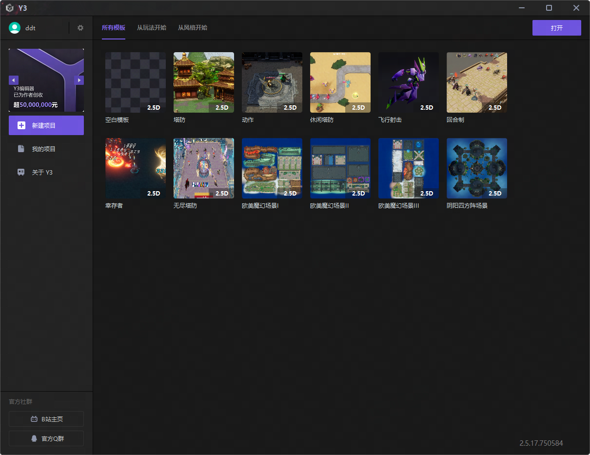

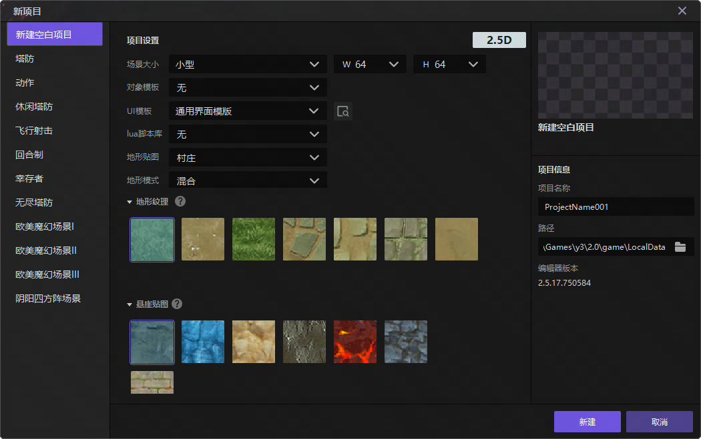

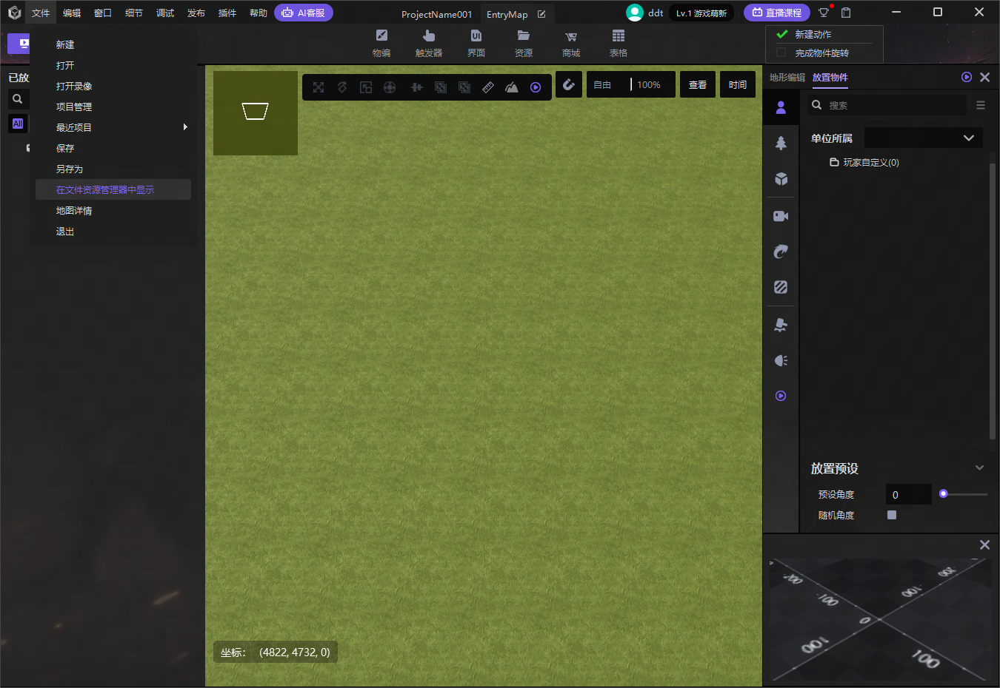

工程目录保存的是项目文件，与软件安装目录不同。若看不到完整文件名，在 Windows 文件资源管理器的“查看”菜单中开启“文件扩展名”。

## 2. 安装 VS Code 并切换中文

### 下载和安装

1. 打开 [VS Code 官方下载页](https://code.visualstudio.com/download)，选择 **Windows > User Installer（用户安装版）**，通常不需要管理员权限。
2. 普通 Intel/AMD 电脑一般选择 **x64**。拿不准时，在 Windows“设置 > 系统 > 关于”查看“系统类型”，按处理器架构选择。
3. 下载后按 `Ctrl+J` 找到并运行 `VSCodeUserSetup-` 开头的安装程序。
4. 阅读并同意协议，点击“下一步”；安装目录和开始菜单名称可保留默认值。
5. 在“选择附加任务”页，建议勾选“创建桌面快捷方式”“添加到 PATH”和文件、文件夹右键菜单中的“通过 Code 打开”。没有右键菜单选项也可继续。
6. 点击“安装”，完成后启动 Visual Studio Code。

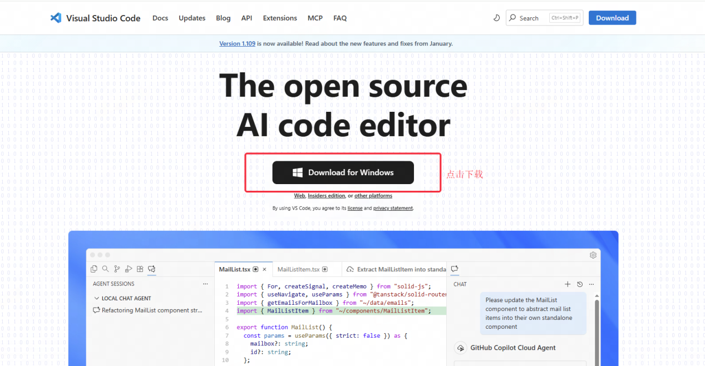

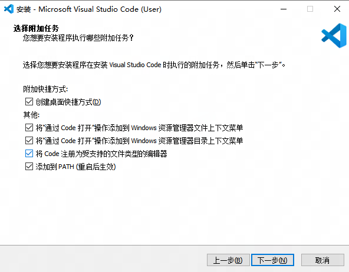

### 安装中文语言包

界面已经是中文时可跳过。

1. 在 VS Code 按 `Ctrl+Shift+X`，打开左侧“扩展”面板。
2. 搜索 `Chinese (Simplified)`，找到简体中文语言包，确认发布者是 **Microsoft**，点击 **Install（安装）**。
3. 安装后按提示切换语言并重启。
4. 若没有提示，按 `Ctrl+Shift+P` 打开顶部命令面板，搜索 `Configure Display Language`，选择简体中文后重启。

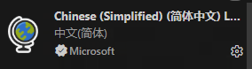

**完成标志：**顶部菜单显示“文件”“编辑”“查看”等中文文字。

## 3. 安装 Y3 开发助手

### 从扩展商店安装

1. 按 `Ctrl+Shift+X`，搜索 `Y3开发助手`。
2. 核对名称 **Y3开发助手**、发布者 **sumneko**。搜索不明确时，可直接输入唯一标识 `sumneko.y3-helper`。
3. 点击“安装”；如询问信任发布者，核对后确认。
4. 等待助手及其 Lua 依赖扩展装好，按提示重新加载窗口。

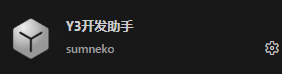

**完成标志：**详情页出现“禁用”“卸载”等操作。若提示版本不兼容，从“帮助 > 检查更新”更新 VS Code 后重试。

## 4. 用 VS Code 打开自己的 Y3 工程

1. 保持编辑器打开自己的项目，在 VS Code 点击 **文件 > 打开文件夹**。
2. 选择第 1 节记下的、包含 `header.project` 的文件夹，点击“选择文件夹”。
3. 出现工作区信任提示时，确认是自己创建的工程后选择信任。
4. 点击左侧 **Y3 开发助手** 图标。如果未识别项目，点击“重新选择 Y3 地图路径”，在文件窗口中选择该工程的 `header.project`。

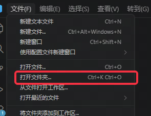

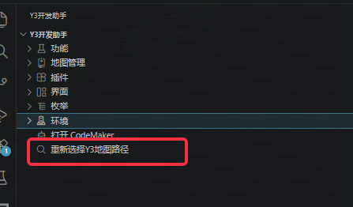

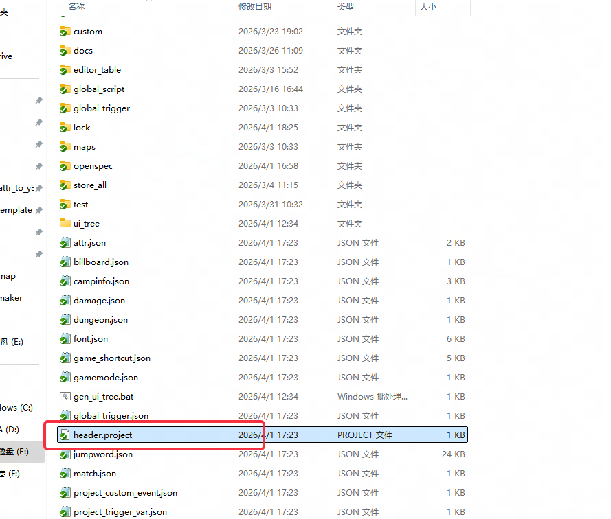

**完成标志：**助手识别了工程，面板中能找到“打开 Y3Maker”。接下来准备三项基础环境，再初始化。

## 5. 用自带的 Y3Maker 安装辅助软件 {#support-tools}

### 先让 Y3Maker 能正常回复

点击“打开 Y3Maker”，完成[配置 Y3Maker](./AssistantDevelopment.md#model-connection)中的模型连接和回复检查，再回本节使用提示词。模型服务信息需由你使用的服务方或团队提供。

<span id="git首次初始化前需要"></span>
<span id="python用到相关脚本时再准备"></span>
<span id="nodejs用到相关工具时再准备"></span>

### 一次准备 Git、Python 和 Node.js

将下面整段文字复制给 **Y3Maker**：

```text
请用内置终端工具，为我的 Windows 电脑准备 Y3 开发必装环境：Git、Python 3（含 pip）、Node.js LTS（含 npm）。
先检查已有版本，兼容且可用就复用；从官方渠道安装缺失项，保留已有软件和项目文件。
优先满足项目版本要求；没有指定时，选择仍受支持的 Python 3 稳定版本和 Node.js LTS。
实际执行 git --version、Python 版本检查及同一解释器的 pip 检查、node --version、npm.cmd --version。
再分别用 Python 和 Node.js 运行一条简单输出命令，确认能够执行脚本。
需要我确认命令、点击安装窗口或重启 VS Code 时，用中文逐步说明。
最后汇总三项软件的安装路径、版本和验证结果；全部可用后再告诉我可以初始化工程。
```

需要重启时，**完全退出并重开 VS Code**，打开原工程，在 Y3Maker 会话中继续检查。安装器可能更新 PATH（系统查找程序的路径列表），重开后才能可靠地读取新设置。

**完成标志：**Git、Python、Node.js 三项均检查通过，pip 和 npm 可用。技能需要额外的 Python 库时，再由 Y3Maker 根据具体脚本补齐。

## 6. 初始化新项目的 Y3 Lua 库

初始化会下载 Lua 库、项目资料并写入默认配置。**本节用于新项目；已有业务代码的工程先检查现有配置，避免覆盖。**

1. 确认三项基础环境检查通过，VS Code 打开的是目标工程。
2. 展开助手的 **功能**，点击 **初始化 Y3 库**。
3. 若弹出来源选择，可选 **Gitee（国内镜像）**，或根据网络条件选择 GitHub。
4. 等待初始化结束；VS Code 若重新打开工程，继续检查文件。

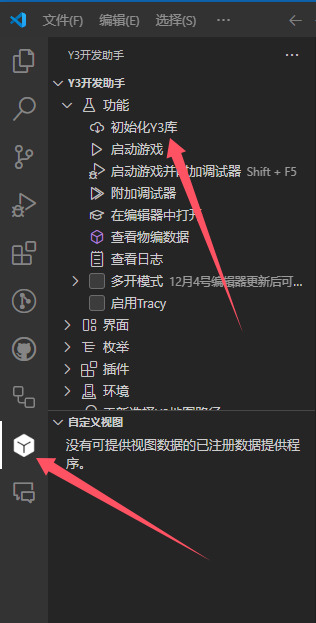

在左侧“资源管理器”中展开文件夹，确认：

| 位置 | 应有内容 |
| --- | --- |
| 工程根目录 | `header.project` 和非空的 `.y3maker` |
| `maps/实际主地图/script` | `main.lua` 和包含库文件的 `y3` 文件夹 |

`EntryMap` 只是常见主地图名，以自己的工程为准。文件齐全且没有失败提示，即可继续；更多目录说明见[工程与 Lua 目录结构参考](./LuaReference.md)。

## 7. 启动一次游戏并完成检查

1. 在 Y3 编辑器中保存项目。
2. 在助手 **功能 > 启动游戏** 中启动，或使用编辑器自身的运行入口。
3. 确认游戏窗口打开的是这张地图，正常进入后结束本次测试。

随后到[配置 Y3Maker](./AssistantDevelopment.md#project-check)检查项目资料和工具。出现问题时，保留错误原文并查[排查问题](./Troubleshooting.md)。

截图为操作位置示意，部分界面来自旧版本。
