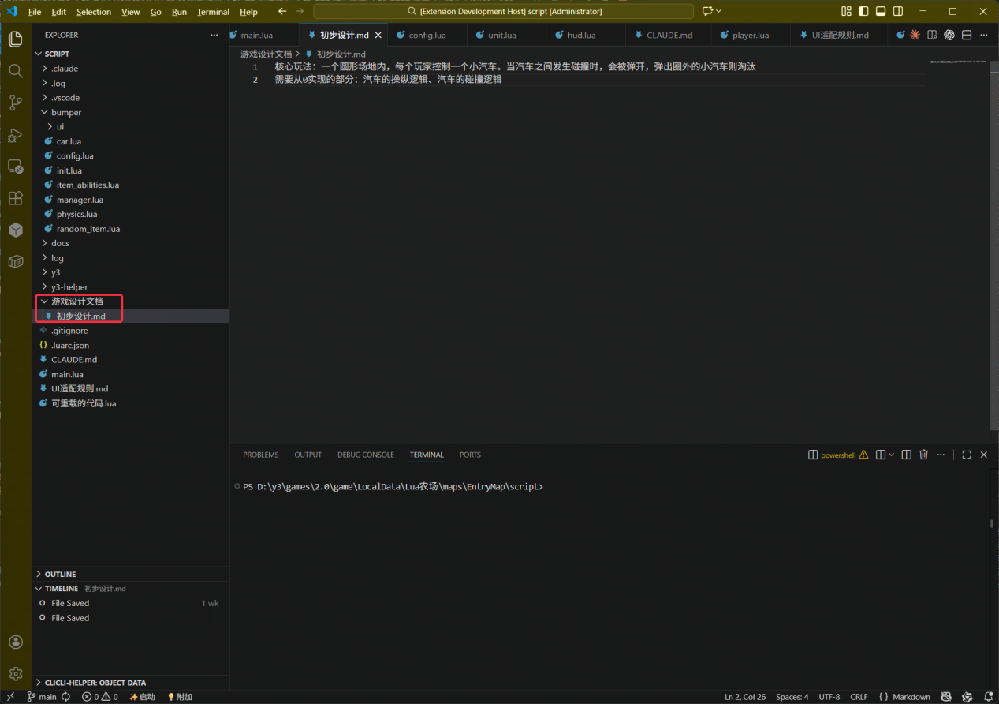

项目上下文就是 AI 完成任务需要的资料：当前需求、工程约定、相关代码和运行方法。使用同一项目做多个任务时，把这些信息保存成文件，方便重复引用。

## 准备哪些资料

1. 在 VS Code 左侧工程目录上右键“新建文件夹”，命名为 `design`。
2. 在其中新建 `需求.md`，填写下面的内容。
3. 在对话中让 AI 先读取 `design/需求.md`，再给出计划。客户端支持文件引用时，也可用 `@` 选择该文件。

```text
目标：要实现或修改什么。
范围：涉及的文件、物编或 UI，哪些内容应保留。
已有资料：相关代码、真实资源 ID、接口说明。
完成标准：怎样运行，应该看到什么结果。
待确认：目前还不知道的参数或限制。
```



## 让客户端真正读取资料

长期约定与当前任务分开保存：

| 客户端 | 项目说明与资料 |
| --- | --- |
| Y3Maker | 初始化后加载的 `.y3maker` 资料，以及对话中指定的需求文件 |
| Claude Code | 项目 `CLAUDE.md` |
| Codex | 项目 `AGENTS.md` |

先检查已有说明文件，再补充工程根目录、主地图、脚本入口、不可改动的目录和运行方法。详细 API 放在参考文件中，任务需要时再读。使用工程相对路径，凭据保存在个人配置中。

新会话开始时，可发送：

```text
请先读取项目说明和 design/需求.md，列出本轮采用的文件及关键约束，暂不修改。
```

来源：[Claude Code 项目说明](https://code.claude.com/docs/en/memory)、[Codex AGENTS.md](https://learn.chatgpt.com/docs/agent-configuration/agents-md)。

## 使用 Y3Maker 知识库

`.y3maker` 包含规则、技能、知识和模板。外部客户端需要专门接入，不能直接把目录改名为 `.codex` 或 `.claude`。

需要长期迁移时，可参考 [Y3Maker Migration Skills](https://github.com/BAIMOoo/y3maker-migration-skills)：

1. 盘点原资料与目标客户端已有文件，保留自定义内容的副本。
2. 预览迁移计划，核对新增、合并、冲突及 MCP 配置范围。
3. 应用后检查文件引用、规则/技能加载和工具连接，再运行一个小任务。

这是可选的社区工具，使用前核对其版本和依赖要求；本教程核对了 README，未实测迁移脚本。原始 `.y3maker` 应保留以便后续同步。

## 什么时候值得做成 Skill

某个流程重复使用且已经验证可行时，可以将输入、步骤、工具前提和完成标准整理为客户端支持的 Skill，例如“修改 UI 后刷新、预览、进游戏检查”。格式见[概念速查](./01-AI相关专业名称释义.md)。

可选扩展阅读：[superpowers](https://github.com/obra/superpowers)、[社区 Y3 热更技能](https://github.com/pirronewantlux529-coder/y3autohotfreshskill)。安装方式以各自 README 为准。

[旧 CLAUDE.md 与 UI 适配资料](https://github.com/BAIMOoo/y3-ai-md)可作历史参考，使用前核对版本、路径和现有规则。

## 结束对话前留下什么

在任务文件中补充已完成内容、检查结果、未完成项和下一步。重新开始时，让 AI 读取记录并核对当前工程。
