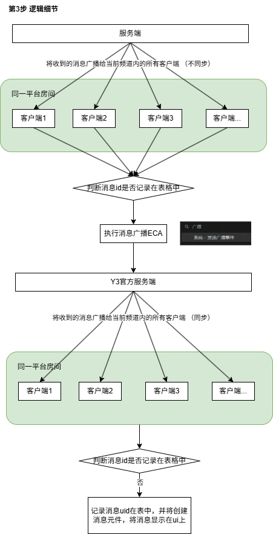

# 00-功能介绍

## 自建全局存档
### 编辑器自带的全局存档功能：
1. 支持字符串、整数全局存档获取
2. 字符串不支持动态修改，修改需要在作者之家修改，并且对字符串有长度限制
3. 整数支持增量修改
4. 无删除功能
5. 实时存档

### 自建全局存档：
1. 增删改查全支持，支持表格
2. 非实时、存档操作会有延迟，具体由服务器负载以及网络情况决定
3. 存档操作并发，复合操作支持较差
4. 暂无权限校验、存在安全问题

 

### 应用场景:
1. 线上公告
2. 线上定向补偿
3. 类似编辑器离线存档的作用

---

## 全服聊天
### **流程图**

 

### 目前功能特性
1. 未区分测试环境
2. 无聊天记录