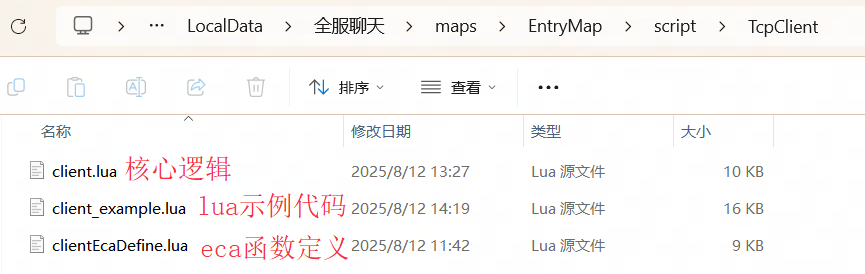

# 01-客户端示例项目下载
1. 下载演示项目https://gitee.com/baim00/y3-tcp-project/repository/archive/main.zip

    项目地址：[BAIM00/Y3TcpProject](https://gitee.com/baim00/y3-tcp-project)

    该项目下载解压即可正常运行，默认连接我个人提供的测试服务器以及mongodb数据库，大家可以下载这个项目后直接体验功能。

    仅供测试，最好不要在线上项目链接该服务器以及数据库

2. 脚本目录位于项目下\maps\EntryMap\script\TcpClient

3. 如果你熟练使用lua开发并且项目使用过lua，将TcpClient文件夹移入至你的项目script文件夹下即可，并在main入口函数下合适位置require所需要的lua文件

4. 如果你没使用过lua开发，请将示例项目下的\maps\EntryMap\script文件夹，复制到你项目下的相同路径即可。eca调用方法请参照示例项目内的eca