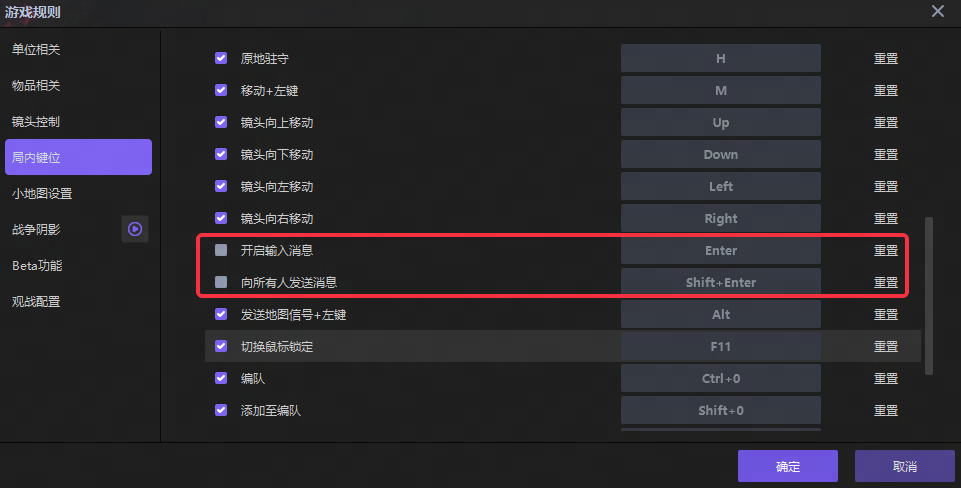

# 01-客户端示例项目下载
1. 下载演示项目https://gitee.com/baim00/y3-tcp-project/repository/archive/main.zip

    项目地址：[BAIM00/Y3TcpProject](https://gitee.com/baim00/y3-tcp-project)

    该项目下载解压即可正常运行，默认连接我个人提供的测试服务器以及mongodb数据库，大家可以下载这个项目后直接体验功能。

    仅供测试，最好不要在线上项目链接该服务器以及数据库

2. 脚本目录位于项目下\maps\EntryMap\script\TcpClient

3. 如果你熟练使用lua开发并且项目使用过lua，将TcpClient文件夹移入至你的项目script文件夹下即可，并在main入口函数下合适位置require所需要的lua文件

4. 如果你没使用过lua开发，请将示例项目下的\maps\EntryMap\script文件夹，复制到你项目下的相同路径即可。eca调用方法请参照示例项目内的eca，如果需要将函数导入到你的项目，请打开示例项目，将示例触发以及示例函数全部包含依赖导出，再导入至你的项目中

5. 项目取消勾选下图两项设置，以适配全服聊天系统

6. 打开示例项目UI编辑器，导出chat元件（包含依赖），再将该元件导入你的项目中

7. 全服聊天功能的配置
函数"本地玩家创建并链接客户端", 有一个可选参数“游戏id”, 该id用于区分不同游戏示例，请作者自行配置(建议使用复杂不易重复的id)
相同的id会处于同一个全服聊天频道

Lua作者需修改游戏id，请查看示例项目内的client_example.lua

8. 如何更新客户端代码？
    重新执行1-4步即可