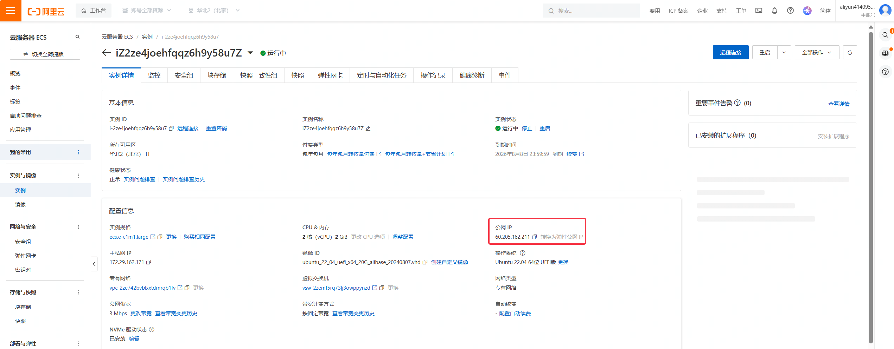

# 03-确定服务端地址
1. 当你执行完第二步后，服务器已经成功部署。现在我们需要确定我们的服务器ip地址，然后将这个地址替换到后续的客户端代码中，这样玩家才能正确得链接到你的服务器上
如果你用的是云服务厂商提供的服务器，类似阿里云、腾讯云之类的平台，平台控制台页面应该会直接能获取到公网ip。如果你有域名那直接用解析过的域名即可

2. 如果你的服务器部署在本地设备，没有公网ip，可通过内网穿透的方式将ip映射到netapp提供的一个网址上
3. 将前两步得到的ip地址或网址修改至客户端中对应位置，**如果仅用于本地测试，也可以填127.0.0.1**
4. lua逻辑位于TcpClient\client_example.lua

5. ECA逻辑位于

