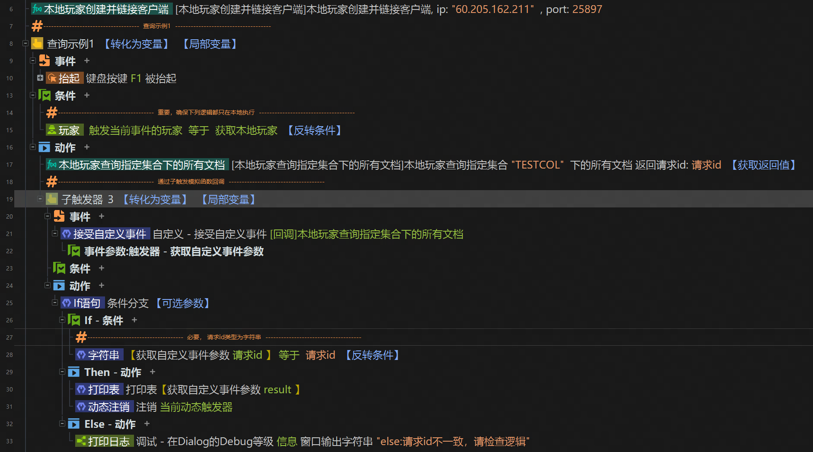
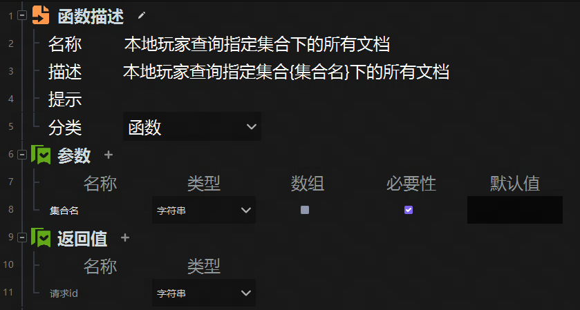
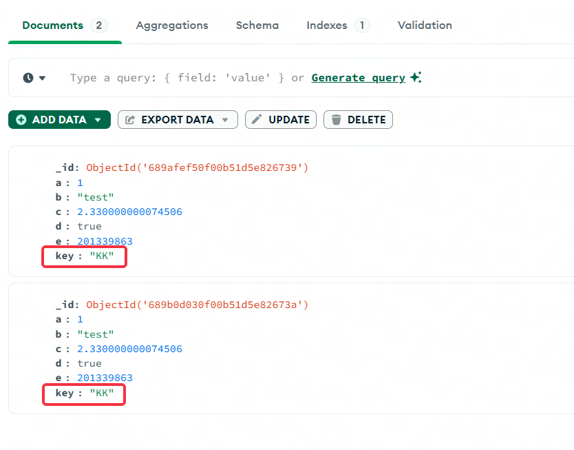
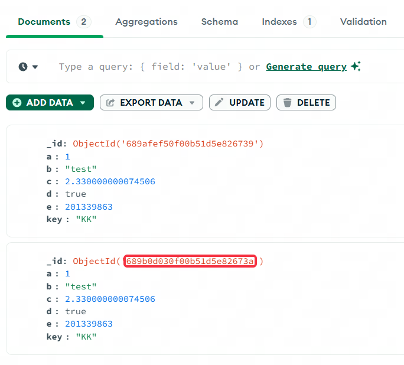
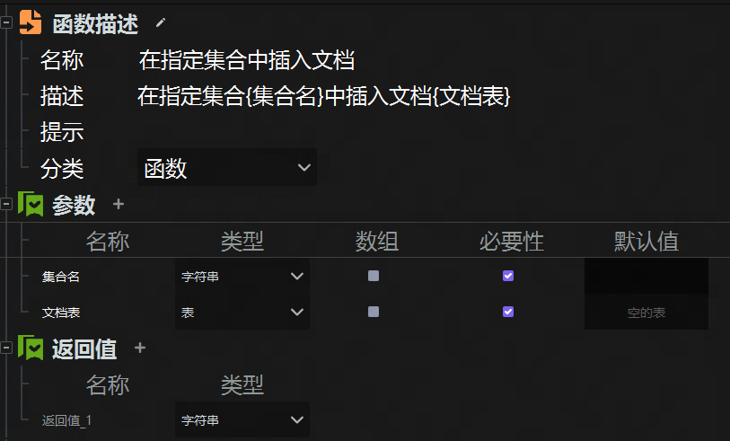
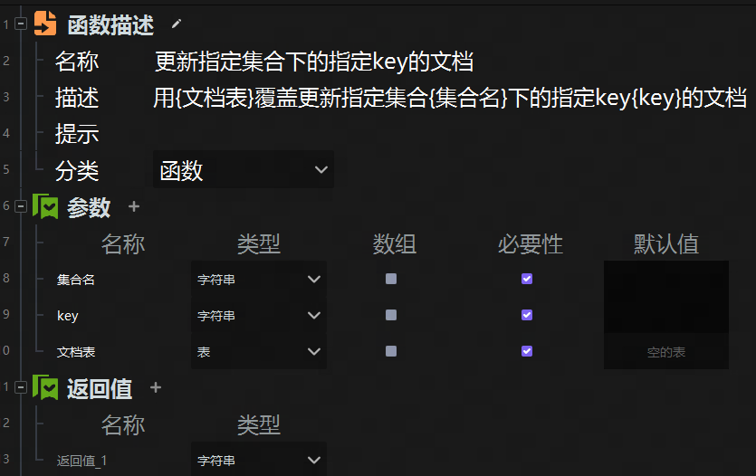
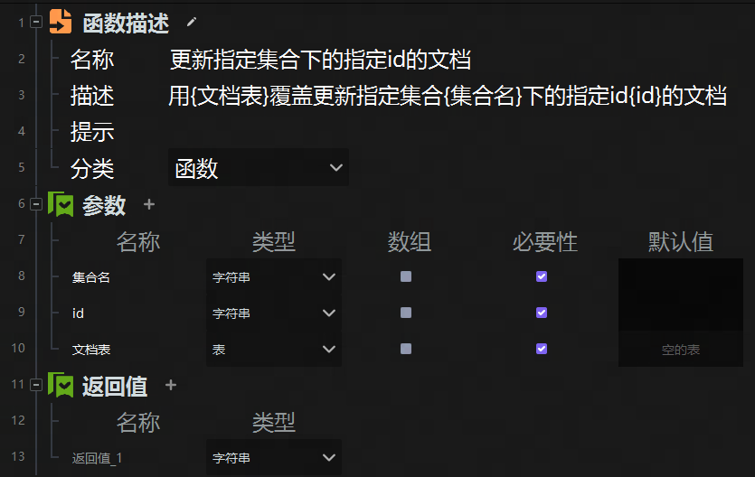

# 05-ECA接口
## 函数及其自定义事件回调
**增删改查的函数均会返回一个请求id(类型为字符串)，如果需要回调函数，需要使用子触发模拟，具体格式参照下图**

---

### 1 本地玩家查询指定集合下的所有文档
查询成功返回指定集合下的所有文档，失败返回空表

---

### 2 本地玩家查询指定集合下指定key的文档
查询成功返回指定集合下的所有key匹配的文档（可能存在多个），失败返回空表

---

### 3 本地玩家查询指定集合下指定id的文档
查询成功返回指定集合下的所有_id匹配的文档（通常只会有一个），失败返回空表

**MongoDB中的_id字段是每个文档默认包含的字段，用于唯一标识文档**

---

### 4 在指定集合中插入文档
第二个参数传入一个表格变量即可

**指定集合名不存在时，会自动新建集合**

---

### 5 更新指定集合下的指定key的文档
第三个参数传入一个表格变量即可，会使用该表格覆盖指定key的文档。
由于key匹配的文档可能存在多个，默认只覆盖第一个匹配的文档

---

### 6 更新指定集合下的指定id的文档
第三个参数传入一个表格变量即可，会使用该表格覆盖指定_id的文档。，默认只覆盖第一个匹配的文档

---

### 7 删除指定集合下的指定key的文档
默认只删除第一个匹配的文档

---

### 8 删除指定集合下的指定id的文档
默认只删除第一个匹配的文档