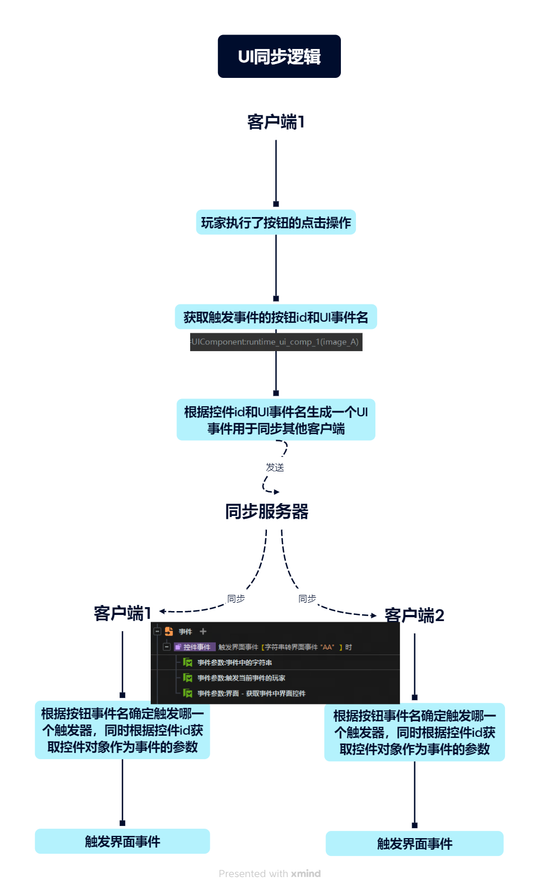

建议先阅读官方文档[多人联机同步机制-开发者学院-Y3编辑器官网](https://163.com/learn/project/d/15?Aid=24)

讲解直播视频： https://163.com/learn/project/d/31?Aid=72
### 界面逻辑中的帧同步+事件同步
- 由于界面的特殊性，Y3在处理界面同步逻辑时，额外采用了事件同步的机制，会同步玩家的具体UI操作事件
- Y3在处理界面逻辑时，为了节省性能开销，将界面数据分为 渲染数据 和 逻辑数据
    - 渲染数据是针对本地玩家用于界面绘制用的数据，本地客户端只会针对当前用户维护一份，不会维护其他玩家的数据
        - 对于静态的UI图片,都属于渲染数据,不会在本地维护其他玩家的这些数据。
        - 例如，本地是玩家2，在ECA执行 为玩家1创建UI时，并不会为这个玩家创建UI的渲染数据，只会创建UI的逻辑数据。
        - 因而导致一个问题,无法使用战斗中的帧同步机制,通过同步玩家的点击行为而让其他客户端演算操作结果(因为其他客户端上并没有绘制触发事件玩家的界面状态,不知道他点的是按钮还是什么)。这个问题将在下文说明。
    - 逻辑数据则是本地客户端将所有玩家有可能用于游戏逻辑使用的数据都维护了一份，可以进行帧同步操作
        - 常见逻辑数据包含：
        - 控件节点对象
        - 控件的自定义属性
        - 控件的显示状态
        - 文本框中的文字
        - 输入框中的文字
    - TIPS：关于如何区分渲染数据和逻辑数据，可以看设置/查询该数据的ECA接口是否需要传递玩家参数，如果不需要传递，则必然是渲染数据
- 由于界面采用了以上处理逻辑，导致界面的操作行为同步，无法简单地通过鼠标点击位置的同步，而让其他客户端演算同样的操作行为。
- 所以，界面中的消息同步，由操作指令同步改为UI事件同步：
    - 客户端会根据本地玩家操作指令的响应，生成对应的UI事件，并将该UI事件同步给其他玩家。
    - 这样一来，其他客户端上虽然没有演算触发事件玩家的UI状态，依然可以同步演算后续操作逻辑。
- 在UI事件同步中，同步消息中会带有触发事件的物件对应的逻辑数据的唯一ID
    - 因此，玩家2的客户端中，只要也有玩家1对应UI的逻辑数据，即可进行与玩家1本地相同的逻辑处理。
    - 这里需要注意，有些开发者在动态创建UI时，会使用“获取本地玩家”，仅为自己创建UI，导致本地数据中并没有其他玩家的对应UI的逻辑数据，后续逻辑响应就会出问题。

客户端1
| 操作                                     	| 元件id   	|
|------------------------------------------	|----------	|
| F1：本地玩家1创建元件A并注册点击事件"AA" 	| 1->元件A 	|
| F2：本地玩家2创建元件B并注册点击事件"BB" 	| 1        	|
| F3  玩家2点击按钮触发事件                	|          	|

客户端2

| 操作                                     	| 元件id   	|
|------------------------------------------	|----------	|
| F1：本地玩家1创建元件A并注册点击事件"AA" 	| 0        	|
| F2：本地玩家2创建元件B并注册点击事件"BB" 	| 1->元件B 	|
| F3  玩家2点击按钮触发事件                	|          	|

玩家2点击按钮，根据控件id和界面事件字符串，生成UI事件用于同步【控件id 1  +  “BB” + 触发事件的玩家】

玩家1实际触发事件的流程：根据事件名确定触发哪些事件，根据id1获取控件对象，将控件对象传入事件作为事件参数