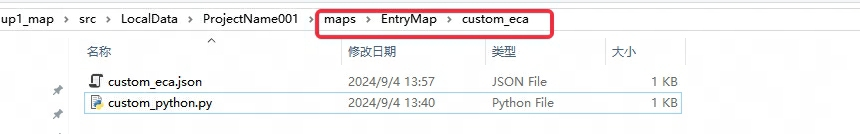

## 如何使用
在关卡下的custom_eca/custom_python.py中可以自定义py的函数加载

例子：
```python title="custom_eca/custom_python.py"
import clients.G as G
from commons.black_box.api import global_api
def get_frame_stack():
    return len(G.black_box.owner.recv_msgs)
# 增加一个获取堆积帧的函数
global_api.get_frame_stack = get_frame_stack
```

```Lua
-- custom_python.py更新后需要在编辑器内触发保存后，才能正确在lua中调用
y3.game.on_client_tick(function ()
    print("堆积帧显示" ..tostring(GlobalAPI.get_frame_stack())) -- 调用新增函数
end)
```


## RSA加密相关
```
from Crypto.Cipher import PKCS1_v1_5
from Crypto.PublicKey import RSA
import six
import hashlib
import clients.G as G
from commons.black_box.api import global_api

def custom_md5(text):
    return hashlib.md5(six.ensure_binary(text)).hexdigest()

def RSA_encrypt_with_public_key(text, public_key):
    public_key_obj = RSA.importKey(public_key)
    # 创建一个新的 Cipher 对象用于加密
    cipher = PKCS1_v1_5.new(public_key_obj)
    # 使用 Cipher 对象进行加密
    cipher_text  = cipher.encrypt(six.ensure_binary(text))
    return cipher_text 


def RSA_decrypt_with_private_key(cipher_text, private_key):
    private_key = RSA.importKey(private_key)
    # 创建PKCS1_v1_5对象
    cipher = PKCS1_v1_5.new(private_key)
    # 解密
    text = cipher.decrypt(cipher_text, None)
    return text

global_api.custom_md5 = custom_md5
global_api.RSA_encrypt_with_public_key = RSA_encrypt_with_public_key
global_api.RSA_decrypt_with_private_key = RSA_decrypt_with_private_key
```

## Websocket相关 （可用来连接一些开源游戏服务端框架）
```
from typing import Any

from commons.black_box.api import global_api
from websockets.sync.client import ClientConnection, connect

try:
    from asyncio import TimeoutError as AsyncioTimeoutError
except Exception:
    AsyncioTimeoutError = None

try:
    from websockets.exceptions import TimeoutError as WebsocketTimeoutError
except Exception:
    WebsocketTimeoutError = None
def create_simple_ws_client(url: str, timeout: float | None = 10) -> ClientConnection:
    """创建同步 WebSocket 连接。"""
    return connect(url, open_timeout=timeout, close_timeout=timeout)

def send_ws_message(ws: ClientConnection, message: Any) -> None:
    """发送文本或二进制消息。"""
    ws.send(message)

def recv_ws_message(ws: ClientConnection, timeout: float | None = None) -> Any:
    """阻塞接收一条消息，支持可选超时（秒）。"""
    try:
        return ws.recv(timeout=timeout)
    except Exception as exc:
        if _is_timeout_error(exc):
            return None
        raise


def close_ws_connection(ws: ClientConnection) -> None:
    """关闭连接，忽略已关闭等非关键错误。"""
    try:
        ws.close()
    except Exception:
        pass


global_api.create_simple_ws_client = create_simple_ws_client
global_api.send_ws_message = send_ws_message
global_api.recv_ws_message = recv_ws_message
global_api.close_ws_connection = close_ws_connection


def _is_timeout_error(exc: BaseException) -> bool:
    """判断异常是否为超时相关。"""
    if isinstance(exc, _TIMEOUT_ERROR_TYPES):
        return True
    message = str(exc).lower()
    return 'timeout' in message or 'timed out' in message


_TIMEOUT_ERROR_TYPES: tuple[type[BaseException], ...] = (TimeoutError,)
if AsyncioTimeoutError is not None:
    _TIMEOUT_ERROR_TYPES = _TIMEOUT_ERROR_TYPES + (AsyncioTimeoutError,)
if WebsocketTimeoutError is not None:
    _TIMEOUT_ERROR_TYPES = _TIMEOUT_ERROR_TYPES + (WebsocketTimeoutError,)
```

## 判断模型是否为MDX模型
```
import clients.G as G
from commons.black_box.api import global_api
def is_mdx_model(model_id):
    return G.custom_res_mgr.get_resource('custom_editor_model').check_mdx(model_id)

global_api.is_mdx_model = is_mdx_model
```

## 区分地图运行环境是在maptest还是线上(仅正式上线后可用)
```
from _G import G;
from commons.black_box.api import global_api
def get_map_id():
    game_info=getattr(G.player, 'game_info', {})
    return game_info.get('map_id')
global_api.get_map_id=get_map_id

# 该函数返回值是一个字符串本地多开测试时返回“TempMutilTest”
# maptest环境中返回 10+地图id，例如10208888
# 测试大厅环境中返回 10+地图id，例如10208888
# 正式环境中返回地图id，例如208888
```

## 判断表格存档中是否存在指定key
```
def archive_table_has_key(role, index, key1=None, key2=None, key3=None):
    t = G.black_box.get_local_save_table(role._role_id, index)
    for key in (key1, key2, key3):
        if key is None:
            break
        if t[key] is None:
            return False
        t = t[key]
    return True
global_api.archive_table_has_key = archive_table_has_key
```

## 获取界面控件的锚点值(不同步)
```
def get_ui_anchors_x(comp_name):
    ui_mgr = G.ui_editor_mgr
    comp = ui_mgr.get_comp(comp_name)
    if comp:
        anchor_x, anchor_y = comp.anchor
        return anchor_x
    
def get_ui_anchors_y(comp_name):
    ui_mgr = G.ui_editor_mgr
    comp = ui_mgr.get_comp(comp_name)
    if comp:
        anchor_x, anchor_y = comp.anchor
        return anchor_y

global_api.get_ui_anchors_x = get_ui_anchors_x
global_api.get_ui_anchors_y = get_ui_anchors_y
```
