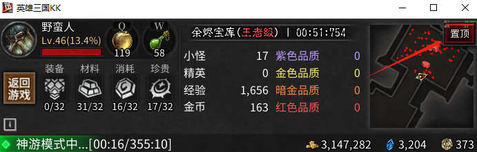

思路：
1. 先确定我们希望缩小后的窗口尺寸
2. 根据期望尺寸，在UI编辑器中绘制相应尺寸的挂机页面
3. 当玩家点击挂机按钮时，修改窗口分辨率
4. UI会因窗口分辨率改变自适应缩小，为了能让ui铺满整个屏幕，我们需要得到该缩放比例， 并反过来放大UI。缩小比例 = 当前窗口分辨率高度/1080， 放大比例 = 1/缩小比例

参考项目：
https://create-bbs.reckfeng.com/forum.php?mod=viewthread&tid=1613&extra=