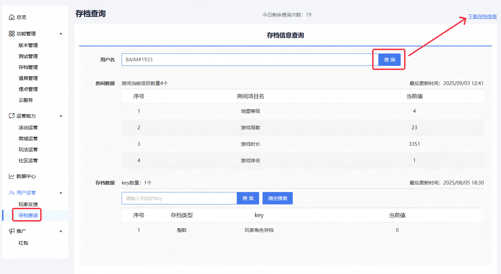
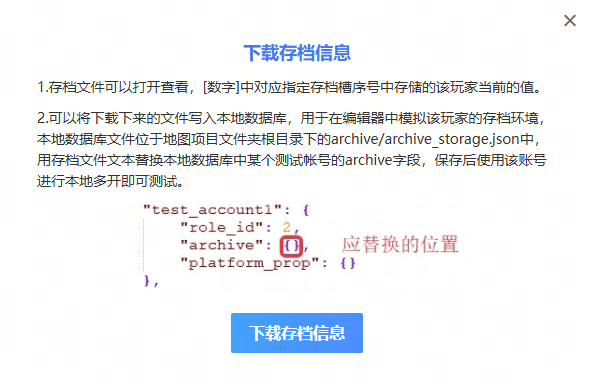
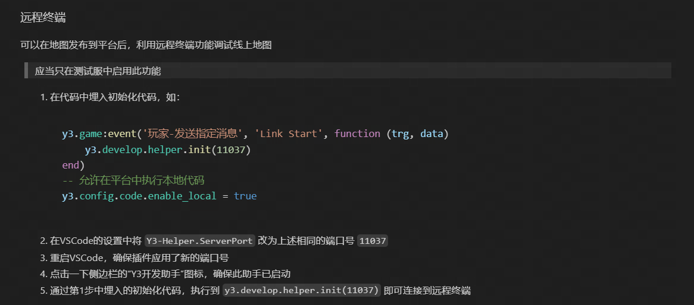
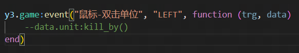
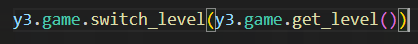

### 拉取线上存档至本地测试
在作者之家中拉取玩家存档

前提：地图正式上线（测试大厅和maptest环境均无法拉取玩家存档）



---

### vscode开发助手远程执行代码

**小技巧：**
1. 端口号可以填平台昵称后缀，比如BAIM#1112
2. 通过合适的事件快速拿到游戏内的实体

    

3. 以 ! 开头的代码会在同步后运行
4. 由于应用场景是在线上环境，所以建议做好严格的权限控制
5. 可以通过切换到当前关卡的逻辑，实现重启游戏，提高测试效率

    

6. 可以快速编写gm代码，配置到一个表格中方便反复使用

**原工作流：**
编写gm代码 -> 发布至maptest -> 测试 -> 修改gm代码 -> 再发布 ->再测试

**优化后的工作流：**
发布至maptest -> 编写或复制gm代码 -> 执行测试

---

### 远程执行代码的另一个方案
通过lua load()把玩家发在聊天框中的字符串转化为函数运行，这样可以不需要依赖y3开发助手，需要做好权限逻辑，通过这种方式，可以比较快速的绕开更新给玩家发放补偿（只不过需要有权限的账号和玩家开一局游戏）。
```Lua
---@package generic
inject = {}
---@peivate
inject.functionCach = {}
---@private
inject.commandTrigger = nil
---@private
inject.GMPlayers = {}

---@param codeString string
function inject.execute(codeString)
    if inject.functionCach[codeString] then
        inject.functionCach[codeString]()
        return
    end
    local fun, err = load(codeString)
    inject.functionCach[codeString] = fun
    inject.functionCach[codeString]()
end

-- 进入注入模式
y3.game:event("玩家-发送指定消息", ".inject", function(_, data)
    inject.GMPlayers[data.player:get_id()] = data.player
    log.info("---------" .. tostring(data.player) .. "进入注入模式---------")
    inject.commandTrigger = y3.game:event("玩家-发送消息", function(_, data)
        if inject.GMPlayers[data.player:get_id()] ~= nil and data.str1 ~= ".inject" and data.str1 ~= ".exit" then -- 该事件会在同一帧监听并回调，需要避免同时回调
            log.info(data.str1)
            inject.execute(data.str1)
        end
    end)
end)

-- 退出注入模式
y3.game:event("玩家-发送指定消息", ".exit", function(_, data)
    if inject.GMPlayers[data.player:get_id()] ~= nil and inject.commandTrigger then
        inject.commandTrigger:remove()
        inject.commandTrigger = nil
        inject.GMPlayer[data.player:get_id()] = nil
    end
end)

return inject
```
