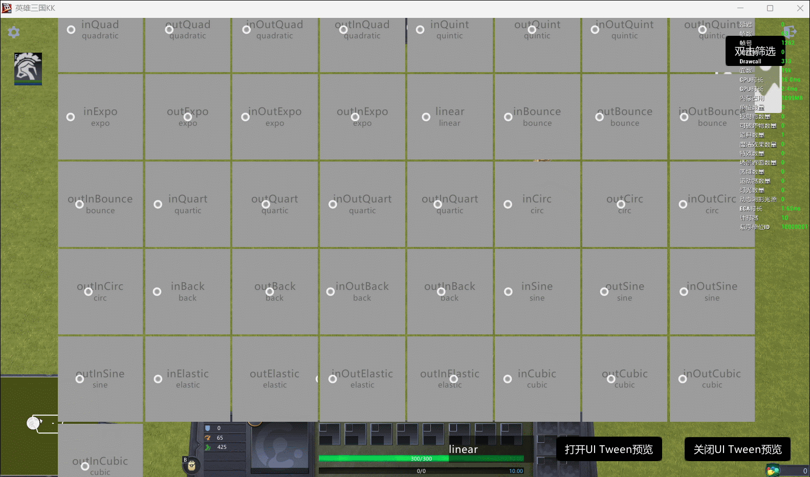
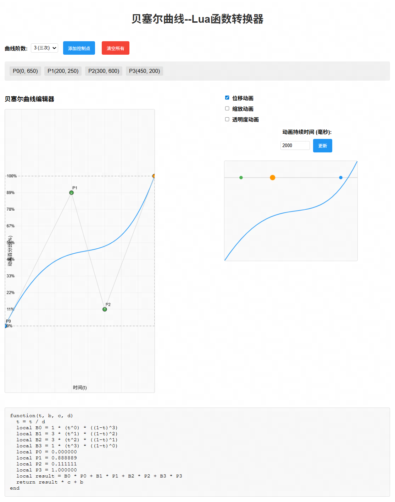

基于开源库https://github.com/kikito/tween.lua 实现，该项目内置了大量常用的运动曲线

### 效果预览
gif录制的33fps的，实际运行会更流畅丝滑



### 应用场景
- UI动效
- 投射物运动轨迹


### 示例项目
https://create-bbs.reckfeng.com/forum.php?mod=viewthread&tid=1607

### 可视化曲线编辑
由于kikito/tween内置的曲线函数修改起来需要一定的数学基础，门槛较高，同时也不能快速直观地预览效果，因此专门开发了可视化曲线编辑的功能。



---

该功能基于web实现，感兴趣的朋友可以直接本地新建一个.html文件,然后复制粘贴下面的源码后打开该网页即可。它会根据当前曲线生成相应的Lua函数，你只需要复制粘贴到tween.Lua中即可调用。

```html showLineNumbers title="twennGenerate.html"
<!DOCTYPE html>
<html lang="zh-CN">
<head>
    <meta charset="UTF-8">
    <meta name="viewport" content="width=device-width, initial-scale=1.0">
    <title>贝塞尔曲线到Lua函数转换器</title>
    <style>
        body {
            font-family: Arial, sans-serif;
            max-width: 1200px;
            margin: 0 auto;
            padding: 20px;
            background-color: #f5f5f5;
        }
        .container {
            background-color: white;
            padding: 20px;
            border-radius: 8px;
            box-shadow: 0 2px 10px rgba(0,0,0,0.1);
        }
        h1 {
            text-align: center;
            color: #333;
        }
        .main-content {
            display: flex;
            gap: 20px;
        }
        .editor-section {
            flex: 1;
        }
        .canvas-container {
            margin: 20px 0;
            position: relative;
        }
        canvas {
            border: 1px solid #ddd;
            border-radius: 4px;
            background-color: #fafafa;
        }
        .controls {
            margin: 20px 0;
        }
        button {
            background-color: #4CAF50;
            color: white;
            padding: 10px 15px;
            border: none;
            border-radius: 4px;
            cursor: pointer;
            margin: 5px;
        }
        button:hover {
            background-color: #45a049;
        }
        button.secondary {
            background-color: #2196F3;
        }
        button.secondary:hover {
            background-color: #1976D2;
        }
        button.danger {
            background-color: #f44336;
        }
        button.danger:hover {
            background-color: #d32f2f;
        }
        .code-output {
            background-color: #f8f8f8;
            border: 1px solid #ddd;
            border-radius: 4px;
            padding: 15px;
            margin: 20px 0;
            font-family: 'Courier New', monospace;
            white-space: pre-wrap;
            overflow-x: auto;
        }
        .control-panel {
            display: flex;
            gap: 10px;
            align-items: center;
            flex-wrap: wrap;
            margin: 10px 0;
        }
        label {
            font-weight: bold;
        }
        input, select {
            padding: 5px;
            border: 1px solid #ddd;
            border-radius: 4px;
        }
        .point-list {
            margin: 15px 0;
            padding: 10px;
            background-color: #f0f0f0;
            border-radius: 4px;
        }
        .point-item {
            display: inline-block;
            margin: 5px;
            padding: 5px 10px;
            background-color: #e0e0e0;
            border-radius: 3px;
            cursor: pointer;
        }
        .point-item:hover {
            background-color: #d0d0d0;
        }
        .point-item.selected {
            background-color: #4CAF50;
            color: white;
        }
        .preview-box {
            margin-top: 20px;
        }
        .preview-title {
            text-align: center;
            font-weight: bold;
            margin-bottom: 10px;
        }
        .axis-label {
            font-size: 12px;
            fill: #333;
        }
        .animation-controls {
            margin: 20px 0;
        }
        .checkbox-container {
            display: flex;
            flex-direction: column;
            gap: 10px;
            margin: 10px 0;
        }
        .checkbox-container label {
            display: flex;
            align-items: center;
            gap: 5px;
        }
        /* 调整样式：优化动画控制区域 */
        .editor-with-controls {
            display: flex;
            gap: 20px;
        }
        .bezier-editor {
            flex: 1;
        }
        .animation-controls-panel {
            width: 500px; /* 减小宽度 */
        }
        /* 调整动画预览画布大小 */
        #animationCanvas {
            width: 400px;
            height: 300px;
        }
    </style>
</head>
<body>
    <div class="container">
        <h1>贝塞尔曲线--Lua函数转换器</h1>
        
        <div class="main-content">
            <div class="editor-section">
                <div class="controls">
                    <div class="control-panel">
                        <label for="order">曲线阶数:</label>
                        <select id="order">
                            <option value="2">2 (二次)</option>
                            <option value="3" selected>3 (三次)</option>
                            <option value="4">4 (四次)</option>
                            <option value="5">5 (五次)</option>
                        </select>
                        
                        <button class="secondary" onclick="addPoint()">添加控制点</button>
                        <button class="danger" onclick="clearAll()">清空所有</button>
                    </div>
                    
                    <div class="point-list" id="pointList">
                        <!-- 控制点列表将在这里显示 -->
                    </div>
                </div>
                
                <div class="editor-with-controls">
                    <div class="bezier-editor">
                        <div class="canvas-container">
                            <div>
                                <h3>贝塞尔曲线编辑器</h3>
                                <canvas id="bezierCanvas" width="450" height="850"></canvas>
                            </div>
                        </div>
                    </div>
                    
                    <div class="animation-controls-panel">
                        <div class="animation-controls">
                            <div class="checkbox-container">
                                <label>
                                    <input type="checkbox" id="positionCheckbox" checked> 位移动画
                                </label>
                                <label>
                                    <input type="checkbox" id="scaleCheckbox"> 缩放动画
                                </label>
                                <label>
                                    <input type="checkbox" id="opacityCheckbox"> 透明度动画
                                </label>
                            </div>
                            <div class="control-panel" style="justify-content: flex-start; margin-top: 15px; flex-direction: column; gap: 5px;">
                                <label for="durationInput">动画持续时间 (毫秒):</label>
                                <div style="display: flex; gap: 5px; align-items: center;">
                                    <input type="number" id="durationInput" value="2000" min="100" max="10000" step="100" style="flex: 1;">
                                    <button class="secondary" onclick="updateDuration()" style="white-space: nowrap;">更新</button>
                                </div>
                            </div>
                        </div>
                        
                        <div class="preview-box">
                            <canvas id="animationCanvas" width="400" height="300"></canvas>
                        </div>
                    </div>
                </div>
                
                <div class="code-output" id="luaOutput">
                    -- 在这里会显示生成的Lua函数
                </div>
            </div>
        </div>
    </div>

    <script>
        // 全局变量
        // 正方形区域450x450，上下各预留200px空间（总共850px高度）
        const CANVAS_WIDTH = 450;
        const CANVAS_HEIGHT = 850;
        const VALID_AREA_SIZE = 450;
        const VALID_AREA_X = 0;
        const VALID_AREA_Y = (CANVAS_HEIGHT - VALID_AREA_SIZE) / 2;
        
        let controlPoints = [
            {x: VALID_AREA_X, y: VALID_AREA_Y + VALID_AREA_SIZE}, // 左下角
            {x: VALID_AREA_X + 200, y: VALID_AREA_Y + 50},
            {x: VALID_AREA_X + 300, y: VALID_AREA_Y + 400},
            {x: VALID_AREA_X + VALID_AREA_SIZE, y: VALID_AREA_Y} // 右上角
        ];
        let selectedPoint = null;
        let canvas, ctx;
        let positionCanvas, positionCtx, scaleCanvas, scaleCtx, opacityCanvas, opacityCtx;
        let order = 3;
        let animationId = null;
        let animationTime = 0;
        let animationDuration = 2000; // 2秒

        // 初始化
        window.onload = function() {
            canvas = document.getElementById('bezierCanvas');
            ctx = canvas.getContext('2d');
            
            positionCanvas = document.getElementById('animationCanvas');
            positionCtx = positionCanvas.getContext('2d');
            
            canvas.addEventListener('mousedown', handleMouseDown);
            document.addEventListener('mousemove', handleMouseMove);
            document.addEventListener('mouseup', handleMouseUp);
            
            document.getElementById('order').addEventListener('change', function(e) {
                order = parseInt(e.target.value);
                updatePointList();
                draw();
                generateLuaFunction(); // 自动生成Lua代码
            });
            
            // 添加复选框事件监听器
            document.getElementById('positionCheckbox').addEventListener('change', draw);
            document.getElementById('scaleCheckbox').addEventListener('change', draw);
            document.getElementById('opacityCheckbox').addEventListener('change', draw);
            
            updatePointList();
            draw();
            generateLuaFunction(); // 初始化时生成Lua代码
            
            // 页面加载完成后自动开始动画循环
            playAnimation();
        };

        // 更新控制点列表显示
        function updatePointList() {
            const pointList = document.getElementById('pointList');
            pointList.innerHTML = '';
            
            // 确保控制点数量与阶数匹配
            while (controlPoints.length < order + 1) {
                controlPoints.push({
                    x: Math.random() * (VALID_AREA_SIZE - 100) + VALID_AREA_X + 50,
                    y: Math.random() * (VALID_AREA_SIZE - 100) + VALID_AREA_Y + 50
                });
            }
            
            while (controlPoints.length > order + 1) {
                controlPoints.pop();
            }
            
            // 固定起点和终点的x坐标，但允许y坐标移动
            controlPoints[0].x = VALID_AREA_X; // 左下角x固定
            if (controlPoints.length > 1) {
                controlPoints[controlPoints.length - 1].x = VALID_AREA_X + VALID_AREA_SIZE; // 右上角x固定
            }
            
            controlPoints.forEach((point, index) => {
                const pointItem = document.createElement('div');
                pointItem.className = 'point-item' + (selectedPoint === index ? ' selected' : '');
                pointItem.textContent = `P${index}(${point.x.toFixed(0)}, ${point.y.toFixed(0)})`;
                pointItem.onclick = () => {
                    selectedPoint = index;
                    updatePointList();
                    draw();
                };
                pointList.appendChild(pointItem);
            });
        }

        // 鼠标事件处理
        function handleMouseDown(e) {
            const rect = canvas.getBoundingClientRect();
            const x = e.clientX - rect.left;
            const y = e.clientY - rect.top;
            
            // 检查是否点击了控制点
            for (let i = 0; i < controlPoints.length; i++) {
                // 起点x固定，终点x固定，但它们的y坐标可以移动
                if (i === 0) {
                    // 起点只能在左边界移动y坐标
                    if (Math.abs(x - controlPoints[i].x) < 10 && Math.abs(y - controlPoints[i].y) < 10) {
                        selectedPoint = i;
                        updatePointList();
                        draw();
                        return;
                    }
                    continue;
                }
                
                if (i === controlPoints.length - 1) {
                    // 终点只能在右边界移动y坐标
                    if (Math.abs(x - controlPoints[i].x) < 10 && Math.abs(y - controlPoints[i].y) < 10) {
                        selectedPoint = i;
                        updatePointList();
                        draw();
                        return;
                    }
                    continue;
                }
                
                const point = controlPoints[i];
                const distance = Math.sqrt((x - point.x) ** 2 + (y - point.y) ** 2);
                if (distance < 10) {
                    selectedPoint = i;
                    updatePointList();
                    draw();
                    return;
                }
            }
            
            // 如果没有点击控制点，取消选择
            selectedPoint = null;
            updatePointList();
            draw();
        }

        function handleMouseMove(e) {
            if (selectedPoint !== null) {
                const rect = canvas.getBoundingClientRect();
                const x = e.clientX - rect.left;
                const y = e.clientY - rect.top;
                
                // 根据选中的点类型进行不同的处理
                if (selectedPoint === 0) {
                    // 起点: x固定在左边界，y可以自由移动
                    controlPoints[selectedPoint].x = VALID_AREA_X;
                    controlPoints[selectedPoint].y = Math.max(VALID_AREA_Y, Math.min(VALID_AREA_Y + VALID_AREA_SIZE, y));
                } else if (selectedPoint === controlPoints.length - 1) {
                    // 终点: x固定在右边界，y可以自由移动
                    controlPoints[selectedPoint].x = VALID_AREA_X + VALID_AREA_SIZE;
                    controlPoints[selectedPoint].y = Math.max(VALID_AREA_Y, Math.min(VALID_AREA_Y + VALID_AREA_SIZE, y));
                } else {
                    // 中间点可以在整个画布范围内移动
                    controlPoints[selectedPoint].x = Math.max(0, Math.min(CANVAS_WIDTH, x));
                    controlPoints[selectedPoint].y = y;
                }
                
                updatePointList();
                draw();
                generateLuaFunction(); // 实时更新Lua代码
            }
        }

        function handleMouseUp() {
            selectedPoint = null;
        }

        // 添加控制点
        function addPoint() {
            if (controlPoints.length < 10) { // 限制最多10个控制点
                controlPoints.push({
                    x: Math.random() * (VALID_AREA_SIZE - 100) + VALID_AREA_X + 50,
                    y: Math.random() * (VALID_AREA_SIZE - 100) + VALID_AREA_Y + 50
                });
                order = controlPoints.length - 1;
                document.getElementById('order').value = order;
                updatePointList();
                draw();
                generateLuaFunction(); // 更新Lua代码
            }
        }

        // 清空所有
        function clearAll() {
            controlPoints = [
                {x: VALID_AREA_X, y: VALID_AREA_Y + VALID_AREA_SIZE}, // 左下角
                {x: VALID_AREA_X + 200, y: VALID_AREA_Y + 50},
                {x: VALID_AREA_X + 300, y: VALID_AREA_Y + 400},
                {x: VALID_AREA_X + VALID_AREA_SIZE, y: VALID_AREA_Y} // 右上角
            ];
            order = 3;
            document.getElementById('order').value = order;
            selectedPoint = null;
            updatePointList();
            draw();
            generateLuaFunction(); // 更新Lua代码
        }

        // 绘制贝塞尔曲线
        function draw() {
            // 清空画布
            ctx.clearRect(0, 0, canvas.width, canvas.height);
            
            // 绘制网格
            drawGrid(ctx, canvas.width, canvas.height);
            
            // 绘制坐标轴标签
            drawAxisLabels(ctx, canvas.width, canvas.height, "时间(t)", "动画百分比(%)");
            
            // 绘制有效区域边框
            ctx.beginPath();
            ctx.strokeStyle = '#999';
            ctx.lineWidth = 1;
            ctx.setLineDash([5, 5]);
            ctx.rect(VALID_AREA_X, VALID_AREA_Y, VALID_AREA_SIZE, VALID_AREA_SIZE);
            ctx.stroke();
            ctx.setLineDash([]);
            
            // 绘制贝塞尔曲线（包括超出画布的部分）
            ctx.beginPath();
            ctx.strokeStyle = '#2196F3';
            ctx.lineWidth = 2;
            
            const steps = 100;
            for (let i = 0; i <= steps; i++) {
                const t = i / steps;
                const point = calculateBezierPoint(t, controlPoints);
                if (i === 0) {
                    ctx.moveTo(point.x, point.y);
                } else {
                    ctx.lineTo(point.x, point.y);
                }
            }
            ctx.stroke();
            
            // 绘制控制点（包括超出画布的部分）
            for (let i = 0; i < controlPoints.length; i++) {
                const point = controlPoints[i];
                ctx.beginPath();
                ctx.arc(point.x, point.y, 6, 0, Math.PI * 2);
                // 起点和终点使用不同颜色标识
                if (i === 0) {
                    ctx.fillStyle = '#2196F3'; // 起点蓝色
                } else if (i === controlPoints.length - 1) {
                    ctx.fillStyle = '#FF9800'; // 终点橙色
                } else {
                    ctx.fillStyle = selectedPoint === i ? '#ff0000' : '#4CAF50';
                }
                ctx.fill();
                ctx.strokeStyle = '#000';
                ctx.lineWidth = 1;
                ctx.stroke();
                
                // 绘制点标签
                ctx.fillStyle = '#000';
                ctx.font = '12px Arial';
                ctx.fillText(`P${i}`, point.x + 10, point.y - 10);
            }
            
            // 绘制控制点连线（包括超出画布的部分）
            ctx.beginPath();
            ctx.strokeStyle = '#ccc';
            ctx.lineWidth = 1;
            for (let i = 0; i < controlPoints.length - 1; i++) {
                ctx.moveTo(controlPoints[i].x, controlPoints[i].y);
                ctx.lineTo(controlPoints[i+1].x, controlPoints[i+1].y);
            }
            ctx.stroke();
            
            // 绘制动画预览
            drawAnimationPreviews();
            
            // 检查是否需要播放或停止动画
            checkAnimationState();
        }

        // 绘制网格
        function drawGrid(context, width, height) {
            context.strokeStyle = '#eee';
            context.lineWidth = 1;
            
            // 垂直线
            for (let x = 0; x <= width; x += 50) {
                context.beginPath();
                context.moveTo(x, 0);
                context.lineTo(x, height);
                context.stroke();
            }
            
            // 水平线和百分比标签
            context.fillStyle = '#000';
            context.font = '12px Arial';
            
            // 在Y轴上绘制百分比标签（以起点为原点）
            for (let y = VALID_AREA_Y; y <= VALID_AREA_Y + VALID_AREA_SIZE; y += 50) {
                // 绘制水平线
                context.beginPath();
                context.moveTo(0, y);
                context.lineTo(width, y);
                context.stroke();
                
                // 计算并绘制百分比标签 - 调整位置使其可见
                const percent = ((VALID_AREA_Y + VALID_AREA_SIZE - y) / VALID_AREA_SIZE) * 100;
                // 将文本对齐方式改为left，并绘制在画布左侧边缘内侧
                context.textAlign = 'left';
                context.fillText(percent.toFixed(0) + '%', 5, y + 4);
            }
        }

        // 绘制坐标轴标签
        function drawAxisLabels(context, width, height, xLabel, yLabel) {
            context.fillStyle = '#000';
            context.font = '14px Arial';
            context.textAlign = 'center';
            
            // X轴标签
            context.fillText(xLabel, width / 2, height - 10);
            
            // Y轴标签 (旋转)
            context.save();
            context.translate(20, height / 2);
            context.rotate(-Math.PI / 2);
            context.fillText(yLabel, 0, 0);
            context.restore();
        }

        // 计算贝塞尔曲线上的点
        function calculateBezierPoint(t, points) {
            const n = points.length - 1;
            let x = 0;
            let y = 0;
            
            for (let i = 0; i <= n; i++) {
                const bernstein = bernsteinPolynomial(n, i, t);
                x += bernstein * points[i].x;
                y += bernstein * points[i].y;
            }
            
            return {x, y};
        }

        // 伯恩斯坦多项式
        function bernsteinPolynomial(n, i, t) {
            return binomialCoefficient(n, i) * Math.pow(t, i) * Math.pow(1 - t, n - i);
        }

        // 二项式系数
        function binomialCoefficient(n, k) {
            if (k < 0 || k > n) return 0;
            if (k === 0 || k === n) return 1;
            
            let result = 1;
            for (let i = 1; i <= Math.min(k, n - k); i++) {
                result = result * (n + 1 - i) / i;
            }
            return result;
        }

        // 检查动画状态，如果所有复选框都未选中则停止动画
        function checkAnimationState() {
            const positionChecked = document.getElementById('positionCheckbox').checked;
            const scaleChecked = document.getElementById('scaleCheckbox').checked;
            const opacityChecked = document.getElementById('opacityCheckbox').checked;
            
            // 如果所有复选框都未选中，则停止动画
            if (!positionChecked && !scaleChecked && !opacityChecked) {
                if (animationId) {
                    cancelAnimationFrame(animationId);
                    animationId = null;
                }
            } else {
                // 如果至少有一个复选框被选中且动画未运行，则启动动画
                if (!animationId) {
                    playAnimation();
                }
            }
        }

        // 绘制动画预览
        function drawAnimationPreviews() {
            // 位移动画预览
            drawPositionPreview();
            
        }

        function drawAnimationPreview(currentTimeProgress = null) {
            positionCtx.clearRect(0, 0, positionCanvas.width, positionCanvas.height);
            
            // 绘制扩展轨道
            positionCtx.beginPath();
            positionCtx.strokeStyle = '#ddd';
            positionCtx.lineWidth = 2;
            positionCtx.moveTo(0, 50);
            positionCtx.lineTo(positionCanvas.width, 50);
            positionCtx.stroke();
            
            // 绘制起始点
            positionCtx.beginPath();
            positionCtx.fillStyle = '#4CAF50';
            positionCtx.arc(50, 50, 5, 0, Math.PI * 2);
            positionCtx.fill();
            
            // 绘制结束点
            positionCtx.beginPath();
            positionCtx.fillStyle = '#2196F3';
            positionCtx.arc(positionCanvas.width-50, 50, 5, 0, Math.PI * 2);
            positionCtx.fill();
            
            if (currentTimeProgress === null) {
                // 静态预览模式 - 绘制多个时间点
                const steps = 5;
                for (let i = 0; i <= steps; i++) {
                    const timeProgress = i / steps;
                    const animationProgress = getAnimationProgress(timeProgress);
                    
                    let x = animationProgress * positionCanvas.width;
                    let y = 50;
                    let size = 16;
                    let color = `rgba(255, 152, 0, ${0.5 + 0.5 * (1 - timeProgress)})`;
                    
                    if (document.getElementById('scaleCheckbox').checked) {
                        const scale = 0.5 + animationProgress * 1.5;
                        size = 16 * scale;
                    }
                    
                    if (document.getElementById('opacityCheckbox').checked) {
                        const opacity = animationProgress;
                        color = `rgba(255, 152, 0, ${opacity})`;
                    }
                    
                    positionCtx.beginPath();
                    positionCtx.fillStyle = color;
                    positionCtx.arc(x, y, size/2, 0, Math.PI * 2);
                    positionCtx.fill();
                }
            } else {
                // 动画模式 - 只绘制当前时间点
                const animationProgress = getAnimationProgress(currentTimeProgress);
                
                const x = animationProgress * (positionCanvas.width-100);
                const y = 50;
                let size = 16;
                let color = '#FF9800';
                
                if (document.getElementById('scaleCheckbox').checked) {
                    const scale = 0.5 + animationProgress * 1.5;
                    size = 16 * scale;
                }
                
                if (document.getElementById('opacityCheckbox').checked) {
                    const opacity = animationProgress;
                    color = `rgba(255, 152, 0, ${opacity})`;
                }
                
                positionCtx.beginPath();
                positionCtx.fillStyle = color;
                positionCtx.arc(50+x, y, size/2, 0, Math.PI * 2);
                positionCtx.fill();
            }
            
            // 绘制贝塞尔曲线预览
            positionCtx.beginPath();
            positionCtx.strokeStyle = '#2196F3';
            positionCtx.lineWidth = 2;
            
            const previewSteps = 30;
            for (let i = 0; i <= previewSteps; i++) {
                const t = i / previewSteps;
                const point = calculateBezierPoint(t, controlPoints);
                const x = ((point.x - VALID_AREA_X) / VALID_AREA_SIZE) * positionCanvas.width;
                const y = ((point.y - VALID_AREA_Y) / VALID_AREA_SIZE) * positionCanvas.height;
                
                if (i === 0) {
                    positionCtx.moveTo(x, y);
                } else {
                    positionCtx.lineTo(x, y);
                }
            }
            positionCtx.stroke();
        }      

        // 位移动画预览 - 扩展显示范围
        function drawPositionPreview() {
            drawAnimationPreview();
        }

        // 添加更新动画持续时间的函数
        function updateDuration() {
            const newDuration = parseInt(document.getElementById('durationInput').value);
            if (!isNaN(newDuration) && newDuration > 0) {
                animationDuration = newDuration;
                // 重新开始动画以确保持续时间更新生效
                playAnimation();
            }
        }

        // 播放动画
        function playAnimation() {
            const positionChecked = document.getElementById('positionCheckbox').checked;
            const scaleChecked = document.getElementById('scaleCheckbox').checked;
            const opacityChecked = document.getElementById('opacityCheckbox').checked;
            
            if (!positionChecked && !scaleChecked && !opacityChecked) {
                return;
            }
            
            if (animationId) {
                cancelAnimationFrame(animationId);
            }
            
            animationTime = 0;
            animationStartTime = performance.now();
            animate();
        }

        // 添加一个函数来计算给定时间t（0-1）时的动画进度
        function getAnimationProgress(t) {
            // 使用贝塞尔曲线计算在时间t时的进度
            const point = calculateBezierPoint(t, controlPoints);
            // Y值需要转换（因为canvas坐标系Y轴向下，且基于有效区域）
            return 1 - ((point.y - VALID_AREA_Y) / VALID_AREA_SIZE); // 转换为0-1范围的进度值
        }

        // 动画循环
        function animate(currentTime) {
            if (!animationStartTime) {
                animationStartTime = currentTime;
            }
            
            const elapsed = currentTime - animationStartTime;
            const timeProgress = Math.min(elapsed / animationDuration, 1);
            
            // 使用通用函数绘制当前动画帧
            drawAnimationPreview(timeProgress);
            
            // 循环播放
            if (timeProgress >= 1) {
                animationStartTime = currentTime;
            }
            
            animationId = requestAnimationFrame(animate);
        }

        // 生成Lua函数
        function generateLuaFunction() {
            const output = document.getElementById('luaOutput');
            
            // 生成Lua函数代码
            let luaCode = ``;
            luaCode += `function(t, b, c, d)\n`;
            luaCode += `  t = t / d\n`;
            
            // 生成伯恩斯坦多项式系数
            // luaCode += `  -- 伯恩斯坦多项式计算\n`;
            for (let i = 0; i <= order; i++) {
                const coeff = binomialCoefficient(order, i);
                luaCode += `  local B${i} = ${coeff} * (t^${i}) * ((1-t)^${order-i})\n`;
            }
            
            // luaCode += `\n  -- 控制点 (需要根据实际需求调整)\n`;
            for (let i = 0; i <= order; i++) {
                // 将控制点Y坐标转换为缓动值 (注意Y轴方向和有效区域)
                const normalizedY = 1 - ((controlPoints[i].y - VALID_AREA_Y) / VALID_AREA_SIZE);
                luaCode += `  local P${i} = ${normalizedY.toFixed(6)}\n`;
            }
            
            // luaCode += `\n  -- 计算贝塞尔曲线值\n`;
            luaCode += `  local result = `;
            for (let i = 0; i <= order; i++) {
                luaCode += `B${i} * P${i}`;
                if (i < order) luaCode += ` + `;
            }
            luaCode += `\n`;
            
            luaCode += `  return result * c + b\n`;
            luaCode += `end`;
            
            // 添加使用示例
            // luaCode += `-- 使用示例: value = bezierEase${order}(currentTime, startValue, changeInValue, duration)\n`;
            
            output.textContent = luaCode;
        }
    </script>
</body>
</html>
```