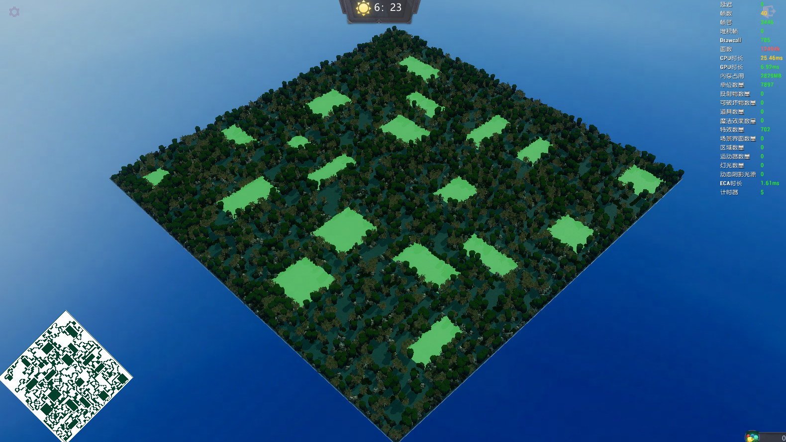

### 思路参考 {#references}
https://journal.stuffwithstuff.com/2014/12/21/rooms-and-mazes/

https://zhuanlan.zhihu.com/p/27381213

### 项目地址 {#project}
https://github.com/BAIMOoo/randomDungeon

### 核心逻辑 {#core-logic}
(代码很臭)
maps\EntryMap\script\dungeonGenerate.lua

### 效果预览 {#preview}

